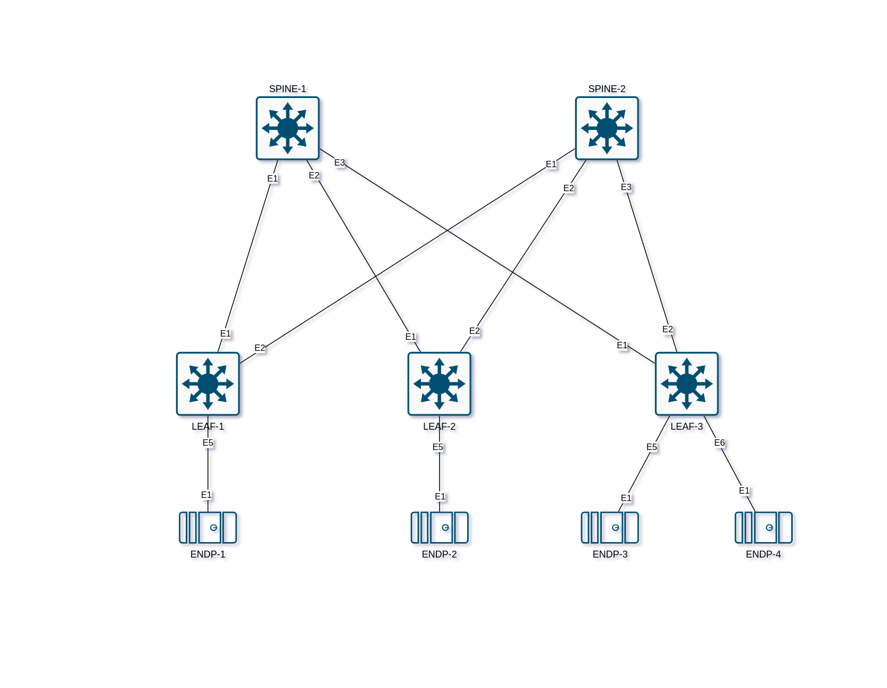

## Проектирование адресного пространства

### Задачи:

- Собрать схему CLOS;
- Распределить адресное пространство.

## Выполнение:

### Собранная схема сети



### Таблица адресов
| hostname | interface |   IP /MASK   | Description |
| :------: | :-------: | :----------: | :---------: |
|  LEAF-1  | Loopback1 | 10.0.1.1 /32 |            |
|  LEAF-1  |  eth 1  | 10.1.1.11 /31 | to-spine-1 |
|  LEAF-1  |  eth 2  | 10.2.1.11 /31 | to-spine-2 |
|          |          |              |            |
|  LEAF-2  | Loopback1 | 10.0.2.1 /32 |            |
|  LEAF-2  |  eth 1  | 10.1.2.11 /31 | to-spine-1 |
|  LEAF-2  |  eth 2  | 10.2.2.11 /31 | to-spine-2 |
|          |          |              |            |
|  LEAF-3  | Loopback1 | 10.0.3.1 /32 |            |
|  LEAF-3  |  eth 1  | 10.1.3.11 /31 | to-spine-1 |
|  LEAF-3  |  eth 2  | 10.2.3.11 /31 | to-spine-2 |
|          |          |              |            |
| SPINE-1 | Loopback1 | 10.0.0.1 /32 |            |
| SPINE-1 |  eth 1  | 10.1.1.10 /31 |  TO-LEAF-1  |
| SPINE-1 |  eth 2  | 10.1.2.10 /31 |  TO-LEAF-2  |
| SPINE-1 |  eth 3  | 10.1.3.10 /31 |  TO-LEAF-3  |
|          |          |              |            |
| SPINE-2 | Loopback1 | 10.0.0.2 /32 |            |
| SPINE-2 |  eth 1  | 10.2.1.10 /31 |  TO-LEAF-1  |
| SPINE-2 |  eth 2  | 10.2.2.10 /31 |  TO-LEAF-2  |
| SPINE-2 |  eth 3  | 10.2.3.10 /31 |  TO-LEAF-3  |

Предполагаемая адресация по схеме:

10.W.X.YZ, где
W: Номер SPINE
X: Шкаф
Y: Номер LEAF в шкафу
Z: 0 - SPINE, 1 - LEAF

10.2.15.21 - Второй LEAF в шкафу 15, интерфейс е2, смотрит на SPINE-2

### Конфигурация оборудования

- #### [SPINE-1](config/SPINE-1.cfg)
```
hostname SPINE-1
!
interface Ethernet1
   description TO-LEAF-1
   no switchport
   ip address 10.1.1.10/31
!
interface Ethernet2
   description TO-LEAF-2
   no switchport
   ip address 10.1.2.10/31
!
interface Ethernet3
   description TO-LEAF-3
   no switchport
   ip address 10.1.3.10/31
!
interface Loopback1
   ip address 10.0.0.1/32
!
```
- #### [SPINE-2](config/SPINE-2.cfg)
```
hostname SPINE-2
!
interface Ethernet1
   description TO-LEAF-1
   no switchport
   ip address 10.2.1.10/31
!
interface Ethernet2
   description TO-LEAF-2
   no switchport
   ip address 10.2.2.10/31
!
interface Ethernet3
   description TO-LEAF-3
   no switchport
   ip address 10.2.3.10/31
!
interface Loopback1
   ip address 10.0.0.2/32
!
```
- #### [LEAF-1](config/LEAF-1.cfg)
```
hostname LEAF-1
!
interface Ethernet1
   description TO-SPINE-1
   no switchport
   ip address 10.1.1.11/31
!
interface Ethernet2
   description TO-SPINE-2
   no switchport
   ip address 10.2.1.11/31
!
interface Loopback1
   ip address 10.0.1.1/32
!
```
- #### [LEAF-2](config/LEAF-2.cfg)
```
hostname LEAF-2
!
interface Ethernet1
   description TO-SPINE-1
   no switchport
   ip address 10.1.2.11/31
!
interface Ethernet2
   description TO-SPINE-2
   no switchport
   ip address 10.2.2.11/31
!
interface Loopback1
   ip address 10.0.2.1/32
!
```
- #### [LEAF-3](config/LEAF-3.cfg)
```
hostname LEAF-3
!
interface Ethernet1
   description TO-SPINE-1
   no switchport
   ip address 10.1.3.11/31
!
interface Ethernet2
   description TO-SPINE-2
   no switchport
   ip address 10.2.3.11/31
!
interface Loopback1
   ip address 10.0.3.1/32
!
```
### Проверка доступности

- #### SPINE-1
```
SPINE-1#ping 10.1.1.11
PING 10.1.1.11 (10.1.1.11) 72(100) bytes of data.
80 bytes from 10.1.1.11: icmp_seq=1 ttl=64 time=0.131 ms
80 bytes from 10.1.1.11: icmp_seq=2 ttl=64 time=0.051 ms
80 bytes from 10.1.1.11: icmp_seq=3 ttl=64 time=0.039 ms
80 bytes from 10.1.1.11: icmp_seq=4 ttl=64 time=0.044 ms
80 bytes from 10.1.1.11: icmp_seq=5 ttl=64 time=0.067 ms

--- 10.1.1.11 ping statistics ---
5 packets transmitted, 5 received, 0% packet loss, time 0ms
rtt min/avg/max/mdev = 0.039/0.066/0.131/0.033 ms, ipg/ewma 0.089/0.098 ms
SPINE-1#ping 10.1.2.11
PING 10.1.2.11 (10.1.2.11) 72(100) bytes of data.
80 bytes from 10.1.2.11: icmp_seq=1 ttl=64 time=0.171 ms
80 bytes from 10.1.2.11: icmp_seq=2 ttl=64 time=0.052 ms
80 bytes from 10.1.2.11: icmp_seq=3 ttl=64 time=0.031 ms
80 bytes from 10.1.2.11: icmp_seq=4 ttl=64 time=0.044 ms
80 bytes from 10.1.2.11: icmp_seq=5 ttl=64 time=0.035 ms

--- 10.1.2.11 ping statistics ---
5 packets transmitted, 5 received, 0% packet loss, time 0ms
rtt min/avg/max/mdev = 0.031/0.066/0.171/0.052 ms, ipg/ewma 0.097/0.116 ms
SPINE-1#ping 10.1.3.11
PING 10.1.3.11 (10.1.3.11) 72(100) bytes of data.
80 bytes from 10.1.3.11: icmp_seq=1 ttl=64 time=0.119 ms
80 bytes from 10.1.3.11: icmp_seq=2 ttl=64 time=0.032 ms
80 bytes from 10.1.3.11: icmp_seq=3 ttl=64 time=0.065 ms
80 bytes from 10.1.3.11: icmp_seq=4 ttl=64 time=0.051 ms
80 bytes from 10.1.3.11: icmp_seq=5 ttl=64 time=0.043 ms

--- 10.1.3.11 ping statistics ---
5 packets transmitted, 5 received, 0% packet loss, time 0ms
rtt min/avg/max/mdev = 0.032/0.062/0.119/0.030 ms, ipg/ewma 0.087/0.089 ms
```

- #### SPINE-1
```
SPINE-2#ping 10.2.1.11
PING 10.2.1.11 (10.2.1.11) 72(100) bytes of data.
80 bytes from 10.2.1.11: icmp_seq=1 ttl=64 time=0.278 ms
80 bytes from 10.2.1.11: icmp_seq=2 ttl=64 time=0.053 ms
80 bytes from 10.2.1.11: icmp_seq=3 ttl=64 time=0.031 ms
80 bytes from 10.2.1.11: icmp_seq=4 ttl=64 time=0.030 ms
80 bytes from 10.2.1.11: icmp_seq=5 ttl=64 time=0.149 ms

--- 10.2.1.11 ping statistics ---
5 packets transmitted, 5 received, 0% packet loss, time 0ms
rtt min/avg/max/mdev = 0.030/0.108/0.278/0.095 ms, ipg/ewma 0.120/0.192 ms
SPINE-2#ping 10.2.2.11
PING 10.2.2.11 (10.2.2.11) 72(100) bytes of data.
80 bytes from 10.2.2.11: icmp_seq=1 ttl=64 time=0.269 ms
80 bytes from 10.2.2.11: icmp_seq=2 ttl=64 time=0.054 ms
80 bytes from 10.2.2.11: icmp_seq=3 ttl=64 time=0.034 ms
80 bytes from 10.2.2.11: icmp_seq=4 ttl=64 time=0.033 ms
80 bytes from 10.2.2.11: icmp_seq=5 ttl=64 time=0.036 ms

--- 10.2.2.11 ping statistics ---
5 packets transmitted, 5 received, 0% packet loss, time 0ms
rtt min/avg/max/mdev = 0.033/0.085/0.269/0.092 ms, ipg/ewma 0.120/0.173 ms
SPINE-2#ping 10.2.3.11
PING 10.2.3.11 (10.2.3.11) 72(100) bytes of data.
80 bytes from 10.2.3.11: icmp_seq=1 ttl=64 time=0.431 ms
80 bytes from 10.2.3.11: icmp_seq=2 ttl=64 time=0.040 ms
80 bytes from 10.2.3.11: icmp_seq=3 ttl=64 time=0.029 ms
80 bytes from 10.2.3.11: icmp_seq=4 ttl=64 time=0.035 ms
80 bytes from 10.2.3.11: icmp_seq=5 ttl=64 time=0.035 ms

--- 10.2.3.11 ping statistics ---
5 packets transmitted, 5 received, 0% packet loss, time 1ms
rtt min/avg/max/mdev = 0.029/0.114/0.431/0.158 ms, ipg/ewma 0.156/0.267 ms
```