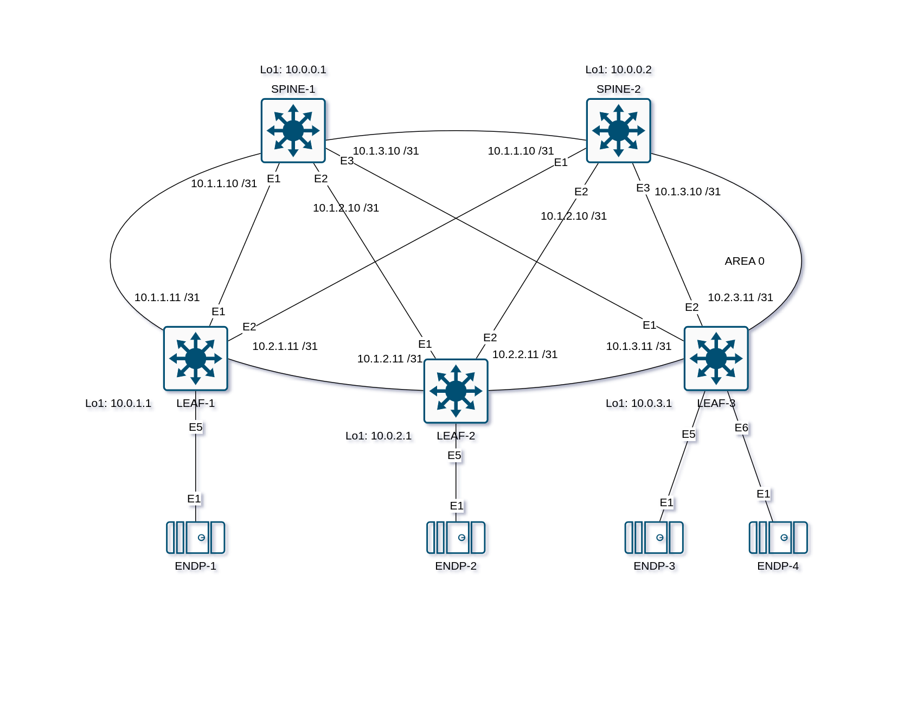

## Underlay. OSPF

### Цель:

- Настроить протокол OSPF для Underlay сети

## Выполнение:

### Схема сети


### Конфигурация оборудования

- #### [LEAF-1](config/LEAF-1.cfg)
- #### [LEAF-2](config/LEAF-2.cfg)
- #### [LEAF-3](config/LEAF-3.cfg)
- #### [SPINE-1](config/SPINE-1.cfg)
- #### [SPINE-2](config/SPINE-2.cfg)

---
### Проверка связанности устройств по протоколу OSPF
- #### SPINE-1
```
SPINE-1#show ip ospf neighbor
Neighbor ID     Instance VRF      Pri State                  Dead Time   Address         Interface
10.0.2.1        1        default  0   FULL                   00:00:30    10.1.2.11       Ethernet2
10.0.1.1        1        default  0   FULL                   00:00:30    10.1.1.11       Ethernet1
10.0.3.1        1        default  0   FULL                   00:00:30    10.1.3.11       Ethernet3
```
```
SPINE-1#show bfd peer
VRF name: default
-----------------
DstAddr                MyDisc         YourDisc       Interface/Transport         Type               LastUp       LastDown            LastDiag    State
--------------- ---------------- ---------------- ------------------------- ------------ -------------------- -------------- ------------------- -----
10.1.1.11          2368760763        407255479             Ethernet1(14)       normal       03/23/25 13:26             NA       No Diagnostic       Up
10.1.2.11          2569793392       3242541117             Ethernet2(17)       normal       03/23/25 13:30             NA       No Diagnostic       Up
10.1.3.11          2561701876       2558636959             Ethernet3(20)       normal       03/23/25 13:31             NA       No Diagnostic       Up
```
```
SPINE-1#show ip route ospf

VRF: default
Source Codes:
       C - connected, S - static, K - kernel,
       O - OSPF, IA - OSPF inter area, E1 - OSPF external type 1,
       E2 - OSPF external type 2, N1 - OSPF NSSA external type 1,
       N2 - OSPF NSSA external type2, B - Other BGP Routes,
       B I - iBGP, B E - eBGP, R - RIP, I L1 - IS-IS level 1,
       I L2 - IS-IS level 2, O3 - OSPFv3, A B - BGP Aggregate,
       A O - OSPF Summary, NG - Nexthop Group Static Route,
       V - VXLAN Control Service, M - Martian,
       DH - DHCP client installed default route,
       DP - Dynamic Policy Route, L - VRF Leaked,
       G  - gRIBI, RC - Route Cache Route,
       CL - CBF Leaked Route

 O        10.0.0.2/32 [110/30]
           via 10.1.1.11, Ethernet1
           via 10.1.2.11, Ethernet2
           via 10.1.3.11, Ethernet3
 O        10.0.1.1/32 [110/20]
           via 10.1.1.11, Ethernet1
 O        10.0.2.1/32 [110/20]
           via 10.1.2.11, Ethernet2
 O        10.0.3.1/32 [110/20]
           via 10.1.3.11, Ethernet3
 O        10.2.1.10/31 [110/20]
           via 10.1.1.11, Ethernet1
 O        10.2.2.10/31 [110/20]
           via 10.1.2.11, Ethernet2
 O        10.2.3.10/31 [110/20]
           via 10.1.3.11, Ethernet3
```
- #### SPINE-2
```
SPINE-2#show ip ospf neighbor
Neighbor ID     Instance VRF      Pri State                  Dead Time   Address         Interface
10.0.2.1        1        default  0   FULL                   00:00:35    10.2.2.11       Ethernet2
10.0.1.1        1        default  0   FULL                   00:00:37    10.2.1.11       Ethernet1
10.0.3.1        1        default  0   FULL                   00:00:33    10.2.3.11       Ethernet3
```
```
SPINE-2#show bfd peer
VRF name: default
-----------------
DstAddr                MyDisc         YourDisc       Interface/Transport         Type               LastUp       LastDown            LastDiag    State
--------------- ---------------- ---------------- ------------------------- ------------ -------------------- -------------- ------------------- -----
10.2.1.11          1083605850       3065152577             Ethernet1(12)       normal       03/23/25 13:44             NA       No Diagnostic       Up
10.2.2.11          3228150443       3451060874             Ethernet2(15)       normal       03/23/25 13:32             NA       No Diagnostic       Up
10.2.3.11          1185616027        971815270             Ethernet3(18)       normal       03/23/25 13:32             NA       No Diagnostic       Up
```
```
SPINE-2#show ip route ospf

VRF: default
Source Codes:
       C - connected, S - static, K - kernel,
       O - OSPF, IA - OSPF inter area, E1 - OSPF external type 1,
       E2 - OSPF external type 2, N1 - OSPF NSSA external type 1,
       N2 - OSPF NSSA external type2, B - Other BGP Routes,
       B I - iBGP, B E - eBGP, R - RIP, I L1 - IS-IS level 1,
       I L2 - IS-IS level 2, O3 - OSPFv3, A B - BGP Aggregate,
       A O - OSPF Summary, NG - Nexthop Group Static Route,
       V - VXLAN Control Service, M - Martian,
       DH - DHCP client installed default route,
       DP - Dynamic Policy Route, L - VRF Leaked,
       G  - gRIBI, RC - Route Cache Route,
       CL - CBF Leaked Route

 O        10.0.0.1/32 [110/30]
           via 10.2.1.11, Ethernet1
           via 10.2.2.11, Ethernet2
           via 10.2.3.11, Ethernet3
 O        10.0.1.1/32 [110/20]
           via 10.2.1.11, Ethernet1
 O        10.0.2.1/32 [110/20]
           via 10.2.2.11, Ethernet2
 O        10.0.3.1/32 [110/20]
           via 10.2.3.11, Ethernet3
 O        10.1.1.10/31 [110/20]
           via 10.2.1.11, Ethernet1
 O        10.1.2.10/31 [110/20]
           via 10.2.2.11, Ethernet2
 O        10.1.3.10/31 [110/20]
           via 10.2.3.11, Ethernet3
```