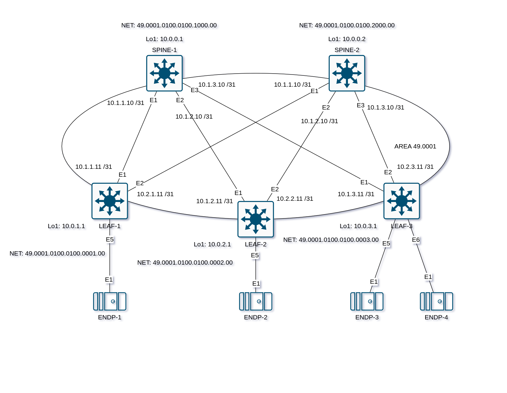

# Домашнее задание №3

## Underlay. IS-IS

### Задача:
- Настроить IS-IS для Underlay сети

## Выполнение:

### Схема сети



### Конфигурация оборудования

### Конфигурация оборудования

- #### [LEAF-1](config/LEAF-1.cfg)
- #### [LEAF-2](config/LEAF-2.cfg)
- #### [LEAF-3](config/LEAF-3.cfg)
- #### [SPINE-1](config/SPINE-1.cfg)
- #### [SPINE-2](config/SPINE-2.cfg)

### Проверка связанности устройств по протоколу IS-IS
- #### SPINE-1
```
SPINE-1#show isis neighbors

Instance  VRF      System Id        Type Interface          SNPA              State Hold time   Circuit Id
Underlay  default  LEAF-1           L1   Ethernet1          P2P               UP    28          0D
Underlay  default  LEAF-2           L1   Ethernet2          P2P               UP    23          44
Underlay  default  LEAF-3           L1   Ethernet3          P2P               UP    21          45
```
```
SPINE-1#show bfd peer
VRF name: default
-----------------
DstAddr                MyDisc         YourDisc       Interface/Transport         Type               LastUp             LastDown            LastDiag    State
--------------- ---------------- ---------------- ------------------------- ------------ -------------------- -------------------- ------------------- -----
10.1.1.11          3417848864       2738119935             Ethernet1(14)       normal       03/23/25 14:00                   NA       No Diagnostic       Up
10.1.2.11          3472493921        202792178             Ethernet2(17)       normal       03/23/25 14:04                   NA       No Diagnostic       Up
10.1.3.11           111945115       4099247985             Ethernet3(20)       normal       03/23/25 14:05       03/23/25 14:05       No Diagnostic       Up
```
```
SPINE-1#show ip route isis

VRF: default
Source Codes:
       C - connected, S - static, K - kernel,
       O - OSPF, IA - OSPF inter area, E1 - OSPF external type 1,
       E2 - OSPF external type 2, N1 - OSPF NSSA external type 1,
       N2 - OSPF NSSA external type2, B - Other BGP Routes,
       B I - iBGP, B E - eBGP, R - RIP, I L1 - IS-IS level 1,
       I L2 - IS-IS level 2, O3 - OSPFv3, A B - BGP Aggregate,
       A O - OSPF Summary, NG - Nexthop Group Static Route,
       V - VXLAN Control Service, M - Martian,
       DH - DHCP client installed default route,
       DP - Dynamic Policy Route, L - VRF Leaked,
       G  - gRIBI, RC - Route Cache Route,
       CL - CBF Leaked Route

 I L1     10.0.0.2/32 [115/30]
           via 10.1.1.11, Ethernet1
           via 10.1.2.11, Ethernet2
           via 10.1.3.11, Ethernet3
 I L1     10.0.1.1/32 [115/20]
           via 10.1.1.11, Ethernet1
 I L1     10.0.2.1/32 [115/20]
           via 10.1.2.11, Ethernet2
 I L1     10.0.3.1/32 [115/20]
           via 10.1.3.11, Ethernet3
 I L1     10.2.1.10/31 [115/20]
           via 10.1.1.11, Ethernet1
 I L1     10.2.2.10/31 [115/20]
           via 10.1.2.11, Ethernet2
 I L1     10.2.3.10/31 [115/20]
           via 10.1.3.11, Ethernet3
```

- #### SPINE-2
```
SPINE-2#show isis neighbors

Instance  VRF      System Id        Type Interface          SNPA              State Hold time   Circuit Id
Underlay  default  LEAF-1           L1   Ethernet1          P2P               UP    24          10
Underlay  default  LEAF-2           L1   Ethernet2          P2P               UP    30          46
Underlay  default  LEAF-3           L1   Ethernet3          P2P               UP    30          47
```
```
SPINE-2#show bfd peer
VRF name: default
-----------------
DstAddr                MyDisc         YourDisc       Interface/Transport         Type               LastUp       LastDown            LastDiag    State
--------------- ---------------- ---------------- ------------------------- ------------ -------------------- -------------- ------------------- -----
10.2.1.11          1936432898       4128034487             Ethernet1(12)       normal       03/23/25 14:05             NA       No Diagnostic       Up
10.2.2.11          1213327137       2082415684             Ethernet2(15)       normal       03/23/25 14:05             NA       No Diagnostic       Up
10.2.3.11           280094057       4070691464             Ethernet3(18)       normal       03/23/25 14:05             NA       No Diagnostic       Up
```
```
SPINE-2#show ip route isis

VRF: default
Source Codes:
       C - connected, S - static, K - kernel,
       O - OSPF, IA - OSPF inter area, E1 - OSPF external type 1,
       E2 - OSPF external type 2, N1 - OSPF NSSA external type 1,
       N2 - OSPF NSSA external type2, B - Other BGP Routes,
       B I - iBGP, B E - eBGP, R - RIP, I L1 - IS-IS level 1,
       I L2 - IS-IS level 2, O3 - OSPFv3, A B - BGP Aggregate,
       A O - OSPF Summary, NG - Nexthop Group Static Route,
       V - VXLAN Control Service, M - Martian,
       DH - DHCP client installed default route,
       DP - Dynamic Policy Route, L - VRF Leaked,
       G  - gRIBI, RC - Route Cache Route,
       CL - CBF Leaked Route

 I L1     10.0.0.1/32 [115/30]
           via 10.2.1.11, Ethernet1
           via 10.2.2.11, Ethernet2
           via 10.2.3.11, Ethernet3
 I L1     10.0.1.1/32 [115/20]
           via 10.2.1.11, Ethernet1
 I L1     10.0.2.1/32 [115/20]
           via 10.2.2.11, Ethernet2
 I L1     10.0.3.1/32 [115/20]
           via 10.2.3.11, Ethernet3
 I L1     10.1.1.10/31 [115/20]
           via 10.2.1.11, Ethernet1
 I L1     10.1.2.10/31 [115/20]
           via 10.2.2.11, Ethernet2
 I L1     10.1.3.10/31 [115/20]
           via 10.2.3.11, Ethernet3
```