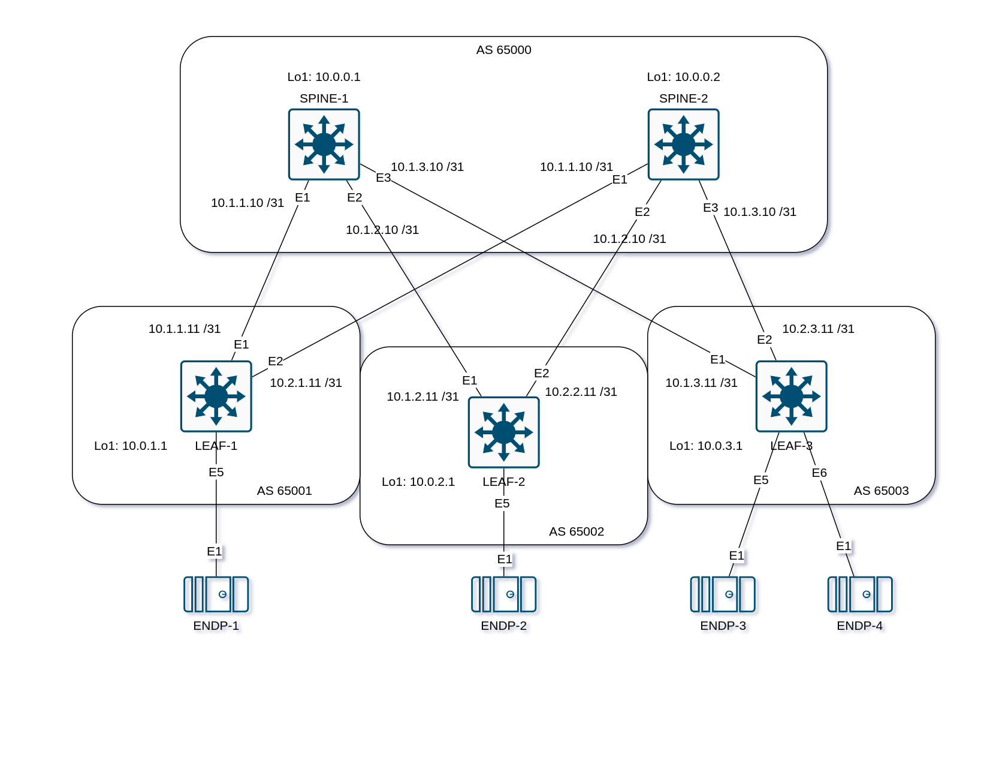

## Underlay. eBGP

### Задача:

- Настроить протокол eBGP для Underlay сети
- Проверить связанность между устройствами

## Выполнение:

### Схема сети



### Конфигурация оборудования

- #### [LEAF-1](config/LEAF-1.cfg)
```
route-map RM_REDIST permit 10
   match interface Loopback1

router bgp 65001
   timers bgp 3 9
   maximum-paths 2 ecmp 2
   neighbor SPINE peer group
   neighbor SPINE remote-as 65000
   neighbor SPINE bfd
   neighbor SPINE allowas-in 1
   neighbor SPINE password OTUS_EBGP_UNDERLAY
   neighbor SPINE send-community
   neighbor 10.1.1.10 peer group SPINE
   neighbor 10.2.1.10 peer group SPINE
   !
   address-family ipv4
      neighbor SPINE activate
      redistribute connected route-map RM_REDIST
```

- #### [LEAF-2](config/LEAF-2.cfg)
```
route-map RM_REDIST permit 10
   match interface Loopback1

router bgp 65002
   timers bgp 3 9
   maximum-paths 2 ecmp 2
   neighbor SPINE peer group
   neighbor SPINE remote-as 65000
   neighbor SPINE bfd
   neighbor SPINE allowas-in 1
   neighbor SPINE password OTUS_EBGP_UNDERLAY
   neighbor SPINE send-community
   neighbor 10.1.2.10 peer group SPINE
   neighbor 10.2.2.10 peer group SPINE
   !
   address-family ipv4
      neighbor SPINE activate
      redistribute connected route-map RM_REDIST
```

- #### [LEAF-3](config/LEAF-3.cfg)
```
route-map RM_REDIST permit 10
   match interface Loopback1

router bgp 65003
   timers bgp 3 9
   maximum-paths 2 ecmp 2
   neighbor SPINE peer group
   neighbor SPINE remote-as 65000
   neighbor SPINE bfd
   neighbor SPINE allowas-in 1
   neighbor SPINE password OTUS_EBGP_UNDERLAY
   neighbor SPINE send-community
   neighbor 10.1.3.10 peer group SPINE
   neighbor 10.2.3.10 peer group SPINE
   !
   address-family ipv4
      neighbor SPINE activate
      redistribute connected route-map RM_REDIST
```

- #### [SPINE-1](config/SPINE-1.cfg)
```
route-map RM_REDIST permit 10
   match interface Loopback1

peer-filter PF_ASN
   10 match as-range 65001-65003 result accept

router bgp 65000
   timers bgp 3 9
   maximum-paths 2 ecmp 2
   dynamic peer max 3
   bgp listen range 10.1.0.0/16 peer-group LEAF peer-filter PF_ASN
   neighbor LEAF peer group
   neighbor LEAF bfd
   neighbor LEAF allowas-in 1
   neighbor LEAF password OTUS_EBGP_UNDERLAY
   neighbor LEAF send-community
   !
   address-family ipv4
      neighbor LEAF activate
      redistribute connected route-map RM_REDIST
```

- #### [SPINE-2](config/SPINE-2.cfg)
```
route-map RM_REDIST permit 10
   match interface Loopback1

peer-filter PF_ASN
   10 match as-range 65001-65003 result accept

router bgp 65000
   timers bgp 3 9
   maximum-paths 2 ecmp 2
   dynamic peer max 3
   bgp listen range 10.2.0.0/16 peer-group LEAF peer-filter PF_ASN
   neighbor LEAF peer group
   neighbor LEAF bfd
   neighbor LEAF allowas-in 1
   neighbor LEAF password OTUS_EBGP_UNDERLAY
   neighbor LEAF send-community
   !
   address-family ipv4
      neighbor LEAF activate
      redistribute connected route-map RM_REDIST
```

### Проверка связанности устройств по протоколу BGP

- #### SPINE-1
```
SPINE-1#show ip bgp summary
BGP summary information for VRF default
Router identifier 10.0.0.1, local AS number 65000
Neighbor Status Codes: m - Under maintenance
  Neighbor  V AS           MsgRcvd   MsgSent  InQ OutQ  Up/Down State   PfxRcd PfxAcc
  10.1.1.11 4 65001            253       253    0    0 00:10:32 Estab   4      4
  10.1.2.11 4 65002            256       257    0    0 00:10:32 Estab   4      4
  10.1.3.11 4 65003            255       256    0    0 00:10:32 Estab   4      4
SPINE-1#show ip route bgp

VRF: default
Source Codes:
       C - connected, S - static, K - kernel,
       O - OSPF, IA - OSPF inter area, E1 - OSPF external type 1,
       E2 - OSPF external type 2, N1 - OSPF NSSA external type 1,
       N2 - OSPF NSSA external type2, B - Other BGP Routes,
       B I - iBGP, B E - eBGP, R - RIP, I L1 - IS-IS level 1,
       I L2 - IS-IS level 2, O3 - OSPFv3, A B - BGP Aggregate,
       A O - OSPF Summary, NG - Nexthop Group Static Route,
       V - VXLAN Control Service, M - Martian,
       DH - DHCP client installed default route,
       DP - Dynamic Policy Route, L - VRF Leaked,
       G  - gRIBI, RC - Route Cache Route,
       CL - CBF Leaked Route

 B E      10.0.0.2/32 [200/0]
           via 10.1.1.11, Ethernet1
           via 10.1.2.11, Ethernet2
           via 10.1.3.11, Ethernet3
 B E      10.0.1.1/32 [200/0]
           via 10.1.1.11, Ethernet1
 B E      10.0.2.1/32 [200/0]
           via 10.1.2.11, Ethernet2
 B E      10.0.3.1/32 [200/0]
           via 10.1.3.11, Ethernet3

SPINE-1#show bfd peers
VRF name: default
-----------------
DstAddr                MyDisc         YourDisc       Interface/Transport         Type               LastUp       LastDown            LastDiag    State
--------------- ---------------- ---------------- ------------------------- ------------ -------------------- -------------- ------------------- -----
10.1.1.11           541196265       3581667247            Ethernet1(203)       normal       03/30/25 16:53             NA       No Diagnostic       Up
10.1.2.11          2293948888       3178394802            Ethernet2(206)       normal       03/30/25 16:53             NA       No Diagnostic       Up
10.1.3.11          3966615416       1363898130            Ethernet3(209)       normal       03/30/25 16:53             NA       No Diagnostic       Up

SPINE-1#ping 10.0.0.2 source loopback 1
PING 10.0.0.2 (10.0.0.2) from 10.0.0.1 : 72(100) bytes of data.
80 bytes from 10.0.0.2: icmp_seq=1 ttl=63 time=0.511 ms
80 bytes from 10.0.0.2: icmp_seq=2 ttl=63 time=0.302 ms
80 bytes from 10.0.0.2: icmp_seq=3 ttl=63 time=0.208 ms
80 bytes from 10.0.0.2: icmp_seq=4 ttl=63 time=0.209 ms
80 bytes from 10.0.0.2: icmp_seq=5 ttl=63 time=0.187 ms

--- 10.0.0.2 ping statistics ---
5 packets transmitted, 5 received, 0% packet loss, time 2ms
rtt min/avg/max/mdev = 0.187/0.283/0.511/0.120 ms, ipg/ewma 0.446/0.391 ms
SPINE-1#ping 10.0.1.1 source loopback 1
PING 10.0.1.1 (10.0.1.1) from 10.0.0.1 : 72(100) bytes of data.
80 bytes from 10.0.1.1: icmp_seq=1 ttl=64 time=0.082 ms
80 bytes from 10.0.1.1: icmp_seq=2 ttl=64 time=0.043 ms
80 bytes from 10.0.1.1: icmp_seq=3 ttl=64 time=0.042 ms
80 bytes from 10.0.1.1: icmp_seq=4 ttl=64 time=0.037 ms
80 bytes from 10.0.1.1: icmp_seq=5 ttl=64 time=0.032 ms

--- 10.0.1.1 ping statistics ---
5 packets transmitted, 5 received, 0% packet loss, time 0ms
rtt min/avg/max/mdev = 0.032/0.047/0.082/0.017 ms, ipg/ewma 0.072/0.063 ms
SPINE-1#ping 10.0.2.1 source loopback 1
PING 10.0.2.1 (10.0.2.1) from 10.0.0.1 : 72(100) bytes of data.
80 bytes from 10.0.2.1: icmp_seq=1 ttl=64 time=0.201 ms
80 bytes from 10.0.2.1: icmp_seq=2 ttl=64 time=0.041 ms
80 bytes from 10.0.2.1: icmp_seq=3 ttl=64 time=0.045 ms
80 bytes from 10.0.2.1: icmp_seq=4 ttl=64 time=0.033 ms
80 bytes from 10.0.2.1: icmp_seq=5 ttl=64 time=0.037 ms

--- 10.0.2.1 ping statistics ---
5 packets transmitted, 5 received, 0% packet loss, time 0ms
rtt min/avg/max/mdev = 0.033/0.071/0.201/0.064 ms, ipg/ewma 0.097/0.133 ms
SPINE-1#ping 10.0.3.1 source loopback 1
PING 10.0.3.1 (10.0.3.1) from 10.0.0.1 : 72(100) bytes of data.
80 bytes from 10.0.3.1: icmp_seq=1 ttl=64 time=0.130 ms
80 bytes from 10.0.3.1: icmp_seq=2 ttl=64 time=0.029 ms
80 bytes from 10.0.3.1: icmp_seq=3 ttl=64 time=0.048 ms
80 bytes from 10.0.3.1: icmp_seq=4 ttl=64 time=0.043 ms
80 bytes from 10.0.3.1: icmp_seq=5 ttl=64 time=0.051 ms

--- 10.0.3.1 ping statistics ---
5 packets transmitted, 5 received, 0% packet loss, time 0ms
rtt min/avg/max/mdev = 0.029/0.060/0.130/0.035 ms, ipg/ewma 0.083/0.094 ms
```

- #### SPINE-2
```
SPINE-2#show ip bgp summary
BGP summary information for VRF default
Router identifier 10.0.0.2, local AS number 65000
Neighbor Status Codes: m - Under maintenance
  Neighbor  V AS           MsgRcvd   MsgSent  InQ OutQ  Up/Down State   PfxRcd PfxAcc
  10.2.1.11 4 65001            286       286    0    0 00:11:51 Estab   2      2
  10.2.2.11 4 65002            284       282    0    0 00:11:51 Estab   2      2
  10.2.3.11 4 65003            287       290    0    0 00:11:51 Estab   2      2
SPINE-2#show ip route bgp

VRF: default
Source Codes:
       C - connected, S - static, K - kernel,
       O - OSPF, IA - OSPF inter area, E1 - OSPF external type 1,
       E2 - OSPF external type 2, N1 - OSPF NSSA external type 1,
       N2 - OSPF NSSA external type2, B - Other BGP Routes,
       B I - iBGP, B E - eBGP, R - RIP, I L1 - IS-IS level 1,
       I L2 - IS-IS level 2, O3 - OSPFv3, A B - BGP Aggregate,
       A O - OSPF Summary, NG - Nexthop Group Static Route,
       V - VXLAN Control Service, M - Martian,
       DH - DHCP client installed default route,
       DP - Dynamic Policy Route, L - VRF Leaked,
       G  - gRIBI, RC - Route Cache Route,
       CL - CBF Leaked Route

 B E      10.0.0.1/32 [200/0]
           via 10.2.1.11, Ethernet1
           via 10.2.2.11, Ethernet2
           via 10.2.3.11, Ethernet3
 B E      10.0.1.1/32 [200/0]
           via 10.2.1.11, Ethernet1
 B E      10.0.2.1/32 [200/0]
           via 10.2.2.11, Ethernet2
 B E      10.0.3.1/32 [200/0]
           via 10.2.3.11, Ethernet3

SPINE-2#show bfd peers
VRF name: default
-----------------
DstAddr                MyDisc         YourDisc       Interface/Transport         Type               LastUp       LastDown            LastDiag    State
--------------- ---------------- ---------------- ------------------------- ------------ -------------------- -------------- ------------------- -----
10.2.1.11          1087814843       1723158324            Ethernet1(204)       normal       03/30/25 16:53             NA       No Diagnostic       Up
10.2.2.11          1879959871        191859471            Ethernet2(207)       normal       03/30/25 16:53             NA       No Diagnostic       Up
10.2.3.11           102951318        986920821            Ethernet3(210)       normal       03/30/25 16:53             NA       No Diagnostic       Up

SPINE-2#ping 10.0.0.1 source loopback 1
PING 10.0.0.1 (10.0.0.1) from 10.0.0.2 : 72(100) bytes of data.
80 bytes from 10.0.0.1: icmp_seq=1 ttl=63 time=0.375 ms
80 bytes from 10.0.0.1: icmp_seq=2 ttl=63 time=0.289 ms
80 bytes from 10.0.0.1: icmp_seq=3 ttl=63 time=0.242 ms
80 bytes from 10.0.0.1: icmp_seq=4 ttl=63 time=0.247 ms
80 bytes from 10.0.0.1: icmp_seq=5 ttl=63 time=0.284 ms

--- 10.0.0.1 ping statistics ---
5 packets transmitted, 5 received, 0% packet loss, time 1ms
rtt min/avg/max/mdev = 0.242/0.287/0.375/0.047 ms, ipg/ewma 0.312/0.329 ms
SPINE-2#ping 10.0.1.1 source loopback 1
PING 10.0.1.1 (10.0.1.1) from 10.0.0.2 : 72(100) bytes of data.
80 bytes from 10.0.1.1: icmp_seq=1 ttl=64 time=0.246 ms
80 bytes from 10.0.1.1: icmp_seq=2 ttl=64 time=0.121 ms
80 bytes from 10.0.1.1: icmp_seq=3 ttl=64 time=0.048 ms
80 bytes from 10.0.1.1: icmp_seq=4 ttl=64 time=0.052 ms
80 bytes from 10.0.1.1: icmp_seq=5 ttl=64 time=0.040 ms

--- 10.0.1.1 ping statistics ---
5 packets transmitted, 5 received, 0% packet loss, time 1ms
rtt min/avg/max/mdev = 0.040/0.101/0.246/0.077 ms, ipg/ewma 0.141/0.169 ms
SPINE-2#ping 10.0.2.1 source loopback 1
PING 10.0.2.1 (10.0.2.1) from 10.0.0.2 : 72(100) bytes of data.
80 bytes from 10.0.2.1: icmp_seq=1 ttl=64 time=0.156 ms
80 bytes from 10.0.2.1: icmp_seq=2 ttl=64 time=0.064 ms
80 bytes from 10.0.2.1: icmp_seq=3 ttl=64 time=0.036 ms
80 bytes from 10.0.2.1: icmp_seq=4 ttl=64 time=0.030 ms
80 bytes from 10.0.2.1: icmp_seq=5 ttl=64 time=0.053 ms

--- 10.0.2.1 ping statistics ---
5 packets transmitted, 5 received, 0% packet loss, time 0ms
rtt min/avg/max/mdev = 0.030/0.067/0.156/0.045 ms, ipg/ewma 0.102/0.110 ms
SPINE-2#ping 10.0.3.1 source loopback 1
PING 10.0.3.1 (10.0.3.1) from 10.0.0.2 : 72(100) bytes of data.
80 bytes from 10.0.3.1: icmp_seq=1 ttl=64 time=0.207 ms
80 bytes from 10.0.3.1: icmp_seq=2 ttl=64 time=0.051 ms
80 bytes from 10.0.3.1: icmp_seq=3 ttl=64 time=0.041 ms
80 bytes from 10.0.3.1: icmp_seq=4 ttl=64 time=0.043 ms
80 bytes from 10.0.3.1: icmp_seq=5 ttl=64 time=0.038 ms

--- 10.0.3.1 ping statistics ---
5 packets transmitted, 5 received, 0% packet loss, time 0ms
rtt min/avg/max/mdev = 0.038/0.076/0.207/0.065 ms, ipg/ewma 0.110/0.139 ms
```
