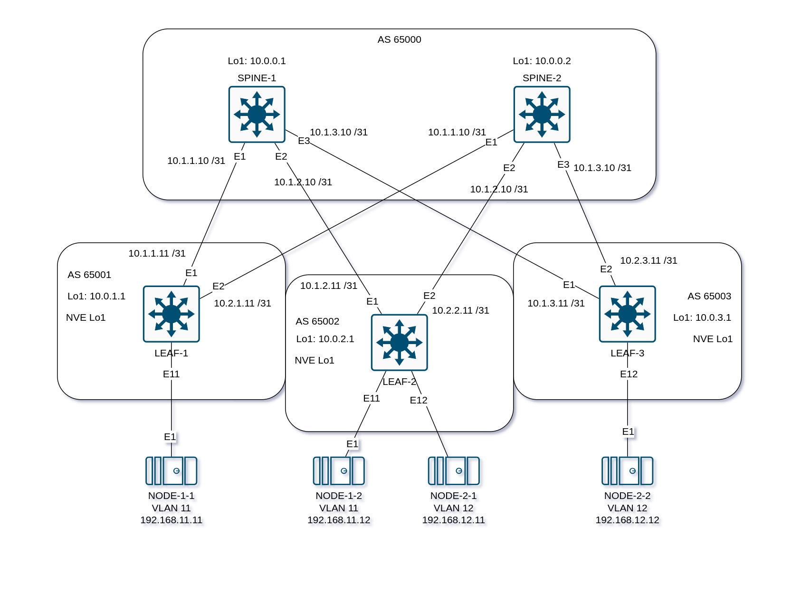

## Overlay. VxLAN EVPN L2

### Задача:

- Настроить BGP peering между Leaf и Spine в AF l2vpn evpn
- Проверить связанность между клиентами

## Выполнение:

### Схема сети



### Конфигурация оборудования

- #### [LEAF-1](config/LEAF-1.cfg)
```
vlan 11-12
!
interface Ethernet11
   switchport access vlan 11
   spanning-tree portfast
!
interface Ethernet12
   switchport access vlan 12
   spanning-tree portfast
!
interface Vxlan1
   vxlan source-interface Loopback1
   vxlan udp-port 4789
   vxlan vlan 11 vni 10011
   vxlan vlan 12 vni 10012
   vxlan learn-restrict any
!
router bgp 65001
   timers bgp 3 9
   maximum-paths 2 ecmp 2
   neighbor SPINE peer group
   neighbor SPINE remote-as 65000
   neighbor SPINE bfd
   neighbor SPINE allowas-in 1
   neighbor SPINE rib-in pre-policy retain all
   neighbor SPINE password 7 yVt/SxQ2cHkCSxO5ZSaL8G2JpeqOLEZj
   neighbor SPINE send-community extended
   neighbor 10.1.1.10 peer group SPINE
   neighbor 10.2.1.10 peer group SPINE
   !
   vlan 11
      rd 10.0.1.1:10011
      route-target both 192.168.11.0:10011
      redistribute learned
   !
   vlan 12
      rd 10.0.1.1:10012
      route-target both 192.168.12.0:10012
      redistribute learned
   !
   address-family evpn
      neighbor SPINE activate
   !
   address-family ipv4
      neighbor SPINE activate
      redistribute connected route-map RM_REDIST
```

- #### [LEAF-2](config/LEAF-2.cfg)
```
vlan 11-12
!
interface Ethernet11
   switchport access vlan 11
   spanning-tree portfast
!
interface Ethernet12
   switchport access vlan 12
   spanning-tree portfast
!
interface Vxlan1
   vxlan source-interface Loopback1
   vxlan udp-port 4789
   vxlan vlan 11 vni 10011
   vxlan vlan 12 vni 10012
   vxlan learn-restrict any
!
router bgp 65002
   timers bgp 3 9
   maximum-paths 2 ecmp 2
   neighbor SPINE peer group
   neighbor SPINE remote-as 65000
   neighbor SPINE bfd
   neighbor SPINE allowas-in 1
   neighbor SPINE rib-in pre-policy retain all
   neighbor SPINE password 7 yVt/SxQ2cHkCSxO5ZSaL8G2JpeqOLEZj
   neighbor SPINE send-community extended
   neighbor 10.1.1.10 peer group SPINE
   neighbor 10.2.1.10 peer group SPINE
   !
   vlan 11
      rd 10.0.2.1:10011
      route-target both 192.168.11.0:10011
      redistribute learned
   !
   vlan 12
      rd 10.0.2.1:10012
      route-target both 192.168.12.0:10012
      redistribute learned
   !
   address-family evpn
      neighbor SPINE activate
   !
   address-family ipv4
      neighbor SPINE activate
      redistribute connected route-map RM_REDIST
```

- #### [LEAF-3](config/LEAF-3.cfg)
```
vlan 11-12
!
interface Ethernet11
   switchport access vlan 11
   spanning-tree portfast
!
interface Ethernet12
   switchport access vlan 12
   spanning-tree portfast
!
interface Vxlan1
   vxlan source-interface Loopback1
   vxlan udp-port 4789
   vxlan vlan 11 vni 10011
   vxlan vlan 12 vni 10012
   vxlan learn-restrict any
!
router bgp 65003
   timers bgp 3 9
   maximum-paths 2 ecmp 2
   neighbor SPINE peer group
   neighbor SPINE remote-as 65000
   neighbor SPINE bfd
   neighbor SPINE allowas-in 1
   neighbor SPINE rib-in pre-policy retain all
   neighbor SPINE password 7 yVt/SxQ2cHkCSxO5ZSaL8G2JpeqOLEZj
   neighbor SPINE send-community extended
   neighbor 10.1.1.10 peer group SPINE
   neighbor 10.2.1.10 peer group SPINE
   !
   vlan 11
      rd 10.0.3.1:10011
      route-target both 192.168.11.0:10011
      redistribute learned
   !
   vlan 12
      rd 10.0.3.1:10012
      route-target both 192.168.12.0:10012
      redistribute learned
   !
   address-family evpn
      neighbor SPINE activate
   !
   address-family ipv4
      neighbor SPINE activate
      redistribute connected route-map RM_REDIST
```

- #### [SPINE-1](config/SPINE-1.cfg)
```
route-map RM_REDIST permit 10
   match interface Loopback1

peer-filter PF_ASN
   10 match as-range 65001-65003 result accept

router bgp 65000
   timers bgp 3 9
   maximum-paths 2 ecmp 2
   dynamic peer max 3
   bgp listen range 10.1.0.0/16 peer-group LEAF peer-filter PF_ASN
   neighbor LEAF peer group
   neighbor LEAF bfd
   neighbor LEAF allowas-in 1
   neighbor LEAF password 7 WLc8U3sGPGe6Xk+tMuueYJPEj/4fguUe
   neighbor LEAF send-community extended
   !
   address-family evpn
      neighbor LEAF activate
   !
   address-family ipv4
      neighbor LEAF activate
      redistribute connected route-map RM_REDIST
```

- #### [SPINE-2](config/SPINE-2.cfg)
```
route-map RM_REDIST permit 10
   match interface Loopback1

peer-filter PF_ASN
   10 match as-range 65001-65003 result accept

router bgp 65000
   timers bgp 3 9
   maximum-paths 2 ecmp 2
   dynamic peer max 3
   bgp listen range 10.2.0.0/16 peer-group LEAF peer-filter PF_ASN
   neighbor LEAF peer group
   neighbor LEAF bfd
   neighbor LEAF allowas-in 1
   neighbor LEAF password 7 WLc8U3sGPGe6Xk+tMuueYJPEj/4fguUe
   neighbor LEAF send-community extended
   !
   address-family evpn
      neighbor LEAF activate
   !
   address-family ipv4
      neighbor LEAF activate
      redistribute connected route-map RM_REDIST
```

### Проверка связанности клиентов по L2

- #### SPINE-1
```
SPINE-1#show bgp evpn summary
BGP summary information for VRF default
Router identifier 10.0.0.1, local AS number 65000
Neighbor Status Codes: m - Under maintenance
  Neighbor  V AS           MsgRcvd   MsgSent  InQ OutQ  Up/Down State   PfxRcd PfxAcc
  10.1.1.11 4 65001            291       300    0    0 00:11:39 Estab   9      9
  10.1.2.11 4 65002            562       564    0    0 00:22:59 Estab   9      9
  10.1.3.11 4 65003            238       235    0    0 00:09:13 Estab   9      9
```

- #### SPINE-2
```
SPINE-2#show bgp evpn summary
BGP summary information for VRF default
Router identifier 10.0.0.2, local AS number 65000
Neighbor Status Codes: m - Under maintenance
  Neighbor  V AS           MsgRcvd   MsgSent  InQ OutQ  Up/Down State   PfxRcd PfxAcc
  10.2.1.11 4 65001            570       573    0    0 00:23:33 Estab   4      4
  10.2.2.11 4 65002            573       568    0    0 00:23:34 Estab   5      5
  10.2.3.11 4 65003            242       246    0    0 00:09:52 Estab   4      4
```

- #### LEAF-1
```
LEAF-1#show ip route

VRF: default
Source Codes:
       C - connected, S - static, K - kernel,
       O - OSPF, IA - OSPF inter area, E1 - OSPF external type 1,
       E2 - OSPF external type 2, N1 - OSPF NSSA external type 1,
       N2 - OSPF NSSA external type2, B - Other BGP Routes,
       B I - iBGP, B E - eBGP, R - RIP, I L1 - IS-IS level 1,
       I L2 - IS-IS level 2, O3 - OSPFv3, A B - BGP Aggregate,
       A O - OSPF Summary, NG - Nexthop Group Static Route,
       V - VXLAN Control Service, M - Martian,
       DH - DHCP client installed default route,
       DP - Dynamic Policy Route, L - VRF Leaked,
       G  - gRIBI, RC - Route Cache Route,
       CL - CBF Leaked Route

Gateway of last resort is not set

 B E      10.0.0.1/32 [200/0]
           via 10.1.1.10, Ethernet1
 B E      10.0.0.2/32 [200/0]
           via 10.2.1.10, Ethernet2
 C        10.0.1.1/32
           directly connected, Loopback1
 B E      10.0.2.1/32 [200/0]
           via 10.1.1.10, Ethernet1
           via 10.2.1.10, Ethernet2
 B E      10.0.3.1/32 [200/0]
           via 10.1.1.10, Ethernet1
           via 10.2.1.10, Ethernet2
 C        10.1.1.10/31
           directly connected, Ethernet1
 C        10.2.1.10/31
           directly connected, Ethernet2
 C        192.168.122.0/24
           directly connected, Management0

LEAF-1#show ip bgp summary
BGP summary information for VRF default
Router identifier 10.0.1.1, local AS number 65001
Neighbor Status Codes: m - Under maintenance
  Neighbor  V AS           MsgRcvd   MsgSent  InQ OutQ  Up/Down State   PfxRcd PfxAcc
  10.1.1.10 4 65000            665       660    0    0 00:15:37 Estab   4      4
  10.2.1.10 4 65000            649       647    0    0 00:26:52 Estab   4      4

LEAF-1#show vxlan address-table
          Vxlan Mac Address Table
----------------------------------------------------------------------

VLAN  Mac Address     Type      Prt  VTEP             Moves   Last Move
----  -----------     ----      ---  ----             -----   ---------
  11  0050.7966.6803  EVPN      Vx1  10.0.2.1         1       0:09:35 ago
  12  0050.7966.6801  EVPN      Vx1  10.0.2.1         1       0:10:11 ago
  12  0cd5.560f.0000  EVPN      Vx1  10.0.3.1         1       0:11:27 ago
Total Remote Mac Addresses for this criterion: 3
LEAF-1#show vxlan vtep
Remote VTEPS for Vxlan1:

VTEP           Tunnel Type(s)
-------------- --------------
10.0.2.1       unicast, flood
10.0.3.1       unicast, flood

Total number of remote VTEPS:  2

LEAF-1#show bgp evpn route-type mac-ip
BGP routing table information for VRF default
Router identifier 10.0.1.1, local AS number 65001
Route status codes: * - valid, > - active, S - Stale, E - ECMP head, e - ECMP
                    c - Contributing to ECMP, % - Pending best path selection
Origin codes: i - IGP, e - EGP, ? - incomplete
AS Path Attributes: Or-ID - Originator ID, C-LST - Cluster List, LL Nexthop - Link Local Nexthop

          Network                Next Hop              Metric  LocPref Weight  Path
 * >Ec    RD: 10.0.2.1:10012 mac-ip 0050.7966.6801
                                 10.0.2.1              -       100     0       65000 65002 i
 *  ec    RD: 10.0.2.1:10012 mac-ip 0050.7966.6801
                                 10.0.2.1              -       100     0       65000 65002 i
 * >      RD: 10.0.1.1:10011 mac-ip 0050.7966.6802
                                 -                     -       -       0       i
 * >Ec    RD: 10.0.2.1:10011 mac-ip 0050.7966.6803
                                 10.0.2.1              -       100     0       65000 65002 i
 *  ec    RD: 10.0.2.1:10011 mac-ip 0050.7966.6803
                                 10.0.2.1              -       100     0       65000 65002 i
 * >Ec    RD: 10.0.3.1:10012 mac-ip 0cd5.560f.0000
                                 10.0.3.1              -       100     0       65000 65003 i
 *  ec    RD: 10.0.3.1:10012 mac-ip 0cd5.560f.0000
                                 10.0.3.1              -       100     0       65000 65003 i

LEAF-1#show interfaces vxlan 1
Vxlan1 is up, line protocol is up (connected)
  Hardware is Vxlan
  Source interface is Loopback1 and is active with 10.0.1.1
  Listening on UDP port 4789
  Replication/Flood Mode is headend with Flood List Source: EVPN
  Remote MAC learning via EVPN
  VNI mapping to VLANs
  Static VLAN to VNI mapping is
    [11, 10011]       [12, 10012]
  Note: All Dynamic VLANs used by VCS are internal VLANs.
        Use 'show vxlan vni' for details.
  Static VRF to VNI mapping is not configured
  Headend replication flood vtep list is:
    11 10.0.2.1        10.0.3.1
    12 10.0.2.1        10.0.3.1
  Shared Router MAC is 0000.0000.0000

LEAF-1#show vxlan vni
VNI to VLAN Mapping for Vxlan1
VNI         VLAN       Source       Interface        802.1Q Tag
----------- ---------- ------------ ---------------- ----------
10011       11         static       Ethernet11       untagged
                                    Vxlan1           11
10012       12         static       Ethernet12       untagged
                                    Vxlan1           12

VNI to dynamic VLAN Mapping for Vxlan1
VNI       VLAN       VRF       Source
--------- ---------- --------- ------------
```

- #### LEAF-2
```
LEAF-2#show ip route

VRF: default
Source Codes:
       C - connected, S - static, K - kernel,
       O - OSPF, IA - OSPF inter area, E1 - OSPF external type 1,
       E2 - OSPF external type 2, N1 - OSPF NSSA external type 1,
       N2 - OSPF NSSA external type2, B - Other BGP Routes,
       B I - iBGP, B E - eBGP, R - RIP, I L1 - IS-IS level 1,
       I L2 - IS-IS level 2, O3 - OSPFv3, A B - BGP Aggregate,
       A O - OSPF Summary, NG - Nexthop Group Static Route,
       V - VXLAN Control Service, M - Martian,
       DH - DHCP client installed default route,
       DP - Dynamic Policy Route, L - VRF Leaked,
       G  - gRIBI, RC - Route Cache Route,
       CL - CBF Leaked Route

Gateway of last resort is not set

 B E      10.0.0.1/32 [200/0]
           via 10.1.2.10, Ethernet1
 B E      10.0.0.2/32 [200/0]
           via 10.2.2.10, Ethernet2
 B E      10.0.1.1/32 [200/0]
           via 10.1.2.10, Ethernet1
           via 10.2.2.10, Ethernet2
 C        10.0.2.1/32
           directly connected, Loopback1
 B E      10.0.3.1/32 [200/0]
           via 10.1.2.10, Ethernet1
           via 10.2.2.10, Ethernet2
 C        10.1.2.10/31
           directly connected, Ethernet1
 C        10.2.2.10/31
           directly connected, Ethernet2
 C        192.168.122.0/24
           directly connected, Management0

LEAF-2#show ip bgp summary
BGP summary information for VRF default
Router identifier 10.0.2.1, local AS number 65002
Neighbor Status Codes: m - Under maintenance
  Neighbor  V AS           MsgRcvd   MsgSent  InQ OutQ  Up/Down State   PfxRcd PfxAcc
  10.1.2.10 4 65000            629       625    0    0 00:25:43 Estab   3      3
  10.2.2.10 4 65000            618       622    0    0 00:25:39 Estab   3      3
LEAF-2#show vxlan address-table
          Vxlan Mac Address Table
----------------------------------------------------------------------

VLAN  Mac Address     Type      Prt  VTEP             Moves   Last Move
----  -----------     ----      ---  ----             -----   ---------
  11  0050.7966.6802  EVPN      Vx1  10.0.1.1         1       0:08:21 ago
  12  0cd5.560f.0000  EVPN      Vx1  10.0.3.1         1       0:10:13 ago
Total Remote Mac Addresses for this criterion: 2

LEAF-2#show vxlan vtep
Remote VTEPS for Vxlan1:

VTEP           Tunnel Type(s)
-------------- --------------
10.0.1.1       flood, unicast
10.0.3.1       flood, unicast

Total number of remote VTEPS:  2

LEAF-2#show bgp evpn route-type mac-ip
BGP routing table information for VRF default
Router identifier 10.0.2.1, local AS number 65002
Route status codes: * - valid, > - active, S - Stale, E - ECMP head, e - ECMP
                    c - Contributing to ECMP, % - Pending best path selection
Origin codes: i - IGP, e - EGP, ? - incomplete
AS Path Attributes: Or-ID - Originator ID, C-LST - Cluster List, LL Nexthop - Link Local Nexthop

          Network                Next Hop              Metric  LocPref Weight  Path
 * >      RD: 10.0.2.1:10012 mac-ip 0050.7966.6801
                                 -                     -       -       0       i
 * >Ec    RD: 10.0.1.1:10011 mac-ip 0050.7966.6802
                                 10.0.1.1              -       100     0       65000 65001 i
 *  ec    RD: 10.0.1.1:10011 mac-ip 0050.7966.6802
                                 10.0.1.1              -       100     0       65000 65001 i
 * >      RD: 10.0.2.1:10011 mac-ip 0050.7966.6803
                                 -                     -       -       0       i
 * >Ec    RD: 10.0.3.1:10012 mac-ip 0cd5.560f.0000
                                 10.0.3.1              -       100     0       65000 65003 i
 *  ec    RD: 10.0.3.1:10012 mac-ip 0cd5.560f.0000
                                 10.0.3.1              -       100     0       65000 65003 i

LEAF-2#show interfaces vxlan 1
Vxlan1 is up, line protocol is up (connected)
  Hardware is Vxlan
  Source interface is Loopback1 and is active with 10.0.2.1
  Listening on UDP port 4789
  Replication/Flood Mode is headend with Flood List Source: EVPN
  Remote MAC learning via EVPN
  VNI mapping to VLANs
  Static VLAN to VNI mapping is
    [11, 10011]       [12, 10012]
  Note: All Dynamic VLANs used by VCS are internal VLANs.
        Use 'show vxlan vni' for details.
  Static VRF to VNI mapping is not configured
  Headend replication flood vtep list is:
    11 10.0.1.1        10.0.3.1
    12 10.0.1.1        10.0.3.1
  Shared Router MAC is 0000.0000.0000

LEAF-2#show vxlan vni
VNI to VLAN Mapping for Vxlan1
VNI         VLAN       Source       Interface        802.1Q Tag
----------- ---------- ------------ ---------------- ----------
10011       11         static       Ethernet11       untagged
                                    Vxlan1           11
10012       12         static       Ethernet12       untagged
                                    Vxlan1           12

VNI to dynamic VLAN Mapping for Vxlan1
VNI       VLAN       VRF       Source
--------- ---------- --------- ------------
```

- #### LEAF-3
```
LEAF-3#show ip route

VRF: default
Source Codes:
       C - connected, S - static, K - kernel,
       O - OSPF, IA - OSPF inter area, E1 - OSPF external type 1,
       E2 - OSPF external type 2, N1 - OSPF NSSA external type 1,
       N2 - OSPF NSSA external type2, B - Other BGP Routes,
       B I - iBGP, B E - eBGP, R - RIP, I L1 - IS-IS level 1,
       I L2 - IS-IS level 2, O3 - OSPFv3, A B - BGP Aggregate,
       A O - OSPF Summary, NG - Nexthop Group Static Route,
       V - VXLAN Control Service, M - Martian,
       DH - DHCP client installed default route,
       DP - Dynamic Policy Route, L - VRF Leaked,
       G  - gRIBI, RC - Route Cache Route,
       CL - CBF Leaked Route

Gateway of last resort is not set

 B E      10.0.0.1/32 [200/0]
           via 10.1.3.10, Ethernet1
 B E      10.0.0.2/32 [200/0]
           via 10.2.3.10, Ethernet2
 B E      10.0.1.1/32 [200/0]
           via 10.1.3.10, Ethernet1
           via 10.2.3.10, Ethernet2
 B E      10.0.2.1/32 [200/0]
           via 10.1.3.10, Ethernet1
           via 10.2.3.10, Ethernet2
 C        10.0.3.1/32
           directly connected, Loopback1
 C        10.1.3.10/31
           directly connected, Ethernet1
 C        10.2.3.10/31
           directly connected, Ethernet2
 C        192.168.122.0/24
           directly connected, Management0

LEAF-3#show ip bgp summary
BGP summary information for VRF default
Router identifier 10.0.3.1, local AS number 65003
Neighbor Status Codes: m - Under maintenance
  Neighbor  V AS           MsgRcvd   MsgSent  InQ OutQ  Up/Down State   PfxRcd PfxAcc
  10.1.3.10 4 65000            341       344    0    0 00:13:47 Estab   4      4
  10.2.3.10 4 65000            337       334    0    0 00:13:47 Estab   4      4

LEAF-3#show vxlan address-table
          Vxlan Mac Address Table
----------------------------------------------------------------------

VLAN  Mac Address     Type      Prt  VTEP             Moves   Last Move
----  -----------     ----      ---  ----             -----   ---------
  11  0050.7966.6802  EVPN      Vx1  10.0.1.1         1       0:10:11 ago
  11  0050.7966.6803  EVPN      Vx1  10.0.2.1         1       0:10:11 ago
  12  0050.7966.6801  EVPN      Vx1  10.0.2.1         1       0:10:48 ago
Total Remote Mac Addresses for this criterion: 3

LEAF-3#show vxlan vtep
Remote VTEPS for Vxlan1:

VTEP           Tunnel Type(s)
-------------- --------------
10.0.1.1       unicast, flood
10.0.2.1       unicast, flood

Total number of remote VTEPS:  2

LEAF-3#show bgp evpn route-type mac-ip
BGP routing table information for VRF default
Router identifier 10.0.3.1, local AS number 65003
Route status codes: * - valid, > - active, S - Stale, E - ECMP head, e - ECMP
                    c - Contributing to ECMP, % - Pending best path selection
Origin codes: i - IGP, e - EGP, ? - incomplete
AS Path Attributes: Or-ID - Originator ID, C-LST - Cluster List, LL Nexthop - Link Local Nexthop

          Network                Next Hop              Metric  LocPref Weight  Path
 * >Ec    RD: 10.0.2.1:10012 mac-ip 0050.7966.6801
                                 10.0.2.1              -       100     0       65000 65002 i
 *  ec    RD: 10.0.2.1:10012 mac-ip 0050.7966.6801
                                 10.0.2.1              -       100     0       65000 65002 i
 * >Ec    RD: 10.0.1.1:10011 mac-ip 0050.7966.6802
                                 10.0.1.1              -       100     0       65000 65001 i
 *  ec    RD: 10.0.1.1:10011 mac-ip 0050.7966.6802
                                 10.0.1.1              -       100     0       65000 65001 i
 * >Ec    RD: 10.0.2.1:10011 mac-ip 0050.7966.6803
                                 10.0.2.1              -       100     0       65000 65002 i
 *  ec    RD: 10.0.2.1:10011 mac-ip 0050.7966.6803
                                 10.0.2.1              -       100     0       65000 65002 i
 * >      RD: 10.0.3.1:10012 mac-ip 0cd5.560f.0000
                                 -                     -       -       0       i

LEAF-3#show interfaces vxlan 1
Vxlan1 is up, line protocol is up (connected)
  Hardware is Vxlan
  Source interface is Loopback1 and is active with 10.0.3.1
  Listening on UDP port 4789
  Replication/Flood Mode is headend with Flood List Source: EVPN
  Remote MAC learning via EVPN
  VNI mapping to VLANs
  Static VLAN to VNI mapping is
    [11, 10011]       [12, 10012]
  Note: All Dynamic VLANs used by VCS are internal VLANs.
        Use 'show vxlan vni' for details.
  Static VRF to VNI mapping is not configured
  Headend replication flood vtep list is:
    11 10.0.1.1        10.0.2.1
    12 10.0.1.1        10.0.2.1
  Shared Router MAC is 0000.0000.0000

LEAF-3#show vxlan vni
VNI to VLAN Mapping for Vxlan1
VNI         VLAN       Source       Interface        802.1Q Tag
----------- ---------- ------------ ---------------- ----------
10011       11         static       Ethernet11       untagged
                                    Vxlan1           11
10012       12         static       Ethernet12       untagged
                                    Vxlan1           12

VNI to dynamic VLAN Mapping for Vxlan1
VNI       VLAN       VRF       Source
--------- ---------- --------- ------------
```
