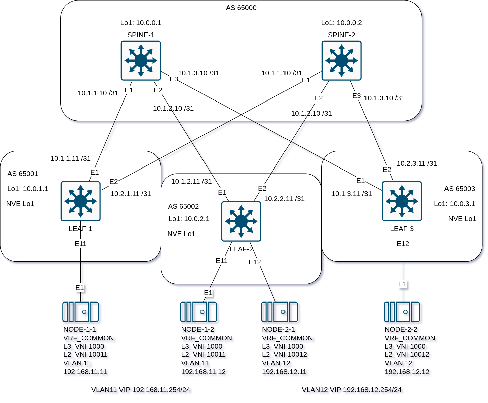

## Overlay. VxLAN EVPN L3

### Задача:

- Настроить клиентов в разных VNI
- Настроить маршрутизацию между клиентами 
- Проверить связанность между клиентами

## Выполнение:

### Схема сети



### Конфигурация оборудования

- #### [LEAF-1](config/LEAF-1.cfg)

```
vlan 11
!
vrf instance VRF_COMMON
!
interface Ethernet11
   switchport access vlan 11
   spanning-tree portfast
!
interface Vlan11
   vrf VRF_COMMON
   ip address virtual 192.168.11.254/24
!
interface Vxlan1
   vxlan source-interface Loopback1
   vxlan udp-port 4789
   vxlan vlan 11 vni 10011
   vxlan vrf VRF_COMMON vni 1000
!
ip virtual-router mac-address 00:00:00:00:00:01
!
ip routing vrf VRF_COMMON
!
router bgp 65001
   vlan 11
      rd 10.0.1.1:10011
      route-target both 192.168.11.0:10011
      redistribute learned
   !
   vrf VRF_COMMON
      rd 10.0.1.1:1000
      route-target import evpn 1000:1000
      route-target export evpn 1000:1000
      redistribute connected
```

- #### [LEAF-2](config/LEAF-2.cfg)

```
vlan 11-12
!
vrf instance VRF_COMMON
!
interface Ethernet11
   switchport access vlan 11
   spanning-tree portfast
!
interface Ethernet12
   switchport access vlan 12
   spanning-tree portfast
!
interface Vlan11
   vrf VRF_COMMON
   ip address virtual 192.168.11.254/24
!
interface Vlan12
   vrf VRF_COMMON
   ip address virtual 192.168.12.254/24
!
interface Vxlan1
   vxlan source-interface Loopback1
   vxlan udp-port 4789
   vxlan vlan 11 vni 10011
   vxlan vlan 12 vni 10012
   vxlan vrf VRF_COMMON vni 1000
!
ip virtual-router mac-address 00:00:00:00:00:01
!
ip routing vrf VRF_COMMON
!
router bgp 65002
   vlan 11
      rd 10.0.2.1:10011
      route-target both 192.168.11.0:10011
      redistribute learned
   !
   vlan 12
      rd 10.0.2.1:10012
      route-target both 192.168.12.0:10012
      redistribute learned
   !
   vrf VRF_COMMON
      rd 10.0.2.1:1000
      route-target import evpn 1000:1000
      route-target export evpn 1000:1000
      redistribute connected

```

- #### [LEAF-3](config/LEAF-3.cfg)

```
vlan 12
!
vrf instance VRF_COMMON
!
interface Ethernet12
   switchport access vlan 12
   spanning-tree portfast
!
interface Vlan12
   vrf VRF_COMMON
   ip address virtual 192.168.12.254/24
!
interface Vxlan1
   vxlan source-interface Loopback1
   vxlan udp-port 4789
   vxlan vlan 12 vni 10012
   vxlan vrf VRF_COMMON vni 1000
!
ip virtual-router mac-address 00:00:00:00:00:01
!
ip routing vrf VRF_COMMON
!
router bgp 65003
   vlan 12
      rd 10.0.3.1:10012
      route-target both 192.168.12.0:10012
      redistribute learned
   !
   vrf VRF_COMMON
      rd 10.0.3.1:1000
      route-target import evpn 1000:1000
      route-target export evpn 1000:1000
      redistribute connected
```
---

### Проверка конфигурации LEAF

- #### LEAF-1

```
LLEAF-1#show ip route vrf VRF_COMMON
VRF: VRF_COMMON
Source Codes:
       C - connected, S - static, K - kernel,
       O - OSPF, IA - OSPF inter area, E1 - OSPF external type 1,
       E2 - OSPF external type 2, N1 - OSPF NSSA external type 1,
       N2 - OSPF NSSA external type2, B - Other BGP Routes,
       B I - iBGP, B E - eBGP, R - RIP, I L1 - IS-IS level 1,
       I L2 - IS-IS level 2, O3 - OSPFv3, A B - BGP Aggregate,
       A O - OSPF Summary, NG - Nexthop Group Static Route,
       V - VXLAN Control Service, M - Martian,
       DH - DHCP client installed default route,
       DP - Dynamic Policy Route, L - VRF Leaked,
       G  - gRIBI, RC - Route Cache Route,
       CL - CBF Leaked Route

Gateway of last resort is not set

 B E      192.168.11.12/32 [20/0]
           via VTEP 10.0.2.1 VNI 1000 router-mac 6a:2f:0e:74:52:a1 local-interface Vxlan1
 C        192.168.11.0/24
           directly connected, Vlan11
 B E      192.168.12.11/32 [20/0]
           via VTEP 10.0.2.1 VNI 1000 router-mac 6a:2f:0e:74:52:a1 local-interface Vxlan1
 B E      192.168.12.12/32 [20/0]
           via VTEP 10.0.3.1 VNI 1000 router-mac 22:07:e5:27:44:34 local-interface Vxlan1
 B E      192.168.12.0/24 [20/0]
           via VTEP 10.0.3.1 VNI 1000 router-mac 22:07:e5:27:44:34 local-interface Vxlan1
           via VTEP 10.0.2.1 VNI 1000 router-mac 6a:2f:0e:74:52:a1 local-interface Vxlan1

LEAF-1#show bgp evpn route-type ip-prefix ipv4
BGP routing table information for VRF default
Router identifier 10.0.1.1, local AS number 65001
Route status codes: * - valid, > - active, S - Stale, E - ECMP head, e - ECMP
                    c - Contributing to ECMP, % - Pending best path selection
Origin codes: i - IGP, e - EGP, ? - incomplete
AS Path Attributes: Or-ID - Originator ID, C-LST - Cluster List, LL Nexthop - Link Local Nexthop

          Network                Next Hop              Metric  LocPref Weight  Path
 * >      RD: 10.0.1.1:1000 ip-prefix 192.168.11.0/24
                                 -                     -       -       0       i
 * >Ec    RD: 10.0.2.1:1000 ip-prefix 192.168.11.0/24
                                 10.0.2.1              -       100     0       65000 65002 i
 *  ec    RD: 10.0.2.1:1000 ip-prefix 192.168.11.0/24
                                 10.0.2.1              -       100     0       65000 65002 i
 * >Ec    RD: 10.0.2.1:1000 ip-prefix 192.168.12.0/24
                                 10.0.2.1              -       100     0       65000 65002 i
 *  ec    RD: 10.0.2.1:1000 ip-prefix 192.168.12.0/24
                                 10.0.2.1              -       100     0       65000 65002 i
 * >Ec    RD: 10.0.3.1:1000 ip-prefix 192.168.12.0/24
                                 10.0.3.1              -       100     0       65000 65003 i
 *  ec    RD: 10.0.3.1:1000 ip-prefix 192.168.12.0/24
                                 10.0.3.1              -       100     0       65000 65003 i

LEAF-1#show bgp evpn route-type mac-ip
BGP routing table information for VRF default
Router identifier 10.0.1.1, local AS number 65001
Route status codes: * - valid, > - active, S - Stale, E - ECMP head, e - ECMP
                    c - Contributing to ECMP, % - Pending best path selection
Origin codes: i - IGP, e - EGP, ? - incomplete
AS Path Attributes: Or-ID - Originator ID, C-LST - Cluster List, LL Nexthop - Link Local Nexthop

          Network                Next Hop              Metric  LocPref Weight  Path
 * >Ec    RD: 10.0.2.1:10012 mac-ip 0050.7966.6801
                                 10.0.2.1              -       100     0       65000 65002 i
 *  ec    RD: 10.0.2.1:10012 mac-ip 0050.7966.6801
                                 10.0.2.1              -       100     0       65000 65002 i
 * >Ec    RD: 10.0.2.1:10012 mac-ip 0050.7966.6801 192.168.12.11
                                 10.0.2.1              -       100     0       65000 65002 i
 *  ec    RD: 10.0.2.1:10012 mac-ip 0050.7966.6801 192.168.12.11
                                 10.0.2.1              -       100     0       65000 65002 i
 * >      RD: 10.0.1.1:10011 mac-ip 0050.7966.6802
                                 -                     -       -       0       i
 * >      RD: 10.0.1.1:10011 mac-ip 0050.7966.6802 192.168.11.11
                                 -                     -       -       0       i
 * >Ec    RD: 10.0.2.1:10011 mac-ip 0050.7966.6803
                                 10.0.2.1              -       100     0       65000 65002 i
 *  ec    RD: 10.0.2.1:10011 mac-ip 0050.7966.6803
                                 10.0.2.1              -       100     0       65000 65002 i
 * >Ec    RD: 10.0.2.1:10011 mac-ip 0050.7966.6803 192.168.11.12
                                 10.0.2.1              -       100     0       65000 65002 i
 *  ec    RD: 10.0.2.1:10011 mac-ip 0050.7966.6803 192.168.11.12
                                 10.0.2.1              -       100     0       65000 65002 i
 * >Ec    RD: 10.0.3.1:10012 mac-ip 0cd5.560f.0000
                                 10.0.3.1              -       100     0       65000 65003 i
 *  ec    RD: 10.0.3.1:10012 mac-ip 0cd5.560f.0000
                                 10.0.3.1              -       100     0       65000 65003 i
 * >Ec    RD: 10.0.3.1:10012 mac-ip 0cd5.560f.0000 192.168.12.12
                                 10.0.3.1              -       100     0       65000 65003 i
 *  ec    RD: 10.0.3.1:10012 mac-ip 0cd5.560f.0000 192.168.12.12
                                 10.0.3.1              -       100     0       65000 65003 i

LEAF-1#show arp vrf VRF_COMMON
Address         Age (sec)  Hardware Addr   Interface
192.168.11.11     0:00:41  0050.7966.6802  Vlan11, Ethernet11
192.168.11.12           -  0050.7966.6803  Vlan11, Vxlan1

LEAF-1#show interfaces vxlan 1
Vxlan1 is up, line protocol is up (connected)
  Hardware is Vxlan
  Source interface is Loopback1 and is active with 10.0.1.1
  Listening on UDP port 4789
  Replication/Flood Mode is headend with Flood List Source: EVPN
  Remote MAC learning via EVPN
  VNI mapping to VLANs
  Static VLAN to VNI mapping is
    [11, 10011]
  Dynamic VLAN to VNI mapping for 'evpn' is
    [4094, 1000]
  Note: All Dynamic VLANs used by VCS are internal VLANs.
        Use 'show vxlan vni' for details.
  Static VRF to VNI mapping is
   [VRF_COMMON, 1000]
  Headend replication flood vtep list is:
    11 10.0.2.1
  Shared Router MAC is 0000.0000.0000
LEAF-1#show vxlan vni
VNI to VLAN Mapping for Vxlan1
VNI         VLAN       Source       Interface        802.1Q Tag
----------- ---------- ------------ ---------------- ----------
10011       11         static       Ethernet11       untagged
                                    Vxlan1           11

VNI to dynamic VLAN Mapping for Vxlan1
VNI        VLAN       VRF              Source
---------- ---------- ---------------- ------------
1000       4094       VRF_COMMON       evpn

LEAF-1#

```

- #### LEAF-2

```
LEAF-2#show ip route vrf VRF_COMMON
VRF: VRF_COMMON
Source Codes:
       C - connected, S - static, K - kernel,
       O - OSPF, IA - OSPF inter area, E1 - OSPF external type 1,
       E2 - OSPF external type 2, N1 - OSPF NSSA external type 1,
       N2 - OSPF NSSA external type2, B - Other BGP Routes,
       B I - iBGP, B E - eBGP, R - RIP, I L1 - IS-IS level 1,
       I L2 - IS-IS level 2, O3 - OSPFv3, A B - BGP Aggregate,
       A O - OSPF Summary, NG - Nexthop Group Static Route,
       V - VXLAN Control Service, M - Martian,
       DH - DHCP client installed default route,
       DP - Dynamic Policy Route, L - VRF Leaked,
       G  - gRIBI, RC - Route Cache Route,
       CL - CBF Leaked Route

Gateway of last resort is not set

 B E      192.168.11.11/32 [20/0]
           via VTEP 10.0.1.1 VNI 1000 router-mac ea:a6:95:3a:4b:97 local-interface Vxlan1
 C        192.168.11.0/24
           directly connected, Vlan11
 B E      192.168.12.12/32 [20/0]
           via VTEP 10.0.3.1 VNI 1000 router-mac 22:07:e5:27:44:34 local-interface Vxlan1
 C        192.168.12.0/24
           directly connected, Vlan12

LEAF-2#show bgp evpn route-type ip-prefix ipv4
BGP routing table information for VRF default
Router identifier 10.0.2.1, local AS number 65002
Route status codes: * - valid, > - active, S - Stale, E - ECMP head, e - ECMP
                    c - Contributing to ECMP, % - Pending best path selection
Origin codes: i - IGP, e - EGP, ? - incomplete
AS Path Attributes: Or-ID - Originator ID, C-LST - Cluster List, LL Nexthop - Link Local Nexthop

          Network                Next Hop              Metric  LocPref Weight  Path
 * >Ec    RD: 10.0.1.1:1000 ip-prefix 192.168.11.0/24
                                 10.0.1.1              -       100     0       65000 65001 i
 *  ec    RD: 10.0.1.1:1000 ip-prefix 192.168.11.0/24
                                 10.0.1.1              -       100     0       65000 65001 i
 * >      RD: 10.0.2.1:1000 ip-prefix 192.168.11.0/24
                                 -                     -       -       0       i
 * >      RD: 10.0.2.1:1000 ip-prefix 192.168.12.0/24
                                 -                     -       -       0       i
 * >Ec    RD: 10.0.3.1:1000 ip-prefix 192.168.12.0/24
                                 10.0.3.1              -       100     0       65000 65003 i
 *  ec    RD: 10.0.3.1:1000 ip-prefix 192.168.12.0/24
                                 10.0.3.1              -       100     0       65000 65003 i

LEAF-2#show bgp evpn route-type mac-ip
BGP routing table information for VRF default
Router identifier 10.0.2.1, local AS number 65002
Route status codes: * - valid, > - active, S - Stale, E - ECMP head, e - ECMP
                    c - Contributing to ECMP, % - Pending best path selection
Origin codes: i - IGP, e - EGP, ? - incomplete
AS Path Attributes: Or-ID - Originator ID, C-LST - Cluster List, LL Nexthop - Link Local Nexthop

          Network                Next Hop              Metric  LocPref Weight  Path
 * >      RD: 10.0.2.1:10012 mac-ip 0050.7966.6801
                                 -                     -       -       0       i
 * >      RD: 10.0.2.1:10012 mac-ip 0050.7966.6801 192.168.12.11
                                 -                     -       -       0       i
 * >Ec    RD: 10.0.1.1:10011 mac-ip 0050.7966.6802
                                 10.0.1.1              -       100     0       65000 65001 i
 *  ec    RD: 10.0.1.1:10011 mac-ip 0050.7966.6802
                                 10.0.1.1              -       100     0       65000 65001 i
 * >Ec    RD: 10.0.1.1:10011 mac-ip 0050.7966.6802 192.168.11.11
                                 10.0.1.1              -       100     0       65000 65001 i
 *  ec    RD: 10.0.1.1:10011 mac-ip 0050.7966.6802 192.168.11.11
                                 10.0.1.1              -       100     0       65000 65001 i
 * >      RD: 10.0.2.1:10011 mac-ip 0050.7966.6803
                                 -                     -       -       0       i
 * >      RD: 10.0.2.1:10011 mac-ip 0050.7966.6803 192.168.11.12
                                 -                     -       -       0       i
 * >Ec    RD: 10.0.3.1:10012 mac-ip 0cd5.560f.0000
                                 10.0.3.1              -       100     0       65000 65003 i
 *  ec    RD: 10.0.3.1:10012 mac-ip 0cd5.560f.0000
                                 10.0.3.1              -       100     0       65000 65003 i
 * >Ec    RD: 10.0.3.1:10012 mac-ip 0cd5.560f.0000 192.168.12.12
                                 10.0.3.1              -       100     0       65000 65003 i
 *  ec    RD: 10.0.3.1:10012 mac-ip 0cd5.560f.0000 192.168.12.12
                                 10.0.3.1              -       100     0       65000 65003 i

LEAF-2#show arp vrf VRF_COMMON
Address         Age (sec)  Hardware Addr   Interface
192.168.11.11           -  0050.7966.6802  Vlan11, Vxlan1
192.168.11.12     0:03:43  0050.7966.6803  Vlan11, Ethernet11
192.168.12.11     0:01:42  0050.7966.6801  Vlan12, Ethernet12
192.168.12.12           -  0cd5.560f.0000  Vlan12, Vxlan1

LEAF-2#show interfaces vxlan 1
Vxlan1 is up, line protocol is up (connected)
  Hardware is Vxlan
  Source interface is Loopback1 and is active with 10.0.2.1
  Listening on UDP port 4789
  Replication/Flood Mode is headend with Flood List Source: EVPN
  Remote MAC learning via EVPN
  VNI mapping to VLANs
  Static VLAN to VNI mapping is
    [11, 10011]       [12, 10012]
  Dynamic VLAN to VNI mapping for 'evpn' is
    [4093, 1000]
  Note: All Dynamic VLANs used by VCS are internal VLANs.
        Use 'show vxlan vni' for details.
  Static VRF to VNI mapping is
   [VRF_COMMON, 1000]
  Headend replication flood vtep list is:
    11 10.0.1.1
    12 10.0.3.1
  Shared Router MAC is 0000.0000.0000

LEAF-2#show vxlan vni
VNI to VLAN Mapping for Vxlan1
VNI         VLAN       Source       Interface        802.1Q Tag
----------- ---------- ------------ ---------------- ----------
10011       11         static       Ethernet11       untagged
                                    Vxlan1           11
10012       12         static       Ethernet12       untagged
                                    Vxlan1           12

VNI to dynamic VLAN Mapping for Vxlan1
VNI        VLAN       VRF              Source
---------- ---------- ---------------- ------------
1000       4093       VRF_COMMON       evpn

LEAF-2#
```

- #### LEAF-3

```
LEAF-3#show ip route vrf VRF_COMMON
VRF: VRF_COMMON
Source Codes:
       C - connected, S - static, K - kernel,
       O - OSPF, IA - OSPF inter area, E1 - OSPF external type 1,
       E2 - OSPF external type 2, N1 - OSPF NSSA external type 1,
       N2 - OSPF NSSA external type2, B - Other BGP Routes,
       B I - iBGP, B E - eBGP, R - RIP, I L1 - IS-IS level 1,
       I L2 - IS-IS level 2, O3 - OSPFv3, A B - BGP Aggregate,
       A O - OSPF Summary, NG - Nexthop Group Static Route,
       V - VXLAN Control Service, M - Martian,
       DH - DHCP client installed default route,
       DP - Dynamic Policy Route, L - VRF Leaked,
       G  - gRIBI, RC - Route Cache Route,
       CL - CBF Leaked Route

Gateway of last resort is not set

 B E      192.168.11.11/32 [20/0]
           via VTEP 10.0.1.1 VNI 1000 router-mac ea:a6:95:3a:4b:97 local-interface Vxlan1
 B E      192.168.11.12/32 [20/0]
           via VTEP 10.0.2.1 VNI 1000 router-mac 6a:2f:0e:74:52:a1 local-interface Vxlan1
 B E      192.168.11.0/24 [20/0]
           via VTEP 10.0.1.1 VNI 1000 router-mac ea:a6:95:3a:4b:97 local-interface Vxlan1
           via VTEP 10.0.2.1 VNI 1000 router-mac 6a:2f:0e:74:52:a1 local-interface Vxlan1
 B E      192.168.12.11/32 [20/0]
           via VTEP 10.0.2.1 VNI 1000 router-mac 6a:2f:0e:74:52:a1 local-interface Vxlan1
 C        192.168.12.0/24
           directly connected, Vlan12

LEAF-3#show bgp evpn route-type ip-prefix ipv4
BGP routing table information for VRF default
Router identifier 10.0.3.1, local AS number 65003
Route status codes: * - valid, > - active, S - Stale, E - ECMP head, e - ECMP
                    c - Contributing to ECMP, % - Pending best path selection
Origin codes: i - IGP, e - EGP, ? - incomplete
AS Path Attributes: Or-ID - Originator ID, C-LST - Cluster List, LL Nexthop - Link Local Nexthop

          Network                Next Hop              Metric  LocPref Weight  Path
 * >Ec    RD: 10.0.1.1:1000 ip-prefix 192.168.11.0/24
                                 10.0.1.1              -       100     0       65000 65001 i
 *  ec    RD: 10.0.1.1:1000 ip-prefix 192.168.11.0/24
                                 10.0.1.1              -       100     0       65000 65001 i
 * >Ec    RD: 10.0.2.1:1000 ip-prefix 192.168.11.0/24
                                 10.0.2.1              -       100     0       65000 65002 i
 *  ec    RD: 10.0.2.1:1000 ip-prefix 192.168.11.0/24
                                 10.0.2.1              -       100     0       65000 65002 i
 * >Ec    RD: 10.0.2.1:1000 ip-prefix 192.168.12.0/24
                                 10.0.2.1              -       100     0       65000 65002 i
 *  ec    RD: 10.0.2.1:1000 ip-prefix 192.168.12.0/24
                                 10.0.2.1              -       100     0       65000 65002 i
 * >      RD: 10.0.3.1:1000 ip-prefix 192.168.12.0/24
                                 -                     -       -       0       i

LEAF-3#show bgp evpn route-type mac-ip
BGP routing table information for VRF default
Router identifier 10.0.3.1, local AS number 65003
Route status codes: * - valid, > - active, S - Stale, E - ECMP head, e - ECMP
                    c - Contributing to ECMP, % - Pending best path selection
Origin codes: i - IGP, e - EGP, ? - incomplete
AS Path Attributes: Or-ID - Originator ID, C-LST - Cluster List, LL Nexthop - Link Local Nexthop

          Network                Next Hop              Metric  LocPref Weight  Path
 * >Ec    RD: 10.0.2.1:10012 mac-ip 0050.7966.6801
                                 10.0.2.1              -       100     0       65000 65002 i
 *  ec    RD: 10.0.2.1:10012 mac-ip 0050.7966.6801
                                 10.0.2.1              -       100     0       65000 65002 i
 * >Ec    RD: 10.0.2.1:10012 mac-ip 0050.7966.6801 192.168.12.11
                                 10.0.2.1              -       100     0       65000 65002 i
 *  ec    RD: 10.0.2.1:10012 mac-ip 0050.7966.6801 192.168.12.11
                                 10.0.2.1              -       100     0       65000 65002 i
 * >Ec    RD: 10.0.1.1:10011 mac-ip 0050.7966.6802
                                 10.0.1.1              -       100     0       65000 65001 i
 *  ec    RD: 10.0.1.1:10011 mac-ip 0050.7966.6802
                                 10.0.1.1              -       100     0       65000 65001 i
 * >Ec    RD: 10.0.1.1:10011 mac-ip 0050.7966.6802 192.168.11.11
                                 10.0.1.1              -       100     0       65000 65001 i
 *  ec    RD: 10.0.1.1:10011 mac-ip 0050.7966.6802 192.168.11.11
                                 10.0.1.1              -       100     0       65000 65001 i
 * >Ec    RD: 10.0.2.1:10011 mac-ip 0050.7966.6803
                                 10.0.2.1              -       100     0       65000 65002 i
 *  ec    RD: 10.0.2.1:10011 mac-ip 0050.7966.6803
                                 10.0.2.1              -       100     0       65000 65002 i
 * >Ec    RD: 10.0.2.1:10011 mac-ip 0050.7966.6803 192.168.11.12
                                 10.0.2.1              -       100     0       65000 65002 i
 *  ec    RD: 10.0.2.1:10011 mac-ip 0050.7966.6803 192.168.11.12
                                 10.0.2.1              -       100     0       65000 65002 i
 * >      RD: 10.0.3.1:10012 mac-ip 0cd5.560f.0000
                                 -                     -       -       0       i
 * >      RD: 10.0.3.1:10012 mac-ip 0cd5.560f.0000 192.168.12.12
                                 -                     -       -       0       i

LEAF-3#show arp vrf VRF_COMMON
Address         Age (sec)  Hardware Addr   Interface
192.168.12.11           -  0050.7966.6801  Vlan12, Vxlan1
192.168.12.12     0:00:11  0cd5.560f.0000  Vlan12, Ethernet12

LEAF-3#show interfaces vxlan 1
Vxlan1 is up, line protocol is up (connected)
  Hardware is Vxlan
  Source interface is Loopback1 and is active with 10.0.3.1
  Listening on UDP port 4789
  Replication/Flood Mode is headend with Flood List Source: EVPN
  Remote MAC learning via EVPN
  VNI mapping to VLANs
  Static VLAN to VNI mapping is
    [12, 10012]
  Dynamic VLAN to VNI mapping for 'evpn' is
    [4094, 1000]
  Note: All Dynamic VLANs used by VCS are internal VLANs.
        Use 'show vxlan vni' for details.
  Static VRF to VNI mapping is
   [VRF_COMMON, 1000]
  Headend replication flood vtep list is:
    12 10.0.2.1
  Shared Router MAC is 0000.0000.0000
LEAF-3#show vxlan vni
VNI to VLAN Mapping for Vxlan1
VNI         VLAN       Source       Interface        802.1Q Tag
----------- ---------- ------------ ---------------- ----------
10012       12         static       Ethernet12       untagged
                                    Vxlan1           12

VNI to dynamic VLAN Mapping for Vxlan1
VNI        VLAN       VRF              Source
---------- ---------- ---------------- ------------
1000       4094       VRF_COMMON       evpn

LEAF-3#
```
### Проверка связанности клиентов

- #### NODE-1-1, IP 192.168.11.11

```
NODE-1-1> ping 192.168.11.12 -c 1
84 bytes from 192.168.11.12 icmp_seq=1 ttl=64 time=1.907 ms

NODE-1-1> ping 192.168.12.11 -c 1
84 bytes from 192.168.12.11 icmp_seq=1 ttl=62 time=2.023 ms

NODE-1-1> ping 192.168.12.12 -c 1
84 bytes from 192.168.12.12 icmp_seq=1 ttl=62 time=1.875 ms
```

- #### NODE-2-1, IP 192.168.12.11

```
NODE-2-1> ping 192.168.11.11 -c 1
84 bytes from 192.168.11.11 icmp_seq=1 ttl=62 time=1.558 ms

NODE-2-1> ping 192.168.11.12 -c 1
84 bytes from 192.168.11.12 icmp_seq=1 ttl=63 time=3.044 ms

NODE-2-1> ping 192.168.12.12 -c 1
84 bytes from 192.168.12.12 icmp_seq=1 ttl=64 time=1.247 ms
```