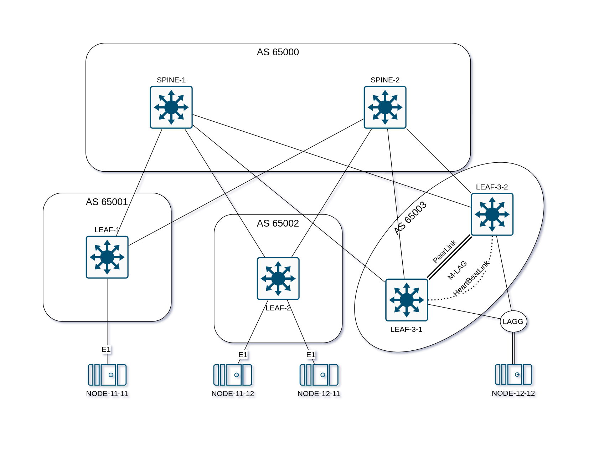

## VxLAN. Аналоги VPC

### Задача:

- Настроить VPC или аналог для работы в Overlay сети
- Подключить клиента двумя линками к разным LEAF
- Настроить агрегированный канал между клиентом и парой LEAF-коммутаторов
- Проверить связанность между клиентами

## Выполнение:

### Схема сети



| HOSTNAME   | LOCAL INTF             | LOCAL IP          | LOCAL AS    | REMOTE AS   | REMOTE IP         | REMOTE INTF            | NEIGHBOR         |
| ---------- | ---------------------- | ----------------- | ----------- | ----------- | ----------------- | ---------------------- | ---------------- |
| SPINE-1    | Ethernet1              | 10.1.1.10/31      | 65000       | 65001       | 10.1.1.11/31      | Ethernet1              | LEAF-1           |
|            | Ethernet2              | 10.1.2.10/31      | 65000       | 65002       | 10.1.2.11/31      | Ethernet1              | LEAF-2           |
|            | Ethernet3              | 10.1.3.10/31      | 65000       | 65003       | 10.1.3.11/31      | Ethernet1              | LEAF-3-1         |
|            | Ethernet4              | 10.1.3.20/31      | 65000       | 65003       | 10.1.3.21/31      | Ethernet1              | LEAF-3-2         |
|            | Loopback1              | 10.0.0.1/32       |             |             |                   |                        |                  |
|            |                        |                   |             |             |                   |                        |                  |
| SPINE-2    | Ethernet1              | 10.2.1.10/31      | 65000       | 65001       | 10.2.1.11/31      | Ethernet2              | LEAF-1           |
|            | Ethernet2              | 10.2.2.10/31      | 65000       | 65002       | 10.2.2.11/31      | Ethernet2              | LEAF-2           |
|            | Ethernet3              | 10.2.3.10/31      | 65000       | 65003       | 10.2.3.11/31      | Ethernet2              | LEAF-3-1         |
|            | Ethernet4              | 10.2.3.20/31      | 65000       | 65003       | 10.2.3.21/31      | Ethernet2              | LEAF-3-2         |
|            | Loopback1              | 10.0.0.2/32       |             |             |                   |                        |                  |
|            |                        |                   |             |             |                   |                        |                  |
| LEAF-1     | Ethernet1              | 10.1.1.11/31      | 65001       | 65000       | 10.1.1.10/31      | Ethernet1              | SPINE-1          |
|            | Ethernet2              | 10.2.1.11/31      | 65001       | 65000       | 10.2.1.10/31      | Ethernet1              | SPINE-2          |
|            | Loopback1              | 10.0.1.1/32       |             |             |                   |                        |                  |
|            | Vxlan1                 | Loopback1         |             |             |                   |                        |                  |
|            | Vlan11                 | **Virtual IP**    |             |             | 192.168.11.11/24  | Ethernet0              | NODE-11-11       |
|            |                        |                   |             |             |                   |                        |                  |
| LEAF-2     | Ethernet1              | 10.1.2.11/31      | 65002       | 65000       | 10.1.2.10/31      | Ethernet2              | SPINE-1          |
|            | Ethernet2              | 10.2.2.11/31      | 65002       | 65000       | 10.2.2.10/31      | Ethernet2              | SPINE-2          |
|            | Loopback1              | 10.0.2.1/32       |             |             |                   |                        |                  |
|            | Vxlan1                 | Loopback1         |             |             |                   |                        |                  |
|            | Vlan11                 | **Virtual IP**    |             |             | 192.168.11.12/24  | Ethernet0              | NODE-11-12       |
|            | Vlan12                 | **Virtual IP**    |             |             | 192.168.12.11/24  | Ethernet0              | NODE-12-11       |
|            |                        |                   |             |             |                   |                        |                  |
| LEAF-3-1   | Ethernet1              | 10.1.3.11/31      | 65003       | 65000       | 10.1.3.10/31      | Ethernet3              | SPINE-1          |
|            | Ethernet2              | 10.2.3.11/31      | 65003       | 65000       | 10.2.3.10/31      | Ethernet3              | SPINE-2          |
|            | ***Vlan4094***         | 10.255.255.1/30   | PeerLink-IP | PeerLink-IP | 10.255.255.2/30   | ***Vlan4094***         | LEAF-3-2         |
|            | ***Vlan4090***         | 10.255.255.201/30 | iBGP        | iBGP        | 10.255.255.202/30 | ***Vlan4090***         | LEAF-3-2         |
|            | ***Port-Channel4094*** |                   | PeerLink    | PeerLink    |                   | ***Port-Channel4094*** | LEAF-3-2         |
|            | Ethernet5              | 10.255.255.101/30 | HeartBeat   | HeartBeat   | 10.255.255.102/30 | Ethernet5              | LEAF-3-2         |
|            | Loopback1              | 10.0.3.1/32       |             |             |                   |                        |                  |
|            | Loopback10             | 10.0.3.10/32      |             |             |                   |                        |                  |
|            | Vxlan1                 | Loopback10        |             |             |                   |                        |                  |
|            | ***Vlan12***           | **Virtual IP**    |             |             | 192.168.12.12/24  | ***Vlan12***           | NODE-12-12       |
|            | ***Port-Channel12***   |                   |             |             |                   | ***Port-Channel12***   | NODE-12-12       |
|            | ***Ethernet12***       |                   |             |             |                   | ***ether1***           | NODE-12-12       |
|            |                        |                   |             |             |                   |                        |                  |
| LEAF-3-2   | Ethernet1              | 10.1.3.21/31      | 65003       | 65000       | 10.1.3.20/31      | Ethernet4              | SPINE-1          |
|            | Ethernet2              | 10.2.3.21/31      | 65003       | 65000       | 10.2.3.20/31      | Ethernet4              | SPINE-2          |
|            | ***Vlan4094***         | 10.255.255.2/30   | PeerLink-IP | PeerLink-IP | 10.255.255.1/30   | ***Vlan4094***         | LEAF-3-1         |
|            | ***Vlan4090***         | 10.255.255.202/30 | iBGP        | iBGP        | 10.255.255.201/30 | ***Vlan4090***         | LEAF-3-1         |
|            | ***Port-Channel4094*** |                   | PeerLink    | PeerLink    |                   | ***Port-Channel4094*** | LEAF-3-1         |
|            | Ethernet5              | 10.255.255.102/30 | HeartBeat   | HeartBeat   | 10.255.255.101/30 | Ethernet5              | LEAF-3-1         |
|            | Loopback1              | 10.0.3.2/32       |             |             |                   |                        |                  |
|            | Loopback10             | 10.0.3.10/32      |             |             |                   |                        |                  |
|            | Vxlan1                 | Loopback10        |             |             |                   |                        |                  |
|            | ***Vlan12***           | **Virtual IP**    |             |             | 192.168.12.12/24  | ***Vlan12***           | NODE-12-12       |
|            | ***Port-Channel12***   |                   |             |             |                   | ***Port-Channel12***   | NODE-12-12       |
|            | ***Ethernet12***       |                   |             |             |                   | ***ether2***           | NODE-12-12       |
|            |                        |                   |             |             |                   |                        |                  |
| NODE-11-11 | Ethernet0              | 192.168.11.11/24  |             |             | **Virtual IP**    | Vlan11                 | LEAF-1           |
|            |                        |                   |             |             |                   |                        |                  |
| NODE-11-12 | Ethernet0              | 192.168.11.12/24  |             |             | **Virtual IP**    | Vlan11                 | LEAF-2           |
|            |                        |                   |             |             |                   |                        |                  |
| NODE-12-11 | Ethernet0              | 192.168.12.11/24  |             |             | **Virtual IP**    | Vlan12                 | LEAF-2           |
|            |                        |                   |             |             |                   |                        |                  |
| NODE-12-12 | ***Vlan12***           | 192.168.12.12/24  |             |             | **Virtual IP**    | ***Vlan12***           | LEAF-3-1/LEAF3-2 |
|            | ***Port-Channel12***   |                   |             |             |                   | ***Port-Channel12***   | LEAF-3-1/LEAF3-2 |
|            | ***ether1***           |                   |             |             |                   | ***Ethernet12***       | LEAF-3-1         |
|            | ***ether2***           |                   |             |             |                   | ***Ethernet12***       | LEAF-3-2         |


|            | **Virtual IP**    |
| ---------- | ----------------- |
| **Vlan11** | 192.168.11.254/24 |
| **Vlan12** | 192.168.11.254/24 |

### Конфигурация оборудования
- #### [LEAF-1](config/LEAF-1.cfg)
- #### [LEAF-2](config/LEAF-2.cfg)

- #### [LEAF-3-1](config/LEAF-3-1.cfg)
```
service routing protocols model multi-agent
!
hostname LEAF-3-1
!
spanning-tree mode rstp
no spanning-tree vlan-id 4090,4094
!
vlan 12
!
vlan 4090,4094
   trunk group MLAGPEER
!
vrf instance HBMLAG
!
vrf instance VRF_COMMON
!
interface Port-Channel12
   switchport trunk allowed vlan 12
   switchport mode trunk
   mlag 12
   spanning-tree portfast
!
interface Port-Channel4094
   switchport mode trunk
   switchport trunk group MLAGPEER
!
interface Ethernet1
   description TO-SPINE-1
   no switchport
   ip address 10.1.3.11/31
   bfd interval 100 min-rx 100 multiplier 3
   bfd echo
!
interface Ethernet2
   description TO-SPINE-2
   no switchport
   ip address 10.2.3.11/31
   bfd interval 100 min-rx 100 multiplier 3
   bfd echo
!
interface Ethernet3
   channel-group 4094 mode active
!
interface Ethernet4
   channel-group 4094 mode active
!
interface Ethernet5
   no switchport
   vrf HBMLAG
   ip address 10.255.255.101/30
!
interface Ethernet12
   switchport access vlan 12
   channel-group 12 mode active
   lacp timer fast
   spanning-tree portfast
!
interface Loopback1
   ip address 10.0.3.1/32
!
interface Loopback10
   ip address 10.0.3.10/32
!
interface Vlan12
   vrf VRF_COMMON
   ip address virtual 192.168.12.254/24
!
interface Vlan4090
   no autostate
   ip address 10.255.255.201/30
!
interface Vlan4094
   no autostate
   ip address 10.255.255.1/30
!
interface Vxlan1
   vxlan source-interface Loopback10
   vxlan virtual-router encapsulation mac-address mlag-system-id
   vxlan udp-port 4789
   vxlan vlan 12 vni 10012
   vxlan vrf VRF_COMMON vni 1000
   vxlan learn-restrict any
!
ip virtual-router mac-address 00:00:00:00:00:01
!
ip routing vrf HBMLAG
ip routing vrf VRF_COMMON
!
mlag configuration
   domain-id MLAG_DOMAIN
   heartbeat-interval 1000
   local-interface Vlan4094
   peer-address 10.255.255.2
   peer-address heartbeat 10.255.255.102 vrf HBMLAG
   peer-link Port-Channel4094
   dual-primary detection delay 10 action errdisable all-interfaces
   reload-delay 180
!
route-map RM_REDIST permit 10
   match interface Loopback1
!
route-map RM_REDIST permit 20
   match interface Loopback10
!
route-map next-hop-self-ipv4 permit 10
   match route-type external
   set ip next-hop peer-address
!
route-map next-hop-self-ipv4 permit 20
!
router bgp 65003
   timers bgp 3 9
   distance bgp 20 200 200
   maximum-paths 2 ecmp 2
   neighbor MLAGPEER peer group
   neighbor MLAGPEER remote-as 65003
   neighbor MLAGPEER route-map next-hop-self-ipv4 out
   neighbor MLAGPEER send-community extended
   neighbor SPINE peer group
   neighbor SPINE remote-as 65000
   neighbor SPINE bfd
   neighbor SPINE allowas-in 1
   neighbor SPINE rib-in pre-policy retain all
   neighbor SPINE password 7 yVt/SxQ2cHkCSxO5ZSaL8G2JpeqOLEZj
   neighbor SPINE send-community extended
   neighbor 10.1.3.10 peer group SPINE
   neighbor 10.2.3.10 peer group SPINE
   neighbor 10.255.255.202 peer group MLAGPEER
   !
   vlan 12
      rd 10.0.3.1:10012
      route-target both 192.168.12.0:10012
      redistribute learned
   !
   address-family evpn
      neighbor MLAGPEER activate
      neighbor SPINE activate
   !
   address-family ipv4
      neighbor MLAGPEER activate
      neighbor SPINE activate
      redistribute connected route-map RM_REDIST
   !
   vrf VRF_COMMON
      rd 10.0.3.1:1000
      route-target import evpn 1000:1000
      route-target export evpn 1000:1000
      redistribute connected
!
router general
   router-id ipv4 10.0.3.1
!
```

- #### [LEAF-3-2](config/LEAF-3-2.cfg)
```
service routing protocols model multi-agent
!
hostname LEAF-3-2
!
spanning-tree mode rstp
no spanning-tree vlan-id 4090,4094
!
vlan 12
!
vlan 4090,4094
   trunk group MLAGPEER
!
vrf instance HBMLAG
!
vrf instance VRF_COMMON
!
interface Port-Channel12
   switchport trunk allowed vlan 12
   switchport mode trunk
   mlag 12
   spanning-tree portfast
!
interface Port-Channel4094
   switchport mode trunk
   switchport trunk group MLAGPEER
!
interface Ethernet1
   description TO-SPINE-1
   no switchport
   ip address 10.1.3.21/31
   bfd interval 100 min-rx 100 multiplier 3
   bfd echo
!
interface Ethernet2
   description TO-SPINE-2
   no switchport
   ip address 10.2.3.21/31
   bfd interval 100 min-rx 100 multiplier 3
   bfd echo
!
interface Ethernet3
   channel-group 4094 mode active
!
interface Ethernet4
   channel-group 4094 mode active
!
interface Ethernet5
   no switchport
   vrf HBMLAG
   ip address 10.255.255.102/30
!
interface Ethernet12
   switchport access vlan 12
   channel-group 12 mode active
   lacp timer fast
   spanning-tree portfast
!
interface Loopback1
   ip address 10.0.3.2/32
!
interface Loopback10
   ip address 10.0.3.10/32
!
interface Vlan12
   vrf VRF_COMMON
   ip address virtual 192.168.12.254/24
!
interface Vlan4090
   no autostate
   ip address 10.255.255.202/30
!
interface Vlan4094
   no autostate
   ip address 10.255.255.2/30
!
interface Vxlan1
   vxlan source-interface Loopback10
   vxlan virtual-router encapsulation mac-address mlag-system-id
   vxlan udp-port 4789
   vxlan vlan 12 vni 10012
   vxlan vrf VRF_COMMON vni 1000
   vxlan learn-restrict any
!
ip virtual-router mac-address 00:00:00:00:00:01
!
ip routing vrf HBMLAG
ip routing vrf VRF_COMMON
!
mlag configuration
   domain-id MLAG_DOMAIN
   heartbeat-interval 1000
   local-interface Vlan4094
   peer-address 10.255.255.1
   peer-address heartbeat 10.255.255.101 vrf HBMLAG
   peer-link Port-Channel4094
   dual-primary detection delay 10 action errdisable all-interfaces
   reload-delay 180
!
route-map RM_REDIST permit 10
   match interface Loopback1
!
route-map RM_REDIST permit 20
   match interface Loopback10
!
route-map next-hop-self-ipv4 permit 10
   match route-type external
   set ip next-hop peer-address
!
route-map next-hop-self-ipv4 permit 20
!
router bgp 65003
   timers bgp 3 9
   maximum-paths 2 ecmp 2
   neighbor MLAGPEER peer group
   neighbor MLAGPEER remote-as 65003
   neighbor MLAGPEER route-map next-hop-self-ipv4 out
   neighbor MLAGPEER send-community extended
   neighbor SPINE peer group
   neighbor SPINE remote-as 65000
   neighbor SPINE bfd
   neighbor SPINE allowas-in 1
   neighbor SPINE rib-in pre-policy retain all
   neighbor SPINE password 7 yVt/SxQ2cHkCSxO5ZSaL8G2JpeqOLEZj
   neighbor SPINE send-community extended
   neighbor 10.1.3.20 peer group SPINE
   neighbor 10.2.3.20 peer group SPINE
   neighbor 10.255.255.201 peer group MLAGPEER
   !
   vlan 12
      rd 10.0.3.2:10012
      route-target both 192.168.12.0:10012
      redistribute learned
   !
   address-family evpn
      neighbor MLAGPEER activate
      neighbor SPINE activate
   !
   address-family ipv4
      neighbor MLAGPEER activate
      neighbor SPINE activate
      redistribute connected route-map RM_REDIST
   !
   vrf VRF_COMMON
      rd 10.0.3.2:1000
      route-target import evpn 1000:1000
      route-target export evpn 1000:1000
      redistribute connected
!
router general
   router-id ipv4 10.0.3.2
!
```

- #### [NODE-12-12](config/NODE-12-12.cfg)
```
[admin@NODE-12-12] > /interface/bonding/print detail
Flags: X - disabled; R - running
 0  R name="Port-Channel12" mtu=1500 mac-address=0C:D5:56:0F:00:00 arp=enabled
      arp-timeout=auto slaves=ether1,ether2 mode=802.3ad primary=none
      link-monitoring=mii arp-interval=100ms arp-ip-targets="" mii-interval=100ms
      down-delay=0ms up-delay=0ms lacp-rate=1sec transmit-hash-policy=layer-2
      min-links=0

[admin@NODE-12-12] > /interface/vlan/print detail
Flags: X - disabled, R - running
 0 R name="Vlan12" mtu=1496 l2mtu=1496 mac-address=0C:D5:56:0F:00:00 arp=enabled
     arp-timeout=auto loop-protect=default loop-protect-status=off
     loop-protect-send-interval=5s loop-protect-disable-time=5m vlan-id=12
     interface=Port-Channel12 use-service-tag=no mvrp=no

[admin@NODE-12-12] > /ip/address/print detail
Flags: X - disabled, I - invalid; D - dynamic; S - slave
 0     address=192.168.12.12/24 network=192.168.12.0 interface=Vlan12
       actual-interface=Vlan12

[admin@NODE-12-12] > /ip/route/print detail
Flags: D - dynamic; X - disabled, I - inactive, A - active;
c - connect, s - static, r - rip, b - bgp, o - ospf, i - is-is, d - dhcp, v - vpn, m - >
H - hw-offloaded; + - ecmp
 0  As   dst-address=0.0.0.0/0 routing-table=main gateway=192.168.12.254
         immediate-gw=192.168.12.254%Vlan12 distance=1 scope=30 target-scope=10

   DAc   dst-address=192.168.12.0/24 routing-table=main gateway=Vlan12
         immediate-gw=Vlan12 distance=0 scope=10 target-scope=5
         local-address=192.168.12.12%Vlan12
```
---

### Проверка конфигурации LEAF

- #### LEAF-1
```
LEAF-1# show ip route vrf VRF_COMMON
VRF: VRF_COMMON
Source Codes:
       C - connected, S - static, K - kernel,
       O - OSPF, IA - OSPF inter area, E1 - OSPF external type 1,
       E2 - OSPF external type 2, N1 - OSPF NSSA external type 1,
       N2 - OSPF NSSA external type2, B - Other BGP Routes,
       B I - iBGP, B E - eBGP, R - RIP, I L1 - IS-IS level 1,
       I L2 - IS-IS level 2, O3 - OSPFv3, A B - BGP Aggregate,
       A O - OSPF Summary, NG - Nexthop Group Static Route,
       V - VXLAN Control Service, M - Martian,
       DH - DHCP client installed default route,
       DP - Dynamic Policy Route, L - VRF Leaked,
       G  - gRIBI, RC - Route Cache Route,
       CL - CBF Leaked Route

Gateway of last resort is not set

 C        192.168.11.0/24
           directly connected, Vlan11
 B E      192.168.12.12/32 [20/0]
           via VTEP 10.0.3.10 VNI 1000 router-mac 02:00:4f:4e:36:5c local-interface Vxlan1
 B E      192.168.12.0/24 [20/0]
           via VTEP 10.0.3.10 VNI 1000 router-mac 02:00:4f:4e:36:5c local-interface Vxlan1

LEAF-1# show bgp evpn route-type ip-prefix ipv4
BGP routing table information for VRF default
Router identifier 10.0.1.1, local AS number 65001
Route status codes: * - valid, > - active, S - Stale, E - ECMP head, e - ECMP
                    c - Contributing to ECMP, % - Pending best path selection
Origin codes: i - IGP, e - EGP, ? - incomplete
AS Path Attributes: Or-ID - Originator ID, C-LST - Cluster List, LL Nexthop - Link Local Nexthop

          Network                Next Hop              Metric  LocPref Weight  Path
 * >      RD: 10.0.1.1:1000 ip-prefix 192.168.11.0/24
                                 -                     -       -       0       i
 * >Ec    RD: 10.0.3.1:1000 ip-prefix 192.168.12.0/24
                                 10.0.3.10             -       100     0       65000 65003 i
 *  ec    RD: 10.0.3.1:1000 ip-prefix 192.168.12.0/24
                                 10.0.3.10             -       100     0       65000 65003 i
 * >Ec    RD: 10.0.3.2:1000 ip-prefix 192.168.12.0/24
                                 10.0.3.10             -       100     0       65000 65003 i
 *  ec    RD: 10.0.3.2:1000 ip-prefix 192.168.12.0/24
                                 10.0.3.10             -       100     0       65000 65003 i

LEAF-1# show bgp evpn route-type mac-ip
BGP routing table information for VRF default
Router identifier 10.0.1.1, local AS number 65001
Route status codes: * - valid, > - active, S - Stale, E - ECMP head, e - ECMP
                    c - Contributing to ECMP, % - Pending best path selection
Origin codes: i - IGP, e - EGP, ? - incomplete
AS Path Attributes: Or-ID - Originator ID, C-LST - Cluster List, LL Nexthop - Link Local Nexthop

          Network                Next Hop              Metric  LocPref Weight  Path
 * >      RD: 10.0.1.1:10011 mac-ip 0050.7966.6800
                                 -                     -       -       0       i
 * >      RD: 10.0.1.1:10011 mac-ip 0050.7966.6800 192.168.11.11
                                 -                     -       -       0       i
 * >Ec    RD: 10.0.3.1:10012 mac-ip 0cd5.560f.0000
                                 10.0.3.10             -       100     0       65000 65003 i
 *  ec    RD: 10.0.3.1:10012 mac-ip 0cd5.560f.0000
                                 10.0.3.10             -       100     0       65000 65003 i
 * >Ec    RD: 10.0.3.2:10012 mac-ip 0cd5.560f.0000
                                 10.0.3.10             -       100     0       65000 65003 i
 *  ec    RD: 10.0.3.2:10012 mac-ip 0cd5.560f.0000
                                 10.0.3.10             -       100     0       65000 65003 i
 * >Ec    RD: 10.0.3.1:10012 mac-ip 0cd5.560f.0000 192.168.12.12
                                 10.0.3.10             -       100     0       65000 65003 i
 *  ec    RD: 10.0.3.1:10012 mac-ip 0cd5.560f.0000 192.168.12.12
                                 10.0.3.10             -       100     0       65000 65003 i
 * >Ec    RD: 10.0.3.2:10012 mac-ip 0cd5.560f.0000 192.168.12.12
                                 10.0.3.10             -       100     0       65000 65003 i
 *  ec    RD: 10.0.3.2:10012 mac-ip 0cd5.560f.0000 192.168.12.12
                                 10.0.3.10             -       100     0       65000 65003 i

LEAF-1# show arp vrf VRF_COMMON
Address         Age (sec)  Hardware Addr   Interface
192.168.11.11     0:00:08  0050.7966.6800  Vlan11, Ethernet11

LEAF-1# show interfaces vxlan 1
Vxlan1 is up, line protocol is up (connected)
  Hardware is Vxlan
  Source interface is Loopback1 and is active with 10.0.1.1
  Listening on UDP port 4789
  Replication/Flood Mode is headend with Flood List Source: EVPN
  Remote MAC learning via EVPN
  VNI mapping to VLANs
  Static VLAN to VNI mapping is
    [11, 10011]
  Dynamic VLAN to VNI mapping for 'evpn' is
    [1006, 1000]
  Note: All Dynamic VLANs used by VCS are internal VLANs.
        Use 'show vxlan vni' for details.
  Static VRF to VNI mapping is
   [VRF_COMMON, 1000]
  Shared Router MAC is 0000.0000.0000

LEAF-1# show vxlan vni
VNI to VLAN Mapping for Vxlan1
VNI         VLAN       Source       Interface        802.1Q Tag
----------- ---------- ------------ ---------------- ----------
10011       11         static       Ethernet11       untagged
                                    Vxlan1           11

VNI to dynamic VLAN Mapping for Vxlan1
VNI        VLAN       VRF              Source
---------- ---------- ---------------- ------------
1000       1006       VRF_COMMON       evpn

```

- #### LEAF-3-1
```
LEAF-3-1# show ip route vrf VRF_COMMON
VRF: VRF_COMMON
Source Codes:
       C - connected, S - static, K - kernel,
       O - OSPF, IA - OSPF inter area, E1 - OSPF external type 1,
       E2 - OSPF external type 2, N1 - OSPF NSSA external type 1,
       N2 - OSPF NSSA external type2, B - Other BGP Routes,
       B I - iBGP, B E - eBGP, R - RIP, I L1 - IS-IS level 1,
       I L2 - IS-IS level 2, O3 - OSPFv3, A B - BGP Aggregate,
       A O - OSPF Summary, NG - Nexthop Group Static Route,
       V - VXLAN Control Service, M - Martian,
       DH - DHCP client installed default route,
       DP - Dynamic Policy Route, L - VRF Leaked,
       G  - gRIBI, RC - Route Cache Route,
       CL - CBF Leaked Route

Gateway of last resort is not set

 B E      192.168.11.11/32 [20/0]
           via VTEP 10.0.1.1 VNI 1000 router-mac 12:81:aa:df:d9:a7 local-interface Vxlan1
 B E      192.168.11.0/24 [20/0]
           via VTEP 10.0.1.1 VNI 1000 router-mac 12:81:aa:df:d9:a7 local-interface Vxlan1
 C        192.168.12.0/24
           directly connected, Vlan12

LEAF-3-1# show bgp evpn route-type ip-prefix ipv4
BGP routing table information for VRF default
Router identifier 10.0.3.1, local AS number 65003
Route status codes: * - valid, > - active, S - Stale, E - ECMP head, e - ECMP
                    c - Contributing to ECMP, % - Pending best path selection
Origin codes: i - IGP, e - EGP, ? - incomplete
AS Path Attributes: Or-ID - Originator ID, C-LST - Cluster List, LL Nexthop - Link Local Nexthop

          Network                Next Hop              Metric  LocPref Weight  Path
 * >Ec    RD: 10.0.1.1:1000 ip-prefix 192.168.11.0/24
                                 10.0.1.1              -       100     0       65000 65001 i
 *  ec    RD: 10.0.1.1:1000 ip-prefix 192.168.11.0/24
                                 10.0.1.1              -       100     0       65000 65001 i
 *        RD: 10.0.1.1:1000 ip-prefix 192.168.11.0/24
                                 10.0.1.1              -       100     0       65000 65001 i
 * >      RD: 10.0.3.1:1000 ip-prefix 192.168.12.0/24
                                 -                     -       -       0       i
          RD: 10.0.3.2:1000 ip-prefix 192.168.12.0/24
                                 10.0.3.10             -       100     0       i
          RD: 10.0.3.2:1000 ip-prefix 192.168.12.0/24
                                 10.0.3.10             -       100     0       65000 65003 i
          RD: 10.0.3.2:1000 ip-prefix 192.168.12.0/24
                                 10.0.3.10             -       100     0       65000 65003 i

LEAF-3-1# show bgp evpn route-type mac-ip
BGP routing table information for VRF default
Router identifier 10.0.3.1, local AS number 65003
Route status codes: * - valid, > - active, S - Stale, E - ECMP head, e - ECMP
                    c - Contributing to ECMP, % - Pending best path selection
Origin codes: i - IGP, e - EGP, ? - incomplete
AS Path Attributes: Or-ID - Originator ID, C-LST - Cluster List, LL Nexthop - Link Local Nexthop

          Network                Next Hop              Metric  LocPref Weight  Path
 * >Ec    RD: 10.0.1.1:10011 mac-ip 0050.7966.6800
                                 10.0.1.1              -       100     0       65000 65001 i
 *  ec    RD: 10.0.1.1:10011 mac-ip 0050.7966.6800
                                 10.0.1.1              -       100     0       65000 65001 i
 *        RD: 10.0.1.1:10011 mac-ip 0050.7966.6800
                                 10.0.1.1              -       100     0       65000 65001 i
 * >Ec    RD: 10.0.1.1:10011 mac-ip 0050.7966.6800 192.168.11.11
                                 10.0.1.1              -       100     0       65000 65001 i
 *  ec    RD: 10.0.1.1:10011 mac-ip 0050.7966.6800 192.168.11.11
                                 10.0.1.1              -       100     0       65000 65001 i
 *        RD: 10.0.1.1:10011 mac-ip 0050.7966.6800 192.168.11.11
                                 10.0.1.1              -       100     0       65000 65001 i
 * >      RD: 10.0.3.1:10012 mac-ip 0cd5.560f.0000
                                 -                     -       -       0       i
          RD: 10.0.3.2:10012 mac-ip 0cd5.560f.0000
                                 10.0.3.10             -       100     0       i
          RD: 10.0.3.2:10012 mac-ip 0cd5.560f.0000
                                 10.0.3.10             -       100     0       65000 65003 i
          RD: 10.0.3.2:10012 mac-ip 0cd5.560f.0000
                                 10.0.3.10             -       100     0       65000 65003 i
 * >      RD: 10.0.3.1:10012 mac-ip 0cd5.560f.0000 192.168.12.12
                                 -                     -       -       0       i
          RD: 10.0.3.2:10012 mac-ip 0cd5.560f.0000 192.168.12.12
                                 10.0.3.10             -       100     0       65000 65003 i
          RD: 10.0.3.2:10012 mac-ip 0cd5.560f.0000 192.168.12.12
                                 10.0.3.10             -       100     0       i
          RD: 10.0.3.2:10012 mac-ip 0cd5.560f.0000 192.168.12.12
                                 10.0.3.10             -       100     0       65000 65003 i

LEAF-3-1# show arp vrf VRF_COMMON
Address         Age (sec)  Hardware Addr   Interface
192.168.12.12     0:00:15  0cd5.560f.0000  Vlan12, Port-Channel12
LEAF-3-1#show interfaces vxlan 1
Vxlan1 is up, line protocol is up (connected)
  Hardware is Vxlan
  Source interface is Loopback10 and is active with 10.0.3.10
  Listening on UDP port 4789
  Replication/Flood Mode is headend with Flood List Source: EVPN
  Remote MAC learning via EVPN
  VNI mapping to VLANs
  Static VLAN to VNI mapping is
    [12, 10012]
  Dynamic VLAN to VNI mapping for 'evpn' is
    [4093, 1000]
  Note: All Dynamic VLANs used by VCS are internal VLANs.
        Use 'show vxlan vni' for details.
  Static VRF to VNI mapping is
   [VRF_COMMON, 1000]
  MLAG Shared Router MAC is 0200.4f4e.365c

LEAF-3-1# show vxlan vni
VNI to VLAN Mapping for Vxlan1
VNI         VLAN       Source       Interface            802.1Q Tag
----------- ---------- ------------ -------------------- ----------
10012       12         static       Ethernet12           untagged
                                    Port-Channel12       12
                                    Vxlan1               12

VNI to dynamic VLAN Mapping for Vxlan1
VNI        VLAN       VRF              Source
---------- ---------- ---------------- ------------
1000       4093       VRF_COMMON       evpn

LEAF-3-1# show mlag
MLAG Configuration:
domain-id                          :         MLAG_DOMAIN
local-interface                    :            Vlan4094
peer-address                       :        10.255.255.2
peer-link                          :    Port-Channel4094
hb-peer-address                    :      10.255.255.102
hb-peer-vrf                        :              HBMLAG
peer-config                        :          consistent

MLAG Status:
state                              :              Active
negotiation status                 :           Connected
peer-link status                   :                  Up
local-int status                   :                  Up
system-id                          :   02:00:4f:4e:36:5c
dual-primary detection             :          Configured
dual-primary interface errdisabled :               False

MLAG Ports:
Disabled                           :                   0
Configured                         :                   0
Inactive                           :                   0
Active-partial                     :                   0
Active-full                        :                   1

LEAF-3-1# show mlag interfaces detail
                                                            local/remote
   mlag             state       local       remote        oper        config       last change    changes
---------- ----------------- ----------- ------------ ----------- ------------- ----------------- -------
     12       active-full        Po12         Po12       up/up       ena/ena       0:17:41 ago          4

LEAF-3-1# show port-channel detailed
Port Channel Port-Channel12 (Fallback State: Unconfigured):
Minimum links: unconfigured
Minimum speed: unconfigured
Current weight/Max weight: 1/16
  Active Ports:
       Port                 Time Became Active       Protocol       Mode         Weight    State
    -------------------- ------------------------ -------------- ------------ ------------ -------
       Ethernet12           17:16:32                 LACP           Active         1       Rx,Tx
       PeerEthernet12       17:16:32                 LACP           Active         0       Unknown

Port Channel Port-Channel4094 (Fallback State: Unconfigured):
Minimum links: unconfigured
Minimum speed: unconfigured
Current weight/Max weight: 2/16
  Active Ports:
       Port            Time Became Active       Protocol       Mode         Weight    State
    --------------- ------------------------ -------------- ------------ ------------ -----
       Ethernet3       17:16:27                 LACP           Active         1       Rx,Tx
       Ethernet4       17:16:27                 LACP           Active         1       Rx,Tx

LEAF-3-1# show lacp interface detailed
State: A = Active, P = Passive; S=ShortTimeout, L=LongTimeout;
       G = Aggregable, I = Individual; s+=InSync, s-=OutOfSync;
       C = Collecting (aggregating incoming frames), X = state machine expired,
       D = Distributing (aggregating outgoing frames),
       d = default neighbor state
                         |                |                        Partner                                                        Partner       Collector                                      Actor                                                      Last                    State Machines
   Port         Status   |    Select      |  Sys-id                         Port#       State         OperKey       PortPri       Churn          MaxDelay       Port#       State         OperKey       AdminKey       PortPriority       Churn          RxTime        Rx            mux                          MuxReason                         TimeoutMultiplier
---------- --------------|----------------|----------------------------- ----------- ------------- ------------- ------------- ------------- --------------- ----------- ------------- ------------- -------------- ------------------ ------------- -------------- ------------- ---------------------------- ------------------------------------ -----------------
Port Channel Port-Channel12*:
   Et12         Bundled  |    Selected    |  FFFF,0c-d5-56-0f-00-00             1       ASGs+CD        0x000f           255       noChurn               0       32780       ASGs+CD        0x000c         0x000c              32768       noChurn       17:34:13       Current       CollectingDistributing       muxActorCollectingDistributing                    3
Port Channel Port-Channel4094:
   Et3          Bundled  |    Selected    |  8000,6a-19-79-6c-9d-30             4       ALGs+CD        0x08ff         32768       noChurn               0           3       ALGs+CD        0x08ff         0x08ff              32768       noChurn       17:33:53       Current       CollectingDistributing       muxActorCollectingDistributing                    3
   Et4          Bundled  |    Selected    |  8000,6a-19-79-6c-9d-30             3       ALGs+CD        0x08ff         32768       noChurn               0           4       ALGs+CD        0x08ff         0x08ff              32768       noChurn       17:33:53       Current       CollectingDistributing       muxActorCollectingDistributing                    3

* - Only local interfaces for MLAGs are displayed. Connect to the peer to
    see the state for peer interfaces.

```

- #### LEAF-3-2
```
LEAF-3-2# show ip route vrf VRF_COMMON
VRF: VRF_COMMON
Source Codes:
       C - connected, S - static, K - kernel,
       O - OSPF, IA - OSPF inter area, E1 - OSPF external type 1,
       E2 - OSPF external type 2, N1 - OSPF NSSA external type 1,
       N2 - OSPF NSSA external type2, B - Other BGP Routes,
       B I - iBGP, B E - eBGP, R - RIP, I L1 - IS-IS level 1,
       I L2 - IS-IS level 2, O3 - OSPFv3, A B - BGP Aggregate,
       A O - OSPF Summary, NG - Nexthop Group Static Route,
       V - VXLAN Control Service, M - Martian,
       DH - DHCP client installed default route,
       DP - Dynamic Policy Route, L - VRF Leaked,
       G  - gRIBI, RC - Route Cache Route,
       CL - CBF Leaked Route

Gateway of last resort is not set

 B E      192.168.11.11/32 [200/0]
           via VTEP 10.0.1.1 VNI 1000 router-mac 12:81:aa:df:d9:a7 local-interface Vxlan1
 B E      192.168.11.0/24 [200/0]
           via VTEP 10.0.1.1 VNI 1000 router-mac 12:81:aa:df:d9:a7 local-interface Vxlan1
 C        192.168.12.0/24
           directly connected, Vlan12

LEAF-3-2# show bgp evpn route-type ip-prefix ipv4
BGP routing table information for VRF default
Router identifier 10.0.3.2, local AS number 65003
Route status codes: * - valid, > - active, S - Stale, E - ECMP head, e - ECMP
                    c - Contributing to ECMP, % - Pending best path selection
Origin codes: i - IGP, e - EGP, ? - incomplete
AS Path Attributes: Or-ID - Originator ID, C-LST - Cluster List, LL Nexthop - Link Local Nexthop

          Network                Next Hop              Metric  LocPref Weight  Path
 * >Ec    RD: 10.0.1.1:1000 ip-prefix 192.168.11.0/24
                                 10.0.1.1              -       100     0       65000 65001 i
 *  ec    RD: 10.0.1.1:1000 ip-prefix 192.168.11.0/24
                                 10.0.1.1              -       100     0       65000 65001 i
 *        RD: 10.0.1.1:1000 ip-prefix 192.168.11.0/24
                                 10.0.1.1              -       100     0       65000 65001 i
          RD: 10.0.3.1:1000 ip-prefix 192.168.12.0/24
                                 10.0.3.10             -       100     0       i
          RD: 10.0.3.1:1000 ip-prefix 192.168.12.0/24
                                 10.0.3.10             -       100     0       65000 65003 i
          RD: 10.0.3.1:1000 ip-prefix 192.168.12.0/24
                                 10.0.3.10             -       100     0       65000 65003 i
 * >      RD: 10.0.3.2:1000 ip-prefix 192.168.12.0/24
                                 -                     -       -       0       i
LEAF-3-2# show bgp evpn route-type mac-ip
BGP routing table information for VRF default
Router identifier 10.0.3.2, local AS number 65003
Route status codes: * - valid, > - active, S - Stale, E - ECMP head, e - ECMP
                    c - Contributing to ECMP, % - Pending best path selection
Origin codes: i - IGP, e - EGP, ? - incomplete
AS Path Attributes: Or-ID - Originator ID, C-LST - Cluster List, LL Nexthop - Link Local Nexthop

          Network                Next Hop              Metric  LocPref Weight  Path
 * >Ec    RD: 10.0.1.1:10011 mac-ip 0050.7966.6800
                                 10.0.1.1              -       100     0       65000 65001 i
 *  ec    RD: 10.0.1.1:10011 mac-ip 0050.7966.6800
                                 10.0.1.1              -       100     0       65000 65001 i
 *        RD: 10.0.1.1:10011 mac-ip 0050.7966.6800
                                 10.0.1.1              -       100     0       65000 65001 i
 * >Ec    RD: 10.0.1.1:10011 mac-ip 0050.7966.6800 192.168.11.11
                                 10.0.1.1              -       100     0       65000 65001 i
 *  ec    RD: 10.0.1.1:10011 mac-ip 0050.7966.6800 192.168.11.11
                                 10.0.1.1              -       100     0       65000 65001 i
 *        RD: 10.0.1.1:10011 mac-ip 0050.7966.6800 192.168.11.11
                                 10.0.1.1              -       100     0       65000 65001 i
          RD: 10.0.3.1:10012 mac-ip 0cd5.560f.0000
                                 10.0.3.10             -       100     0       i
          RD: 10.0.3.1:10012 mac-ip 0cd5.560f.0000
                                 10.0.3.10             -       100     0       65000 65003 i
          RD: 10.0.3.1:10012 mac-ip 0cd5.560f.0000
                                 10.0.3.10             -       100     0       65000 65003 i
 * >      RD: 10.0.3.2:10012 mac-ip 0cd5.560f.0000
                                 -                     -       -       0       i
          RD: 10.0.3.1:10012 mac-ip 0cd5.560f.0000 192.168.12.12
                                 10.0.3.10             -       100     0       65000 65003 i
          RD: 10.0.3.1:10012 mac-ip 0cd5.560f.0000 192.168.12.12
                                 10.0.3.10             -       100     0       i
          RD: 10.0.3.1:10012 mac-ip 0cd5.560f.0000 192.168.12.12
                                 10.0.3.10             -       100     0       65000 65003 i
 * >      RD: 10.0.3.2:10012 mac-ip 0cd5.560f.0000 192.168.12.12
                                 -                     -       -       0       i

LEAF-3-2# show arp vrf VRF_COMMON
Address         Age (sec)  Hardware Addr   Interface
192.168.12.12     0:00:15  0cd5.560f.0000  Vlan12, Port-Channel12

LEAF-3-2# show interfaces vxlan 1
Vxlan1 is up, line protocol is up (connected)
  Hardware is Vxlan
  Source interface is Loopback10 and is active with 10.0.3.10
  Listening on UDP port 4789
  Replication/Flood Mode is headend with Flood List Source: EVPN
  Remote MAC learning via EVPN
  VNI mapping to VLANs
  Static VLAN to VNI mapping is
    [12, 10012]
  Dynamic VLAN to VNI mapping for 'evpn' is
    [4093, 1000]
  Note: All Dynamic VLANs used by VCS are internal VLANs.
        Use 'show vxlan vni' for details.
  Static VRF to VNI mapping is
   [VRF_COMMON, 1000]
  MLAG Shared Router MAC is 0200.4f4e.365c

LEAF-3-2# show vxlan vni
VNI to VLAN Mapping for Vxlan1
VNI         VLAN       Source       Interface            802.1Q Tag
----------- ---------- ------------ -------------------- ----------
10012       12         static       Ethernet12           untagged
                                    Port-Channel12       12
                                    Vxlan1               12

VNI to dynamic VLAN Mapping for Vxlan1
VNI        VLAN       VRF              Source
---------- ---------- ---------------- ------------
1000       4093       VRF_COMMON       evpn

LEAF-3-2# show mlag
MLAG Configuration:
domain-id                          :         MLAG_DOMAIN
local-interface                    :            Vlan4094
peer-address                       :        10.255.255.1
peer-link                          :    Port-Channel4094
hb-peer-address                    :      10.255.255.101
hb-peer-vrf                        :              HBMLAG
peer-config                        :          consistent

MLAG Status:
state                              :              Active
negotiation status                 :           Connected
peer-link status                   :                  Up
local-int status                   :                  Up
system-id                          :   02:00:4f:4e:36:5c
dual-primary detection             :          Configured
dual-primary interface errdisabled :               False

MLAG Ports:
Disabled                           :                   0
Configured                         :                   0
Inactive                           :                   0
Active-partial                     :                   0
Active-full                        :                   1

LEAF-3-2# show mlag interfaces detail
                                                            local/remote
   mlag             state       local       remote        oper        config       last change    changes
---------- ----------------- ----------- ------------ ----------- ------------- ----------------- -------
     12       active-full        Po12         Po12       up/up       ena/ena       0:17:41 ago          4

LEAF-3-2# show port-channel detailed
Port Channel Port-Channel12 (Fallback State: Unconfigured):
Minimum links: unconfigured
Minimum speed: unconfigured
Current weight/Max weight: 1/16
  Active Ports:
       Port                 Time Became Active       Protocol       Mode         Weight    State
    -------------------- ------------------------ -------------- ------------ ------------ -------
       Ethernet12           17:16:32                 LACP           Active         1       Rx,Tx
       PeerEthernet12       17:16:32                 LACP           Active         0       Unknown

Port Channel Port-Channel4094 (Fallback State: Unconfigured):
Minimum links: unconfigured
Minimum speed: unconfigured
Current weight/Max weight: 2/16
  Active Ports:
       Port            Time Became Active       Protocol       Mode         Weight    State
    --------------- ------------------------ -------------- ------------ ------------ -----
       Ethernet3       17:16:27                 LACP           Active         1       Rx,Tx
       Ethernet4       17:16:27                 LACP           Active         1       Rx,Tx

LEAF-3-2# show lacp interface detailed
State: A = Active, P = Passive; S=ShortTimeout, L=LongTimeout;
       G = Aggregable, I = Individual; s+=InSync, s-=OutOfSync;
       C = Collecting (aggregating incoming frames), X = state machine expired,
       D = Distributing (aggregating outgoing frames),
       d = default neighbor state
                         |                |                        Partner                                                        Partner       Collector                                      Actor                                                      Last                    State Machines
   Port         Status   |    Select      |  Sys-id                         Port#       State         OperKey       PortPri       Churn          MaxDelay       Port#       State         OperKey       AdminKey       PortPriority       Churn          RxTime        Rx            mux                          MuxReason                         TimeoutMultiplier
---------- --------------|----------------|----------------------------- ----------- ------------- ------------- ------------- ------------- --------------- ----------- ------------- ------------- -------------- ------------------ ------------- -------------- ------------- ---------------------------- ------------------------------------ -----------------
Port Channel Port-Channel12*:
   Et12         Bundled  |    Selected    |  FFFF,0c-d5-56-0f-00-00             2       ASGs+CD        0x000f           255       noChurn               0          12       ASGs+CD        0x000c         0x000c              32768       noChurn       17:34:13       Current       CollectingDistributing       muxActorCollectingDistributing                    3
Port Channel Port-Channel4094:
   Et3          Bundled  |    Selected    |  8000,fa-0a-4c-d3-c8-45             4       ALGs+CD        0x08ff         32768       noChurn               0           3       ALGs+CD        0x08ff         0x08ff              32768       noChurn       17:33:53       Current       CollectingDistributing       muxActorCollectingDistributing                    3
   Et4          Bundled  |    Selected    |  8000,fa-0a-4c-d3-c8-45             3       ALGs+CD        0x08ff         32768       noChurn               0           4       ALGs+CD        0x08ff         0x08ff              32768       noChurn       17:33:53       Current       CollectingDistributing       muxActorCollectingDistributing                    3

* - Only local interfaces for MLAGs are displayed. Connect to the peer to
    see the state for peer interfaces.

```

- #### NODE-12-12
```
[admin@NODE-12-12] > /ip/arp/print
Flags: D - DYNAMIC; C - COMPLETE
Columns: ADDRESS, MAC-ADDRESS, INTERFACE, STATUS
#    ADDRESS         MAC-ADDRESS        INTERFACE  STATUS
0 DC 192.168.12.254  00:00:00:00:00:01  Vlan12     reachable

[admin@NODE-12-12] /interface/bonding> monitor Port-Channel12
                    mode: 802.3ad
            active-ports: ether1
                          ether2
          inactive-ports:
          lacp-system-id: 0C:D5:56:0F:00:00
    lacp-system-priority: 65535
  lacp-partner-system-id: 02:00:4F:4E:36:5C


[admin@NODE-12-12] /interface/bonding> monitor-slaves
bond: Port-Channel12
Flags: A - active; P - partner
 AP port=ether1 key=15 flags="ATGSCD--" partner-sys-id=02:00:4F:4E:36:5C
     partner-sys-priority=32768 partner-key=12 partner-flags="ATGSCD--"

 AP port=ether2 key=15 flags="ATGSCD--" partner-sys-id=02:00:4F:4E:36:5C
     partner-sys-priority=32768 partner-key=12 partner-flags="ATGSCD--"
```

### Проверка связности клиентов

#### Все интерфейсы в UP

- #### NODE-11-11
```
NODE-1-1> ping 192.168.12.12 -c 3

84 bytes from 192.168.12.12 icmp_seq=1 ttl=62 time=3.180 ms
84 bytes from 192.168.12.12 icmp_seq=2 ttl=62 time=2.403 ms
84 bytes from 192.168.12.12 icmp_seq=3 ttl=62 time=2.382 ms
```
- #### NODE-12-12
```
[admin@NODE-12-12] > ping 192.168.11.11 count=3
  SEQ HOST                                     SIZE TTL TIME       STATUS
    0 192.168.11.11                              56  62 4ms245us
    1 192.168.11.11                              56  62 2ms319us
    2 192.168.11.11                              56  62 2ms672us
    sent=3 received=3 packet-loss=0% min-rtt=2ms319us avg-rtt=3ms78us max-rtt=4ms245us
```

#### Оба UPLINK на LEAF-3-1 в DOWN
- #### NODE-11-11 on LEAF-1
```
NODE-11-11> ping 192.168.12.12 -c 3

84 bytes from 192.168.12.12 icmp_seq=1 ttl=62 time=3.057 ms
84 bytes from 192.168.12.12 icmp_seq=2 ttl=62 time=1.927 ms
84 bytes from 192.168.12.12 icmp_seq=3 ttl=62 time=2.262 ms
```
- #### NODE-12-12 on MLAG(LEAF-3-1, LEAF-3-2)
```
[admin@NODE-12-12] > ping 192.168.11.11 count=3
  SEQ HOST                                     SIZE TTL TIME       STATUS
    0 192.168.11.11                              56  62 2ms587us
    1 192.168.11.11                              56  62 1ms865us
    2 192.168.11.11                              56  62 2ms635us
    sent=3 received=3 packet-loss=0% min-rtt=1ms865us avg-rtt=2ms362us
```

#### На LEAF-3-1 отключены порты в сторону обоих SPINE. На LEAF-3-2 отключен порт в сторону сервера NODE-12-12
```
NODE-11-11> ping 192.168.12.12 -c 3

84 bytes from 192.168.12.12 icmp_seq=1 ttl=62 time=3.145 ms
84 bytes from 192.168.12.12 icmp_seq=2 ttl=62 time=3.069 ms
84 bytes from 192.168.12.12 icmp_seq=3 ttl=62 time=2.778 ms
```
- #### NODE-12-12 on MLAG(LEAF-3-1, LEAF-3-2)
```
[admin@NODE-12-12] > ping 192.168.11.11 count=3
  SEQ HOST                                     SIZE TTL TIME       STATUS
    0 192.168.11.11                              56  62 12ms408us
    1 192.168.11.11                              56  62 2ms701us
    2 192.168.11.11                              56  62 4ms456us
    sent=3 received=3 packet-loss=0% min-rtt=2ms701us avg-rtt=6ms521us
```