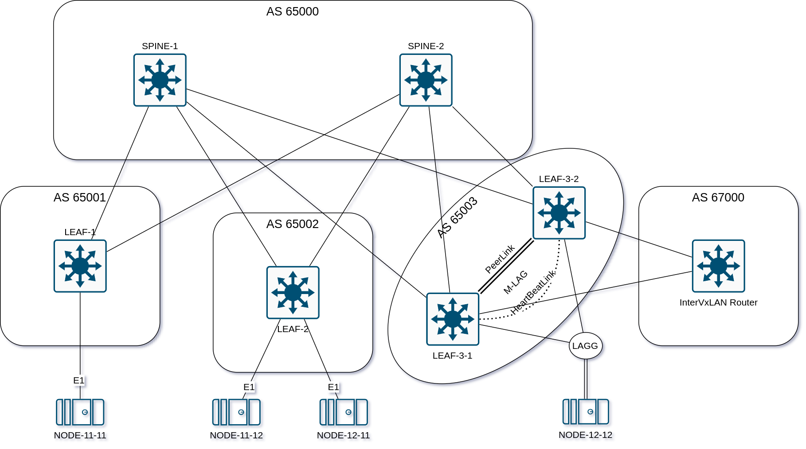

## VxLAN. Оптимизация таблиц маршрутизации 

### Задача:

- Анонсировать суммарные префиксы клиентов в Overlay сети
- Настроить маршрутизацию между клиентами через суммарный префикс
- Проверить связанность между клиентами

## Выполнение:

### Схема сети



### Конфигурация оборудования

- #### [LEAF-1](config/LEAF-1.cfg)

```
hostname LEAF-1
!
vlan 11
!
vrf instance VRF_11
!
interface Ethernet1
   description TO-SPINE-1
   no switchport
   ip address 10.1.1.11/31
   bfd interval 100 min-rx 100 multiplier 3
   bfd echo
!
interface Ethernet2
   description TO-SPINE-2
   no switchport
   ip address 10.2.1.11/31
   bfd interval 100 min-rx 100 multiplier 3
   bfd echo
!
interface Ethernet11
   switchport access vlan 11
   spanning-tree portfast
!
interface Loopback1
   ip address 10.0.1.1/32
!
interface Management0
   ip address 192.168.122.101/24
!
interface Vlan11
   vrf VRF_11
   ip address virtual 192.168.11.254/24
!
interface Vxlan1
   vxlan source-interface Loopback1
   vxlan udp-port 4789
   vxlan vlan 11 vni 10011
   vxlan vrf VRF_11 vni 11
!
ip routing vrf VRF_11
!
route-map RM_REDIST permit 10
   match interface Loopback1
!
router bgp 65001
   timers bgp 3 9
   distance bgp 20 200 200
   maximum-paths 2 ecmp 2
   neighbor SPINE peer group
   neighbor SPINE remote-as 65000
   neighbor SPINE bfd
   neighbor SPINE allowas-in 1
   neighbor SPINE rib-in pre-policy retain all
   neighbor SPINE password 7 yVt/SxQ2cHkCSxO5ZSaL8G2JpeqOLEZj
   neighbor SPINE send-community extended
   neighbor 10.1.1.10 peer group SPINE
   neighbor 10.2.1.10 peer group SPINE
   !
   vlan 11
      rd 10.0.1.1:10011
      route-target both 192.168.11.0:10011
      redistribute learned
   !
   address-family evpn
      neighbor SPINE activate
   !
   address-family ipv4
      neighbor SPINE activate
      redistribute connected route-map RM_REDIST
   !
   vrf VRF_11
      rd 10.0.1.1:11
      route-target import evpn 10011:11
      route-target export evpn 10011:11
      redistribute connected
!
router general
   router-id ipv4 10.0.1.1
!
```

- #### [LEAF-2](config/LEAF-2.cfg)

```
hostname LEAF-2
!
vlan 11-12
!
vrf instance VRF_11
!
vrf instance VRF_12
!
interface Ethernet1
   description TO-SPINE-1
   no switchport
   ip address 10.1.2.11/31
   bfd interval 100 min-rx 100 multiplier 3
   bfd echo
!
interface Ethernet2
   description TO-SPINE-2
   no switchport
   ip address 10.2.2.11/31
   bfd interval 100 min-rx 100 multiplier 3
   bfd echo
!
interface Ethernet11
   switchport access vlan 11
   spanning-tree portfast
!
interface Ethernet12
   switchport access vlan 12
   spanning-tree portfast
!
interface Loopback1
   ip address 10.0.2.1/32
!
interface Management0
   ip address 192.168.122.102/24
!
interface Vlan11
   vrf VRF_11
   ip address virtual 192.168.11.254/24
!
interface Vlan12
   vrf VRF_12
   ip address virtual 192.168.12.254/24
!
interface Vxlan1
   vxlan source-interface Loopback1
   vxlan udp-port 4789
   vxlan vlan 11 vni 10011
   vxlan vlan 12 vni 10012
   vxlan vrf VRF_11 vni 11
   vxlan vrf VRF_12 vni 12
!
ip routing vrf VRF_11
ip routing vrf VRF_12
!
route-map RM_REDIST permit 10
   match interface Loopback1
!
router bgp 65002
   timers bgp 3 9
   distance bgp 20 200 200
   maximum-paths 2 ecmp 2
   neighbor SPINE peer group
   neighbor SPINE remote-as 65000
   neighbor SPINE bfd
   neighbor SPINE allowas-in 1
   neighbor SPINE password 7 yVt/SxQ2cHkCSxO5ZSaL8G2JpeqOLEZj
   neighbor SPINE send-community
   neighbor 10.1.2.10 peer group SPINE
   neighbor 10.2.2.10 peer group SPINE
   !
   vlan 11
      rd 10.0.2.1:10011
      route-target both 192.168.11.0:10011
      redistribute learned
   !
   vlan 12
      rd 10.0.2.1:10012
      route-target both 192.168.12.0:10012
      redistribute learned
   !
   address-family evpn
      neighbor SPINE activate
   !
   address-family ipv4
      neighbor SPINE activate
      redistribute connected route-map RM_REDIST
   !
   vrf VRF_11
      rd 10.0.2.1:11
      route-target import evpn 10011:11
      route-target export evpn 10011:11
      redistribute connected
   !
   vrf VRF_12
      rd 10.0.2.1:12
      route-target import evpn 10012:12
      route-target export evpn 10012:12
      redistribute connected
!
router general
   router-id ipv4 10.0.2.1
!
```

- #### [LEAF-3-1](config/LEAF-3-1.cfg)

```
hostname LEAF-3-1
!
spanning-tree mode rstp
no spanning-tree vlan-id 2001-2002,4090,4094
!
vlan 12,2001-2002
!
vrf instance VRF_11
!
vrf instance VRF_12
!
interface Port-Channel6
   description TO-InterVxLANRouter
   switchport trunk allowed vlan 2001-2002
   switchport mode trunk
   mlag 6
   spanning-tree portfast
!
interface Port-Channel12
   description TO-NODE-12-12
   switchport trunk allowed vlan 12
   switchport mode trunk
   mlag 12
   spanning-tree portfast
!
interface Port-Channel4094
   switchport mode trunk
   switchport trunk group MLAGPEER
!
interface Ethernet1
   description TO-SPINE-1
   no switchport
   ip address 10.1.3.11/31
   bfd interval 100 min-rx 100 multiplier 3
   bfd echo
!
interface Ethernet2
   description TO-SPINE-2
   no switchport
   ip address 10.2.3.11/31
   bfd interval 100 min-rx 100 multiplier 3
   bfd echo
!
interface Ethernet6
   description TO-InterVxLANRouter
   bfd interval 100 min-rx 100 multiplier 3
   bfd echo
   channel-group 6 mode active
!
interface Ethernet12
   description TO-NODE-12-12
   switchport access vlan 12
   channel-group 12 mode active
   lacp timer fast
   spanning-tree portfast
!
interface Loopback1
   ip address 10.0.3.1/32
!
interface Loopback10
   ip address 10.0.3.10/32
!
interface Management0
   ip address 192.168.122.103/24
!
interface Vlan11
   no autostate
   vrf VRF_11
   ip address virtual 192.168.11.254/24
!
interface Vlan12
   vrf VRF_12
   ip address virtual 192.168.12.254/24
!
interface Vlan2001
   no autostate
   vrf VRF_11
   ip address 172.16.1.1/24
!
interface Vlan2002
   no autostate
   vrf VRF_12
   ip address 172.16.2.1/24
!
interface Vxlan1
   vxlan source-interface Loopback10
   vxlan virtual-router encapsulation mac-address mlag-system-id
   vxlan udp-port 4789
   vxlan vlan 11 vni 10011
   vxlan vlan 12 vni 10012
   vxlan vrf VRF_11 vni 11
   vxlan vrf VRF_12 vni 12
   vxlan learn-restrict any
!
ip routing vrf VRF_11
ip routing vrf VRF_12
!
route-map RM_REDIST permit 10
   match interface Loopback1
!
route-map RM_REDIST permit 20
   match interface Loopback10
!
route-map next-hop-self-ipv4 permit 10
   match route-type external
   set ip next-hop peer-address
!
route-map next-hop-self-ipv4 permit 20
!
router bgp 65003
   timers bgp 3 9
   distance bgp 20 200 200
   maximum-paths 2 ecmp 2
   neighbor MLAGPEER peer group
   neighbor MLAGPEER remote-as 65003
   neighbor MLAGPEER route-map next-hop-self-ipv4 out
   neighbor MLAGPEER send-community extended
   neighbor SPINE peer group
   neighbor SPINE remote-as 65000
   neighbor SPINE bfd
   neighbor SPINE allowas-in 1
   neighbor SPINE rib-in pre-policy retain all
   neighbor SPINE password 7 yVt/SxQ2cHkCSxO5ZSaL8G2JpeqOLEZj
   neighbor SPINE send-community extended
   neighbor 10.1.3.10 peer group SPINE
   neighbor 10.2.3.10 peer group SPINE
   neighbor 10.255.255.202 peer group MLAGPEER
   !
   vlan 12
      rd 10.0.3.1:10012
      route-target both 192.168.12.0:10012
      redistribute learned
   !
   address-family evpn
      neighbor MLAGPEER activate
      neighbor SPINE activate
   !
   address-family ipv4
      neighbor MLAGPEER activate
      neighbor SPINE activate
      redistribute connected route-map RM_REDIST
   !
   vrf VRF_11
      rd 10.0.3.1:11
      route-target import evpn 10011:11
      route-target export evpn 10011:11
      neighbor 172.16.1.3 remote-as 67000
      redistribute connected
      !
      address-family ipv4
         neighbor 172.16.1.3 activate
   !
   vrf VRF_12
      rd 10.0.3.1:12
      route-target import evpn 10012:12
      route-target export evpn 10012:12
      neighbor 172.16.2.3 remote-as 67000
      redistribute connected
      !
      address-family ipv4
         neighbor 172.16.2.3 activate
!
router general
   router-id ipv4 10.0.3.1
!
```

- #### [LEAF-3-2](config/LEAF-3-2.cfg)

```
hostname LEAF-3-2
!
spanning-tree mode rstp
no spanning-tree vlan-id 2001-2002,4090,4094
!
vlan 12,2001-2002
!
vrf instance VRF_11
!
vrf instance VRF_12
!
interface Port-Channel6
   description TO-InterVxLANRouter
   switchport trunk allowed vlan 2001-2002
   switchport mode trunk
   mlag 6
   spanning-tree portfast
!
interface Port-Channel12
   description TO-NODE-12-12
   switchport trunk allowed vlan 12
   switchport mode trunk
   mlag 12
   spanning-tree portfast
!
interface Port-Channel4094
   switchport mode trunk
   switchport trunk group MLAGPEER
!
interface Ethernet1
   description TO-SPINE-1
   no switchport
   ip address 10.1.3.21/31
   bfd interval 100 min-rx 100 multiplier 3
   bfd echo
!
interface Ethernet2
   description TO-SPINE-2
   no switchport
   ip address 10.2.3.21/31
   bfd interval 100 min-rx 100 multiplier 3
   bfd echo
!
interface Ethernet6
   description TO-InterVxLANRouter
   bfd interval 100 min-rx 100 multiplier 3
   bfd echo
   channel-group 6 mode active
!
interface Ethernet12
   description TO-NODE-12-12
   switchport access vlan 12
   channel-group 12 mode active
   lacp timer fast
   spanning-tree portfast
!
interface Loopback1
   ip address 10.0.3.2/32
!
interface Loopback10
   ip address 10.0.3.10/32
!
interface Vlan11
   no autostate
   vrf VRF_11
   ip address virtual 192.168.11.254/24
!
interface Vlan12
   vrf VRF_12
   ip address virtual 192.168.12.254/24
!
interface Vlan2001
   no autostate
   vrf VRF_11
   ip address 172.16.1.2/24
!
interface Vlan2002
   no autostate
   vrf VRF_12
   ip address 172.16.2.2/24
!
interface Vxlan1
   vxlan source-interface Loopback10
   vxlan virtual-router encapsulation mac-address mlag-system-id
   vxlan udp-port 4789
   vxlan vlan 11 vni 10011
   vxlan vlan 12 vni 10012
   vxlan vrf VRF_11 vni 11
   vxlan vrf VRF_12 vni 12
   vxlan learn-restrict any
!
ip routing vrf VRF_11
ip routing vrf VRF_12
!
route-map RM_REDIST permit 10
   match interface Loopback1
!
route-map RM_REDIST permit 20
   match interface Loopback10
!
route-map next-hop-self-ipv4 permit 10
   match route-type external
   set ip next-hop peer-address
!
route-map next-hop-self-ipv4 permit 20
!
router bgp 65003
   timers bgp 3 9
   maximum-paths 2 ecmp 2
   neighbor MLAGPEER peer group
   neighbor MLAGPEER remote-as 65003
   neighbor MLAGPEER route-map next-hop-self-ipv4 out
   neighbor MLAGPEER send-community extended
   neighbor SPINE peer group
   neighbor SPINE remote-as 65000
   neighbor SPINE bfd
   neighbor SPINE allowas-in 1
   neighbor SPINE rib-in pre-policy retain all
   neighbor SPINE password 7 yVt/SxQ2cHkCSxO5ZSaL8G2JpeqOLEZj
   neighbor SPINE send-community extended
   neighbor 10.1.3.20 peer group SPINE
   neighbor 10.2.3.20 peer group SPINE
   neighbor 10.255.255.201 peer group MLAGPEER
   !
   vlan 12
      rd 10.0.3.2:10012
      route-target both 192.168.12.0:10012
      redistribute learned
   !
   address-family evpn
      neighbor MLAGPEER activate
      neighbor SPINE activate
   !
   address-family ipv4
      neighbor MLAGPEER activate
      neighbor SPINE activate
      redistribute connected route-map RM_REDIST
   !
   vrf VRF_11
      rd 10.0.3.2:11
      route-target import evpn 10011:11
      route-target export evpn 10011:11
      neighbor 172.16.1.3 remote-as 67000
      redistribute connected
      !
      address-family ipv4
         neighbor 172.16.1.3 activate
   !
   vrf VRF_12
      rd 10.0.3.2:12
      route-target import evpn 10012:12
      route-target export evpn 10012:12
      neighbor 172.16.2.3 remote-as 67000
      redistribute connected
      !
      address-family ipv4
         neighbor 172.16.2.3 activate
!
router general
   router-id ipv4 10.0.3.2
!
```

- #### [InterVxLAN Router](config/InterVxLANRouter.cfg)

```
hostname InterVxLANRouter
!
spanning-tree mode mstp
no spanning-tree vlan-id 2001-2002,4094
!
interface Port-Channel1
   switchport trunk allowed vlan 2001-2002
   switchport mode trunk
   spanning-tree portfast
!
interface Port-Channel6
   no switchport
!
interface Port-Channel6.2001
   encapsulation dot1q vlan 2001
   ip address 172.16.1.3/24
!
interface Port-Channel6.2002
   encapsulation dot1q vlan 2002
   ip address 172.16.2.3/24
!
interface Ethernet1
   channel-group 6 mode active
!
interface Ethernet2
   channel-group 6 mode active
!
ip routing
!
router bgp 67000
   timers bgp 3 9
   distance bgp 20 200 200
   maximum-paths 2 ecmp 2
   neighbor LEAF peer group
   neighbor LEAF remote-as 65003
   neighbor LEAF remove-private-as all replace-as
   neighbor 172.16.1.1 peer group LEAF
   neighbor 172.16.1.2 peer group LEAF
   neighbor 172.16.2.1 peer group LEAF
   neighbor 172.16.2.2 peer group LEAF
   aggregate-address 192.168.0.0/16 summary-only
   !
   address-family ipv4
      neighbor LEAF activate
!
router general
   router-id ipv4 10.0.5.1
!
```
---

### Проверка конфигурации LEAF and InterVxLANRouter

- #### LEAF-1

```
LEAF-1# show ip route vrf VRF_11
VRF: VRF_11
Source Codes:
       C - connected, S - static, K - kernel,
       O - OSPF, IA - OSPF inter area, E1 - OSPF external type 1,
       E2 - OSPF external type 2, N1 - OSPF NSSA external type 1,
       N2 - OSPF NSSA external type2, B - Other BGP Routes,
       B I - iBGP, B E - eBGP, R - RIP, I L1 - IS-IS level 1,
       I L2 - IS-IS level 2, O3 - OSPFv3, A B - BGP Aggregate,
       A O - OSPF Summary, NG - Nexthop Group Static Route,
       V - VXLAN Control Service, M - Martian,
       DH - DHCP client installed default route,
       DP - Dynamic Policy Route, L - VRF Leaked,
       G  - gRIBI, RC - Route Cache Route,
       CL - CBF Leaked Route

Gateway of last resort is not set

 B E      172.16.1.0/24 [20/0]
           via VTEP 10.0.3.10 VNI 11 router-mac 02:00:87:bb:46:32 local-interface Vxlan1
 B E      192.168.11.12/32 [20/0]
           via VTEP 10.0.2.1 VNI 11 router-mac 32:d7:d9:f7:60:9b local-interface Vxlan1
 C        192.168.11.0/24
           directly connected, Vlan11
 B E      192.168.0.0/16 [20/0]
           via VTEP 10.0.3.10 VNI 11 router-mac 02:00:87:bb:46:32 local-interface Vxlan1

LEAF-1# show bgp evpn route-type ip-prefix ipv4
BGP routing table information for VRF default
Router identifier 10.0.1.1, local AS number 65001
Route status codes: * - valid, > - active, S - Stale, E - ECMP head, e - ECMP
                    c - Contributing to ECMP, % - Pending best path selection
Origin codes: i - IGP, e - EGP, ? - incomplete
AS Path Attributes: Or-ID - Originator ID, C-LST - Cluster List, LL Nexthop - Link Local Nexthop

          Network                Next Hop              Metric  LocPref Weight  Path
 * >      RD: 10.0.3.1:11 ip-prefix 172.16.1.0/24
                                 10.0.3.10             -       100     0       65000 65003 i
 * >Ec    RD: 10.0.3.2:11 ip-prefix 172.16.1.0/24
                                 10.0.3.10             -       100     0       65000 65003 i
 *  ec    RD: 10.0.3.2:11 ip-prefix 172.16.1.0/24
                                 10.0.3.10             -       100     0       65000 65003 i
 * >      RD: 10.0.3.1:12 ip-prefix 172.16.2.0/24
                                 10.0.3.10             -       100     0       65000 65003 i
 * >Ec    RD: 10.0.3.2:12 ip-prefix 172.16.2.0/24
                                 10.0.3.10             -       100     0       65000 65003 i
 *  ec    RD: 10.0.3.2:12 ip-prefix 172.16.2.0/24
                                 10.0.3.10             -       100     0       65000 65003 i
 * >      RD: 10.0.3.1:11 ip-prefix 192.168.0.0/16
                                 10.0.3.10             -       100     0       65000 65003 67000 i
 * >      RD: 10.0.3.1:12 ip-prefix 192.168.0.0/16
                                 10.0.3.10             -       100     0       65000 65003 67000 i
 * >Ec    RD: 10.0.3.2:11 ip-prefix 192.168.0.0/16
                                 10.0.3.10             -       100     0       65000 65003 67000 i
 *  ec    RD: 10.0.3.2:11 ip-prefix 192.168.0.0/16
                                 10.0.3.10             -       100     0       65000 65003 67000 i
 * >Ec    RD: 10.0.3.2:12 ip-prefix 192.168.0.0/16
                                 10.0.3.10             -       100     0       65000 65003 67000 i
 *  ec    RD: 10.0.3.2:12 ip-prefix 192.168.0.0/16
                                 10.0.3.10             -       100     0       65000 65003 67000 i
 * >      RD: 10.0.1.1:11 ip-prefix 192.168.11.0/24
                                 -                     -       -       0       i
 * >      RD: 10.0.2.1:11 ip-prefix 192.168.11.0/24
                                 10.0.2.1              -       100     0       65000 65002 i
 * >      RD: 10.0.3.1:11 ip-prefix 192.168.11.0/24
                                 10.0.3.10             -       100     0       65000 65003 i
 * >Ec    RD: 10.0.3.2:11 ip-prefix 192.168.11.0/24
                                 10.0.3.10             -       100     0       65000 65003 i
 *  ec    RD: 10.0.3.2:11 ip-prefix 192.168.11.0/24
                                 10.0.3.10             -       100     0       65000 65003 i
 * >      RD: 10.0.2.1:12 ip-prefix 192.168.12.0/24
                                 10.0.2.1              -       100     0       65000 65002 i
 * >      RD: 10.0.3.1:12 ip-prefix 192.168.12.0/24
                                 10.0.3.10             -       100     0       65000 65003 i
 * >Ec    RD: 10.0.3.2:12 ip-prefix 192.168.12.0/24
                                 10.0.3.10             -       100     0       65000 65003 i
 *  ec    RD: 10.0.3.2:12 ip-prefix 192.168.12.0/24
                                 10.0.3.10             -       100     0       65000 65003 i


LEAF-1# show bgp evpn route-type mac-ip
BGP routing table information for VRF default
Router identifier 10.0.1.1, local AS number 65001
Route status codes: * - valid, > - active, S - Stale, E - ECMP head, e - ECMP
                    c - Contributing to ECMP, % - Pending best path selection
Origin codes: i - IGP, e - EGP, ? - incomplete
AS Path Attributes: Or-ID - Originator ID, C-LST - Cluster List, LL Nexthop - Link Local Nexthop

          Network                Next Hop              Metric  LocPref Weight  Path
 * >      RD: 10.0.1.1:10011 mac-ip 0050.7966.6800
                                 -                     -       -       0       i
 * >      RD: 10.0.1.1:10011 mac-ip 0050.7966.6800 192.168.11.11
                                 -                     -       -       0       i
 * >      RD: 10.0.2.1:10011 mac-ip 0050.7966.6801
                                 10.0.2.1              -       100     0       65000 65002 i
 *        RD: 10.0.2.1:10011 mac-ip 0050.7966.6801
                                 10.0.2.1              -       100     0       65000 65003 65000 65002 i
 * >      RD: 10.0.2.1:10011 mac-ip 0050.7966.6801 192.168.11.12
                                 10.0.2.1              -       100     0       65000 65002 i
 *        RD: 10.0.2.1:10011 mac-ip 0050.7966.6801 192.168.11.12
                                 10.0.2.1              -       100     0       65000 65003 65000 65002 i
 * >      RD: 10.0.2.1:10012 mac-ip 0050.7966.6802
                                 10.0.2.1              -       100     0       65000 65002 i
 * >      RD: 10.0.2.1:10012 mac-ip 0050.7966.6802 192.168.12.11
                                 10.0.2.1              -       100     0       65000 65002 i
 * >      RD: 10.0.3.1:10012 mac-ip 0cd5.560f.0000
                                 10.0.3.10             -       100     0       65000 65003 i
 * >Ec    RD: 10.0.3.2:10012 mac-ip 0cd5.560f.0000
                                 10.0.3.10             -       100     0       65000 65003 i
 *  ec    RD: 10.0.3.2:10012 mac-ip 0cd5.560f.0000
                                 10.0.3.10             -       100     0       65000 65003 i
 * >      RD: 10.0.3.1:10012 mac-ip 0cd5.560f.0000 192.168.12.12
                                 10.0.3.10             -       100     0       65000 65003 i
 * >Ec    RD: 10.0.3.2:10012 mac-ip 0cd5.560f.0000 192.168.12.12
                                 10.0.3.10             -       100     0       65000 65003 i
 *  ec    RD: 10.0.3.2:10012 mac-ip 0cd5.560f.0000 192.168.12.12
                                 10.0.3.10             -       100     0       65000 65003 i

LEAF-1# show interfaces vxlan 1
Vxlan1 is up, line protocol is up (connected)
  Hardware is Vxlan
  Source interface is Loopback1 and is active with 10.0.1.1
  Listening on UDP port 4789
  Replication/Flood Mode is headend with Flood List Source: EVPN
  Remote MAC learning via EVPN
  VNI mapping to VLANs
  Static VLAN to VNI mapping is
    [11, 10011]
  Dynamic VLAN to VNI mapping for 'evpn' is
    [1006, 11]        [4094, 12]
  Note: All Dynamic VLANs used by VCS are internal VLANs.
        Use 'show vxlan vni' for details.
  Static VRF to VNI mapping is
   [VRF_11, 11]
  Headend replication flood vtep list is:
    11 10.0.2.1
  Shared Router MAC is 0000.0000.0000

LEAF-1# show vxlan vni
VNI to VLAN Mapping for Vxlan1
VNI         VLAN       Source       Interface        802.1Q Tag
----------- ---------- ------------ ---------------- ----------
10011       11         static       Ethernet11       untagged
                                    Vxlan1           11

VNI to dynamic VLAN Mapping for Vxlan1
VNI       VLAN       VRF          Source
--------- ---------- ------------ ------------
11        1006       VRF_11       evpn
12        4094                    evpn

```

- #### LEAF-2

```
LEAF-2# show ip route vrf VRF_11
VRF: VRF_11
Source Codes:
       C - connected, S - static, K - kernel,
       O - OSPF, IA - OSPF inter area, E1 - OSPF external type 1,
       E2 - OSPF external type 2, N1 - OSPF NSSA external type 1,
       N2 - OSPF NSSA external type2, B - Other BGP Routes,
       B I - iBGP, B E - eBGP, R - RIP, I L1 - IS-IS level 1,
       I L2 - IS-IS level 2, O3 - OSPFv3, A B - BGP Aggregate,
       A O - OSPF Summary, NG - Nexthop Group Static Route,
       V - VXLAN Control Service, M - Martian,
       DH - DHCP client installed default route,
       DP - Dynamic Policy Route, L - VRF Leaked,
       G  - gRIBI, RC - Route Cache Route,
       CL - CBF Leaked Route

Gateway of last resort is not set

 B E      172.16.1.0/24 [20/0]
           via VTEP 10.0.3.10 VNI 11 router-mac 02:00:87:bb:46:32 local-interface Vxlan1
 B E      192.168.11.11/32 [20/0]
           via VTEP 10.0.1.1 VNI 11 router-mac 6e:c0:6b:bf:43:36 local-interface Vxlan1
 C        192.168.11.0/24
           directly connected, Vlan11
 B E      192.168.0.0/16 [20/0]
           via VTEP 10.0.3.10 VNI 11 router-mac 02:00:87:bb:46:32 local-interface Vxlan1

LEAF-2# show ip route vrf VRF_12
VRF: VRF_12
Source Codes:
       C - connected, S - static, K - kernel,
       O - OSPF, IA - OSPF inter area, E1 - OSPF external type 1,
       E2 - OSPF external type 2, N1 - OSPF NSSA external type 1,
       N2 - OSPF NSSA external type2, B - Other BGP Routes,
       B I - iBGP, B E - eBGP, R - RIP, I L1 - IS-IS level 1,
       I L2 - IS-IS level 2, O3 - OSPFv3, A B - BGP Aggregate,
       A O - OSPF Summary, NG - Nexthop Group Static Route,
       V - VXLAN Control Service, M - Martian,
       DH - DHCP client installed default route,
       DP - Dynamic Policy Route, L - VRF Leaked,
       G  - gRIBI, RC - Route Cache Route,
       CL - CBF Leaked Route

Gateway of last resort is not set

 B E      172.16.2.0/24 [20/0]
           via VTEP 10.0.3.10 VNI 12 router-mac 02:00:87:bb:46:32 local-interface Vxlan1
 B E      192.168.12.12/32 [20/0]
           via VTEP 10.0.3.10 VNI 12 router-mac 02:00:87:bb:46:32 local-interface Vxlan1
 C        192.168.12.0/24
           directly connected, Vlan12
 B E      192.168.0.0/16 [20/0]
           via VTEP 10.0.3.10 VNI 12 router-mac 02:00:87:bb:46:32 local-interface Vxlan1

LEAF-2# show bgp evpn route-type ip-prefix ipv4
BGP routing table information for VRF default
Router identifier 10.0.2.1, local AS number 65002
Route status codes: * - valid, > - active, S - Stale, E - ECMP head, e - ECMP
                    c - Contributing to ECMP, % - Pending best path selection
Origin codes: i - IGP, e - EGP, ? - incomplete
AS Path Attributes: Or-ID - Originator ID, C-LST - Cluster List, LL Nexthop - Link Local Nexthop

          Network                Next Hop              Metric  LocPref Weight  Path
 * >      RD: 10.0.3.1:11 ip-prefix 172.16.1.0/24
                                 10.0.3.10             -       100     0       65000 65001 65000 65003 i
 * >      RD: 10.0.3.2:11 ip-prefix 172.16.1.0/24
                                 10.0.3.10             -       100     0       65000 65003 i
 * >      RD: 10.0.3.1:12 ip-prefix 172.16.2.0/24
                                 10.0.3.10             -       100     0       65000 65001 65000 65003 i
 * >      RD: 10.0.3.2:12 ip-prefix 172.16.2.0/24
                                 10.0.3.10             -       100     0       65000 65003 i
 * >      RD: 10.0.3.1:11 ip-prefix 192.168.0.0/16
                                 10.0.3.10             -       100     0       65000 65001 65000 65003 67000 i
 * >      RD: 10.0.3.1:12 ip-prefix 192.168.0.0/16
                                 10.0.3.10             -       100     0       65000 65001 65000 65003 67000 i
 * >      RD: 10.0.3.2:11 ip-prefix 192.168.0.0/16
                                 10.0.3.10             -       100     0       65000 65003 67000 i
 * >      RD: 10.0.3.2:12 ip-prefix 192.168.0.0/16
                                 10.0.3.10             -       100     0       65000 65003 67000 i
 * >      RD: 10.0.1.1:11 ip-prefix 192.168.11.0/24
                                 10.0.1.1              -       100     0       65000 65001 i
 * >      RD: 10.0.2.1:11 ip-prefix 192.168.11.0/24
                                 -                     -       -       0       i
 * >      RD: 10.0.3.1:11 ip-prefix 192.168.11.0/24
                                 10.0.3.10             -       100     0       65000 65001 65000 65003 i
 * >      RD: 10.0.3.2:11 ip-prefix 192.168.11.0/24
                                 10.0.3.10             -       100     0       65000 65003 i
 * >      RD: 10.0.2.1:12 ip-prefix 192.168.12.0/24
                                 -                     -       -       0       i
 * >      RD: 10.0.3.1:12 ip-prefix 192.168.12.0/24
                                 10.0.3.10             -       100     0       65000 65001 65000 65003 i
 * >      RD: 10.0.3.2:12 ip-prefix 192.168.12.0/24
                                 10.0.3.10             -       100     0       65000 65003 i

LEAF-2# show bgp evpn route-type mac-ip
BGP routing table information for VRF default
Router identifier 10.0.2.1, local AS number 65002
Route status codes: * - valid, > - active, S - Stale, E - ECMP head, e - ECMP
                    c - Contributing to ECMP, % - Pending best path selection
Origin codes: i - IGP, e - EGP, ? - incomplete
AS Path Attributes: Or-ID - Originator ID, C-LST - Cluster List, LL Nexthop - Link Local Nexthop

          Network                Next Hop              Metric  LocPref Weight  Path
 * >      RD: 10.0.1.1:10011 mac-ip 0050.7966.6800
                                 10.0.1.1              -       100     0       65000 65001 i
 * >      RD: 10.0.1.1:10011 mac-ip 0050.7966.6800 192.168.11.11
                                 10.0.1.1              -       100     0       65000 65001 i
 * >      RD: 10.0.2.1:10011 mac-ip 0050.7966.6801
                                 -                     -       -       0       i
 * >      RD: 10.0.2.1:10011 mac-ip 0050.7966.6801 192.168.11.12
                                 -                     -       -       0       i
 * >      RD: 10.0.2.1:10012 mac-ip 0050.7966.6802
                                 -                     -       -       0       i
 * >      RD: 10.0.2.1:10012 mac-ip 0050.7966.6802 192.168.12.11
                                 -                     -       -       0       i
 * >      RD: 10.0.3.1:10012 mac-ip 0cd5.560f.0000
                                 10.0.3.10             -       100     0       65000 65001 65000 65003 i
 * >      RD: 10.0.3.2:10012 mac-ip 0cd5.560f.0000
                                 10.0.3.10             -       100     0       65000 65003 i
 * >      RD: 10.0.3.1:10012 mac-ip 0cd5.560f.0000 192.168.12.12
                                 10.0.3.10             -       100     0       65000 65001 65000 65003 i
 * >      RD: 10.0.3.2:10012 mac-ip 0cd5.560f.0000 192.168.12.12
                                 10.0.3.10             -       100     0       65000 65003 i

LEAF-2# show interfaces vxlan 1
Vxlan1 is up, line protocol is up (connected)
  Hardware is Vxlan
  Source interface is Loopback1 and is active with 10.0.2.1
  Listening on UDP port 4789
  Replication/Flood Mode is headend with Flood List Source: EVPN
  Remote MAC learning via EVPN
  VNI mapping to VLANs
  Static VLAN to VNI mapping is
    [11, 10011]       [12, 10012]
  Dynamic VLAN to VNI mapping for 'evpn' is
    [1006, 11]        [4093, 12]
  Note: All Dynamic VLANs used by VCS are internal VLANs.
        Use 'show vxlan vni' for details.
  Static VRF to VNI mapping is
   [VRF_11, 11]
   [VRF_12, 12]
  Headend replication flood vtep list is:
    11 10.0.1.1
    12 10.0.3.10
  Shared Router MAC is 0000.0000.0000

LEAF-2# show vxlan vni
VNI to VLAN Mapping for Vxlan1
VNI         VLAN       Source       Interface        802.1Q Tag
----------- ---------- ------------ ---------------- ----------
10011       11         static       Ethernet11       untagged
                                    Vxlan1           11
10012       12         static       Ethernet12       untagged
                                    Vxlan1           12

VNI to dynamic VLAN Mapping for Vxlan1
VNI       VLAN       VRF          Source
--------- ---------- ------------ ------------
11        1006       VRF_11       evpn
12        4093       VRF_12       evpn

```

- #### LEAF-3-1

```
LEAF-3-1# show ip route vrf VRF_11
VRF: VRF_11
Source Codes:
       C - connected, S - static, K - kernel,
       O - OSPF, IA - OSPF inter area, E1 - OSPF external type 1,
       E2 - OSPF external type 2, N1 - OSPF NSSA external type 1,
       N2 - OSPF NSSA external type2, B - Other BGP Routes,
       B I - iBGP, B E - eBGP, R - RIP, I L1 - IS-IS level 1,
       I L2 - IS-IS level 2, O3 - OSPFv3, A B - BGP Aggregate,
       A O - OSPF Summary, NG - Nexthop Group Static Route,
       V - VXLAN Control Service, M - Martian,
       DH - DHCP client installed default route,
       DP - Dynamic Policy Route, L - VRF Leaked,
       G  - gRIBI, RC - Route Cache Route,
       CL - CBF Leaked Route

Gateway of last resort is not set

 C        172.16.1.0/24
           directly connected, Vlan2001
 B E      192.168.11.11/32 [20/0]
           via VTEP 10.0.1.1 VNI 11 router-mac 6e:c0:6b:bf:43:36 local-interface Vxlan1
 B I      192.168.11.12/32 [200/0]
           via VTEP 10.0.2.1 VNI 11 router-mac 32:d7:d9:f7:60:9b local-interface Vxlan1
 C        192.168.11.0/24
           directly connected, Vlan11
 B E      192.168.0.0/16 [20/0]
           via 172.16.1.3, Vlan2001

LEAF-3-1# show ip route vrf VRF_12
VRF: VRF_12
Source Codes:
       C - connected, S - static, K - kernel,
       O - OSPF, IA - OSPF inter area, E1 - OSPF external type 1,
       E2 - OSPF external type 2, N1 - OSPF NSSA external type 1,
       N2 - OSPF NSSA external type2, B - Other BGP Routes,
       B I - iBGP, B E - eBGP, R - RIP, I L1 - IS-IS level 1,
       I L2 - IS-IS level 2, O3 - OSPFv3, A B - BGP Aggregate,
       A O - OSPF Summary, NG - Nexthop Group Static Route,
       V - VXLAN Control Service, M - Martian,
       DH - DHCP client installed default route,
       DP - Dynamic Policy Route, L - VRF Leaked,
       G  - gRIBI, RC - Route Cache Route,
       CL - CBF Leaked Route

Gateway of last resort is not set

 C        172.16.2.0/24
           directly connected, Vlan2002
 B I      192.168.12.11/32 [200/0]
           via VTEP 10.0.2.1 VNI 12 router-mac 32:d7:d9:f7:60:9b local-interface Vxlan1
 C        192.168.12.0/24
           directly connected, Vlan12
 B E      192.168.0.0/16 [20/0]
           via 172.16.2.3, Vlan2002

LEAF-3-1# show bgp evpn route-type ip-prefix ipv4
BGP routing table information for VRF default
Router identifier 10.0.3.1, local AS number 65003
Route status codes: * - valid, > - active, S - Stale, E - ECMP head, e - ECMP
                    c - Contributing to ECMP, % - Pending best path selection
Origin codes: i - IGP, e - EGP, ? - incomplete
AS Path Attributes: Or-ID - Originator ID, C-LST - Cluster List, LL Nexthop - Link Local Nexthop

          Network                Next Hop              Metric  LocPref Weight  Path
 * >      RD: 10.0.3.1:11 ip-prefix 172.16.1.0/24
                                 -                     -       -       0       i
          RD: 10.0.3.2:11 ip-prefix 172.16.1.0/24
                                 10.0.3.10             -       100     0       i
          RD: 10.0.3.2:11 ip-prefix 172.16.1.0/24
                                 10.0.3.10             -       100     0       65000 65003 i
 * >      RD: 10.0.3.1:12 ip-prefix 172.16.2.0/24
                                 -                     -       -       0       i
          RD: 10.0.3.2:12 ip-prefix 172.16.2.0/24
                                 10.0.3.10             -       100     0       i
          RD: 10.0.3.2:12 ip-prefix 172.16.2.0/24
                                 10.0.3.10             -       100     0       65000 65003 i
 * >      RD: 10.0.3.1:11 ip-prefix 192.168.0.0/16
                                 -                     -       100     0       67000 i
 * >      RD: 10.0.3.1:12 ip-prefix 192.168.0.0/16
                                 -                     -       100     0       67000 i
          RD: 10.0.3.2:11 ip-prefix 192.168.0.0/16
                                 10.0.3.10             -       100     0       67000 i
          RD: 10.0.3.2:11 ip-prefix 192.168.0.0/16
                                 10.0.3.10             -       100     0       65000 65003 67000 i
          RD: 10.0.3.2:12 ip-prefix 192.168.0.0/16
                                 10.0.3.10             -       100     0       67000 i
          RD: 10.0.3.2:12 ip-prefix 192.168.0.0/16
                                 10.0.3.10             -       100     0       65000 65003 67000 i
 * >      RD: 10.0.1.1:11 ip-prefix 192.168.11.0/24
                                 10.0.1.1              -       100     0       65000 65001 i
 *        RD: 10.0.1.1:11 ip-prefix 192.168.11.0/24
                                 10.0.1.1              -       100     0       65000 65001 i
 * >      RD: 10.0.2.1:11 ip-prefix 192.168.11.0/24
                                 10.0.2.1              -       100     0       65000 65002 i
 *        RD: 10.0.2.1:11 ip-prefix 192.168.11.0/24
                                 10.0.2.1              -       100     0       65000 65001 65000 65002 i
 * >      RD: 10.0.3.1:11 ip-prefix 192.168.11.0/24
                                 -                     -       -       0       i
          RD: 10.0.3.2:11 ip-prefix 192.168.11.0/24
                                 10.0.3.10             -       100     0       i
          RD: 10.0.3.2:11 ip-prefix 192.168.11.0/24
                                 10.0.3.10             -       100     0       65000 65003 i
 * >      RD: 10.0.2.1:12 ip-prefix 192.168.12.0/24
                                 10.0.2.1              -       100     0       65000 65002 i
 *        RD: 10.0.2.1:12 ip-prefix 192.168.12.0/24
                                 10.0.2.1              -       100     0       65000 65001 65000 65002 i
 * >      RD: 10.0.3.1:12 ip-prefix 192.168.12.0/24
                                 -                     -       -       0       i
          RD: 10.0.3.2:12 ip-prefix 192.168.12.0/24
                                 10.0.3.10             -       100     0       i
          RD: 10.0.3.2:12 ip-prefix 192.168.12.0/24
                                 10.0.3.10             -       100     0       65000 65003 i

LEAF-3-1# show bgp evpn route-type mac-ip
BGP routing table information for VRF default
Router identifier 10.0.3.1, local AS number 65003
Route status codes: * - valid, > - active, S - Stale, E - ECMP head, e - ECMP
                    c - Contributing to ECMP, % - Pending best path selection
Origin codes: i - IGP, e - EGP, ? - incomplete
AS Path Attributes: Or-ID - Originator ID, C-LST - Cluster List, LL Nexthop - Link Local Nexthop

          Network                Next Hop              Metric  LocPref Weight  Path
 * >      RD: 10.0.1.1:10011 mac-ip 0050.7966.6800
                                 10.0.1.1              -       100     0       65000 65001 i
 *        RD: 10.0.1.1:10011 mac-ip 0050.7966.6800
                                 10.0.1.1              -       100     0       65000 65001 i
 * >      RD: 10.0.1.1:10011 mac-ip 0050.7966.6800 192.168.11.11
                                 10.0.1.1              -       100     0       65000 65001 i
 *        RD: 10.0.1.1:10011 mac-ip 0050.7966.6800 192.168.11.11
                                 10.0.1.1              -       100     0       65000 65001 i
 * >      RD: 10.0.2.1:10011 mac-ip 0050.7966.6801
                                 10.0.2.1              -       100     0       65000 65002 i
 *        RD: 10.0.2.1:10011 mac-ip 0050.7966.6801
                                 10.0.2.1              -       100     0       65000 65003 65000 65002 i
 * >      RD: 10.0.2.1:10011 mac-ip 0050.7966.6801 192.168.11.12
                                 10.0.2.1              -       100     0       65000 65002 i
 *        RD: 10.0.2.1:10011 mac-ip 0050.7966.6801 192.168.11.12
                                 10.0.2.1              -       100     0       65000 65003 65000 65002 i
 * >      RD: 10.0.2.1:10012 mac-ip 0050.7966.6802
                                 10.0.2.1              -       100     0       65000 65002 i
 *        RD: 10.0.2.1:10012 mac-ip 0050.7966.6802
                                 10.0.2.1              -       100     0       65000 65001 65000 65002 i
 * >      RD: 10.0.2.1:10012 mac-ip 0050.7966.6802 192.168.12.11
                                 10.0.2.1              -       100     0       65000 65002 i
 *        RD: 10.0.2.1:10012 mac-ip 0050.7966.6802 192.168.12.11
                                 10.0.2.1              -       100     0       65000 65001 65000 65002 i
 * >      RD: 10.0.3.1:10012 mac-ip 0cd5.560f.0000
                                 -                     -       -       0       i
          RD: 10.0.3.2:10012 mac-ip 0cd5.560f.0000
                                 10.0.3.10             -       100     0       i
          RD: 10.0.3.2:10012 mac-ip 0cd5.560f.0000
                                 10.0.3.10             -       100     0       65000 65003 i
 * >      RD: 10.0.3.1:10012 mac-ip 0cd5.560f.0000 192.168.12.12
                                 -                     -       -       0       i
          RD: 10.0.3.2:10012 mac-ip 0cd5.560f.0000 192.168.12.12
                                 10.0.3.10             -       100     0       65000 65003 i
          RD: 10.0.3.2:10012 mac-ip 0cd5.560f.0000 192.168.12.12
                                 10.0.3.10             -       100     0       i

LEAF-3-1# show interfaces vxlan 1
Vxlan1 is up, line protocol is up (connected)
  Hardware is Vxlan
  Source interface is Loopback10 and is active with 10.0.3.10
  Listening on UDP port 4789
  Replication/Flood Mode is headend with Flood List Source: EVPN
  Remote MAC learning via EVPN
  VNI mapping to VLANs
  Static VLAN to VNI mapping is
    [12, 10012]
  Dynamic VLAN to VNI mapping for 'evpn' is
    [1006, 11]        [4093, 12]
  Note: All Dynamic VLANs used by VCS are internal VLANs.
        Use 'show vxlan vni' for details.
  Static VRF to VNI mapping is
   [VRF_11, 11]
   [VRF_12, 12]
  Headend replication flood vtep list is:
    12 10.0.2.1
  MLAG Shared Router MAC is 0200.87bb.4632
LEAF-3-1#show vxlan vni
VNI to VLAN Mapping for Vxlan1
VNI         VLAN       Source       Interface            802.1Q Tag
----------- ---------- ------------ -------------------- ----------
10012       12         static       Ethernet12           untagged
                                    Port-Channel12       12
                                    Vxlan1               12

VNI to dynamic VLAN Mapping for Vxlan1
VNI       VLAN       VRF          Source
--------- ---------- ------------ ------------
11        1006       VRF_11       evpn
12        4093       VRF_12       evpn

```

- #### LEAF-3-2

```
LEAF-3-2# show ip route vrf VRF_11
VRF: VRF_11
Source Codes:
       C - connected, S - static, K - kernel,
       O - OSPF, IA - OSPF inter area, E1 - OSPF external type 1,
       E2 - OSPF external type 2, N1 - OSPF NSSA external type 1,
       N2 - OSPF NSSA external type2, B - Other BGP Routes,
       B I - iBGP, B E - eBGP, R - RIP, I L1 - IS-IS level 1,
       I L2 - IS-IS level 2, O3 - OSPFv3, A B - BGP Aggregate,
       A O - OSPF Summary, NG - Nexthop Group Static Route,
       V - VXLAN Control Service, M - Martian,
       DH - DHCP client installed default route,
       DP - Dynamic Policy Route, L - VRF Leaked,
       G  - gRIBI, RC - Route Cache Route,
       CL - CBF Leaked Route

Gateway of last resort is not set

 C        172.16.1.0/24
           directly connected, Vlan2001
 B E      192.168.11.11/32 [200/0]
           via VTEP 10.0.1.1 VNI 11 router-mac 6e:c0:6b:bf:43:36 local-interface Vxlan1
 B E      192.168.11.12/32 [200/0]
           via VTEP 10.0.2.1 VNI 11 router-mac 32:d7:d9:f7:60:9b local-interface Vxlan1
 C        192.168.11.0/24
           directly connected, Vlan11
 B E      192.168.0.0/16 [200/0]
           via 172.16.1.3, Vlan2001

LEAF-3-2# show ip route vrf VRF_12
VRF: VRF_12
Source Codes:
       C - connected, S - static, K - kernel,
       O - OSPF, IA - OSPF inter area, E1 - OSPF external type 1,
       E2 - OSPF external type 2, N1 - OSPF NSSA external type 1,
       N2 - OSPF NSSA external type2, B - Other BGP Routes,
       B I - iBGP, B E - eBGP, R - RIP, I L1 - IS-IS level 1,
       I L2 - IS-IS level 2, O3 - OSPFv3, A B - BGP Aggregate,
       A O - OSPF Summary, NG - Nexthop Group Static Route,
       V - VXLAN Control Service, M - Martian,
       DH - DHCP client installed default route,
       DP - Dynamic Policy Route, L - VRF Leaked,
       G  - gRIBI, RC - Route Cache Route,
       CL - CBF Leaked Route

Gateway of last resort is not set

 C        172.16.2.0/24
           directly connected, Vlan2002
 B E      192.168.12.11/32 [200/0]
           via VTEP 10.0.2.1 VNI 12 router-mac 32:d7:d9:f7:60:9b local-interface Vxlan1
 C        192.168.12.0/24
           directly connected, Vlan12
 B E      192.168.0.0/16 [200/0]
           via 172.16.2.3, Vlan2002

LEAF-3-2# show bgp evpn route-type ip-prefix ipv4
BGP routing table information for VRF default
Router identifier 10.0.3.2, local AS number 65003
Route status codes: * - valid, > - active, S - Stale, E - ECMP head, e - ECMP
                    c - Contributing to ECMP, % - Pending best path selection
Origin codes: i - IGP, e - EGP, ? - incomplete
AS Path Attributes: Or-ID - Originator ID, C-LST - Cluster List, LL Nexthop - Link Local Nexthop

          Network                Next Hop              Metric  LocPref Weight  Path
          RD: 10.0.3.1:11 ip-prefix 172.16.1.0/24
                                 10.0.3.10             -       100     0       i
          RD: 10.0.3.1:11 ip-prefix 172.16.1.0/24
                                 10.0.3.10             -       100     0       65000 65003 i
          RD: 10.0.3.1:11 ip-prefix 172.16.1.0/24
                                 10.0.3.10             -       100     0       65000 65001 65000 65003 i
 * >      RD: 10.0.3.2:11 ip-prefix 172.16.1.0/24
                                 -                     -       -       0       i
          RD: 10.0.3.1:12 ip-prefix 172.16.2.0/24
                                 10.0.3.10             -       100     0       i
          RD: 10.0.3.1:12 ip-prefix 172.16.2.0/24
                                 10.0.3.10             -       100     0       65000 65003 i
          RD: 10.0.3.1:12 ip-prefix 172.16.2.0/24
                                 10.0.3.10             -       100     0       65000 65001 65000 65003 i
 * >      RD: 10.0.3.2:12 ip-prefix 172.16.2.0/24
                                 -                     -       -       0       i
          RD: 10.0.3.1:11 ip-prefix 192.168.0.0/16
                                 10.0.3.10             -       100     0       67000 i
          RD: 10.0.3.1:11 ip-prefix 192.168.0.0/16
                                 10.0.3.10             -       100     0       65000 65003 67000 i
          RD: 10.0.3.1:11 ip-prefix 192.168.0.0/16
                                 10.0.3.10             -       100     0       65000 65001 65000 65003 67000 i
          RD: 10.0.3.1:12 ip-prefix 192.168.0.0/16
                                 10.0.3.10             -       100     0       67000 i
          RD: 10.0.3.1:12 ip-prefix 192.168.0.0/16
                                 10.0.3.10             -       100     0       65000 65003 67000 i
          RD: 10.0.3.1:12 ip-prefix 192.168.0.0/16
                                 10.0.3.10             -       100     0       65000 65001 65000 65003 67000 i
 * >      RD: 10.0.3.2:11 ip-prefix 192.168.0.0/16
                                 -                     -       100     0       67000 i
 * >      RD: 10.0.3.2:12 ip-prefix 192.168.0.0/16
                                 -                     -       100     0       67000 i
 * >Ec    RD: 10.0.1.1:11 ip-prefix 192.168.11.0/24
                                 10.0.1.1              -       100     0       65000 65001 i
 *  ec    RD: 10.0.1.1:11 ip-prefix 192.168.11.0/24
                                 10.0.1.1              -       100     0       65000 65001 i
 *        RD: 10.0.1.1:11 ip-prefix 192.168.11.0/24
                                 10.0.1.1              -       100     0       65000 65001 i
 * >      RD: 10.0.2.1:11 ip-prefix 192.168.11.0/24
                                 10.0.2.1              -       100     0       65000 65002 i
 *        RD: 10.0.2.1:11 ip-prefix 192.168.11.0/24
                                 10.0.2.1              -       100     0       65000 65001 65000 65002 i
          RD: 10.0.3.1:11 ip-prefix 192.168.11.0/24
                                 10.0.3.10             -       100     0       i
          RD: 10.0.3.1:11 ip-prefix 192.168.11.0/24
                                 10.0.3.10             -       100     0       65000 65003 i
          RD: 10.0.3.1:11 ip-prefix 192.168.11.0/24
                                 10.0.3.10             -       100     0       65000 65001 65000 65003 i
 * >      RD: 10.0.3.2:11 ip-prefix 192.168.11.0/24
                                 -                     -       -       0       i
 * >      RD: 10.0.2.1:12 ip-prefix 192.168.12.0/24
                                 10.0.2.1              -       100     0       65000 65002 i
 *        RD: 10.0.2.1:12 ip-prefix 192.168.12.0/24
                                 10.0.2.1              -       100     0       65000 65001 65000 65002 i
          RD: 10.0.3.1:12 ip-prefix 192.168.12.0/24
                                 10.0.3.10             -       100     0       i
          RD: 10.0.3.1:12 ip-prefix 192.168.12.0/24
                                 10.0.3.10             -       100     0       65000 65003 i
          RD: 10.0.3.1:12 ip-prefix 192.168.12.0/24
                                 10.0.3.10             -       100     0       65000 65001 65000 65003 i
 * >      RD: 10.0.3.2:12 ip-prefix 192.168.12.0/24
                                 -                     -       -       0       i

LEAF-3-2# show bgp evpn route-type mac-ip
BGP routing table information for VRF default
Router identifier 10.0.3.2, local AS number 65003
Route status codes: * - valid, > - active, S - Stale, E - ECMP head, e - ECMP
                    c - Contributing to ECMP, % - Pending best path selection
Origin codes: i - IGP, e - EGP, ? - incomplete
AS Path Attributes: Or-ID - Originator ID, C-LST - Cluster List, LL Nexthop - Link Local Nexthop

          Network                Next Hop              Metric  LocPref Weight  Path
 * >Ec    RD: 10.0.1.1:10011 mac-ip 0050.7966.6800
                                 10.0.1.1              -       100     0       65000 65001 i
 *  ec    RD: 10.0.1.1:10011 mac-ip 0050.7966.6800
                                 10.0.1.1              -       100     0       65000 65001 i
 *        RD: 10.0.1.1:10011 mac-ip 0050.7966.6800
                                 10.0.1.1              -       100     0       65000 65001 i
 * >Ec    RD: 10.0.1.1:10011 mac-ip 0050.7966.6800 192.168.11.11
                                 10.0.1.1              -       100     0       65000 65001 i
 *  ec    RD: 10.0.1.1:10011 mac-ip 0050.7966.6800 192.168.11.11
                                 10.0.1.1              -       100     0       65000 65001 i
 *        RD: 10.0.1.1:10011 mac-ip 0050.7966.6800 192.168.11.11
                                 10.0.1.1              -       100     0       65000 65001 i
 * >      RD: 10.0.2.1:10011 mac-ip 0050.7966.6801
                                 10.0.2.1              -       100     0       65000 65002 i
 * >      RD: 10.0.2.1:10011 mac-ip 0050.7966.6801 192.168.11.12
                                 10.0.2.1              -       100     0       65000 65002 i
 * >      RD: 10.0.2.1:10012 mac-ip 0050.7966.6802
                                 10.0.2.1              -       100     0       65000 65002 i
 *        RD: 10.0.2.1:10012 mac-ip 0050.7966.6802
                                 10.0.2.1              -       100     0       65000 65001 65000 65002 i
 * >      RD: 10.0.2.1:10012 mac-ip 0050.7966.6802 192.168.12.11
                                 10.0.2.1              -       100     0       65000 65002 i
 *        RD: 10.0.2.1:10012 mac-ip 0050.7966.6802 192.168.12.11
                                 10.0.2.1              -       100     0       65000 65001 65000 65002 i
          RD: 10.0.3.1:10012 mac-ip 0cd5.560f.0000
                                 10.0.3.10             -       100     0       i
          RD: 10.0.3.1:10012 mac-ip 0cd5.560f.0000
                                 10.0.3.10             -       100     0       65000 65001 65000 65003 i
          RD: 10.0.3.1:10012 mac-ip 0cd5.560f.0000
                                 10.0.3.10             -       100     0       65000 65003 i
 * >      RD: 10.0.3.2:10012 mac-ip 0cd5.560f.0000
                                 -                     -       -       0       i
          RD: 10.0.3.1:10012 mac-ip 0cd5.560f.0000 192.168.12.12
                                 10.0.3.10             -       100     0       i
          RD: 10.0.3.1:10012 mac-ip 0cd5.560f.0000 192.168.12.12
                                 10.0.3.10             -       100     0       65000 65001 65000 65003 i
          RD: 10.0.3.1:10012 mac-ip 0cd5.560f.0000 192.168.12.12
                                 10.0.3.10             -       100     0       65000 65003 i
 * >      RD: 10.0.3.2:10012 mac-ip 0cd5.560f.0000 192.168.12.12
                                 -                     -       -       0       i

LEAF-3-2# show interfaces vxlan 1
Vxlan1 is up, line protocol is up (connected)
  Hardware is Vxlan
  Source interface is Loopback10 and is active with 10.0.3.10
  Listening on UDP port 4789
  Replication/Flood Mode is headend with Flood List Source: EVPN
  Remote MAC learning via EVPN
  VNI mapping to VLANs
  Static VLAN to VNI mapping is
    [12, 10012]
  Dynamic VLAN to VNI mapping for 'evpn' is
    [1006, 11]        [4093, 12]
  Note: All Dynamic VLANs used by VCS are internal VLANs.
        Use 'show vxlan vni' for details.
  Static VRF to VNI mapping is
   [VRF_11, 11]
   [VRF_12, 12]
  Headend replication flood vtep list is:
    12 10.0.2.1
  MLAG Shared Router MAC is 0200.87bb.4632

LEAF-3-2# show vxlan vni
VNI to VLAN Mapping for Vxlan1
VNI         VLAN       Source       Interface            802.1Q Tag
----------- ---------- ------------ -------------------- ----------
10012       12         static       Ethernet12           untagged
                                    Port-Channel12       12
                                    Vxlan1               12

VNI to dynamic VLAN Mapping for Vxlan1
VNI       VLAN       VRF          Source
--------- ---------- ------------ ------------
11        1006       VRF_11       evpn
12        4093       VRF_12       evpn

```

- #### InterVxLANRouter

```
InterVxLANRouter# show ip bgp summary
BGP summary information for VRF default
Router identifier 10.0.5.1, local AS number 67000
Neighbor Status Codes: m - Under maintenance
  Neighbor         V  AS           MsgRcvd   MsgSent     InQ    OutQ  Up/Down State   PfxRcd PfxAcc
  172.16.1.1       4  65003           1511      1287       0       0 01:04:01 Estab   4      4
  172.16.1.2       4  65003           1513      1287       0       0 01:04:01 Estab   4      4
  172.16.2.1       4  65003           1515      1287       0       0 01:04:01 Estab   3      3
  172.16.2.2       4  65003           1507      1287       0       0 01:04:01 Estab   3      3

InterVxLANRouter# show ip bgp neighbors received-routes
BGP routing table information for VRF default
Router identifier 10.0.5.1, local AS number 67000
Route status codes: * - valid, > - active, # - not installed, E - ECMP head, e - ECMP
                    S - Stale, c - Contributing to ECMP, b - backup, L - labeled-unicast
Origin codes: i - IGP, e - EGP, ? - incomplete
AS Path Attributes: Or-ID - Originator ID, C-LST - Cluster List, LL Nexthop - Link Local Nexthop

         Network                Peer            Next Hop      Metric  LocPref Weight  Path
 * #Ec   172.16.1.0/24          172.16.1.1      172.16.1.1    -       -       -       65003 i
 *  ec   172.16.1.0/24          172.16.1.2      172.16.1.2    -       -       -       65003 i
 * #Ec   172.16.2.0/24          172.16.2.1      172.16.2.1    -       -       -       65003 i
 *  ec   172.16.2.0/24          172.16.2.2      172.16.2.2    -       -       -       65003 i
 * >     192.168.0.0/16         -                     -       -       -       (null)
 * >Ec   192.168.11.0/24        172.16.1.1      172.16.1.1    -       -       -       65003 i
 *  ec   192.168.11.0/24        172.16.1.2      172.16.1.2    -       -       -       65003 i
 * >Ec   192.168.11.11/32       172.16.1.2      172.16.1.2    -       -       -       65003 65000 65001 i
 *  ec   192.168.11.11/32       172.16.1.1      172.16.1.1    -       -       -       65003 65000 65001 i
 * >Ec   192.168.11.12/32       172.16.1.2      172.16.1.2    -       -       -       65003 65000 65002 i
 *  ec   192.168.11.12/32       172.16.1.1      172.16.1.1    -       -       -       65003 65000 65002 i
 * >Ec   192.168.12.0/24        172.16.2.1      172.16.2.1    -       -       -       65003 i
 *  ec   192.168.12.0/24        172.16.2.2      172.16.2.2    -       -       -       65003 i
 * >Ec   192.168.12.11/32       172.16.2.2      172.16.2.2    -       -       -       65003 65000 65002 i
 *  ec   192.168.12.11/32       172.16.2.1      172.16.2.1    -       -       -       65003 65000 65002 i
```

### Проверка связности клиентов

- #### NODE-11-11

```
NODE-11-11> trace 192.168.12.12 -P 1
trace to 192.168.12.12, 8 hops max (ICMP), press Ctrl+C to stop
 1     *  *  *
 2     *  *  *
 3   172.16.1.3   1.873 ms  1.474 ms  1.462 ms
 4   172.16.2.1   3.068 ms  2.885 ms  2.295 ms
 5   192.168.12.12   2.944 ms  2.271 ms  2.232 ms

NODE-11-11> ping 192.168.12.12 -c 1

84 bytes from 192.168.12.12 icmp_seq=1 ttl=60 time=3.485 ms
```

- #### NODE-12-12

```
[admin@NODE-12-12] > /tool/traceroute address=192.168.11.11
ADDRESS                          LOSS SENT    LAST     AVG    BEST   WORST STD-DEV STA..
                                 100%    4 timeout
172.16.2.3                         0%    3   1.3ms     1.3     1.2     1.4     0.1
172.16.1.2                         0%    3   1.3ms     1.4     1.3     1.4       0
192.168.11.254                     0%    3   2.1ms     2.2     2.1     2.3     0.1
192.168.11.11                      0%    3   2.5ms     2.4     2.4     2.5       0

[admin@NODE-12-12] > /ping 192.168.11.11 count=1
  SEQ HOST                                     SIZE TTL TIME       STATUS
    0 192.168.11.11                              56  60 3ms431us
    sent=1 received=1 packet-loss=0% min-rtt=3ms431us avg-rtt=3ms431us max-rtt=3ms431us
```